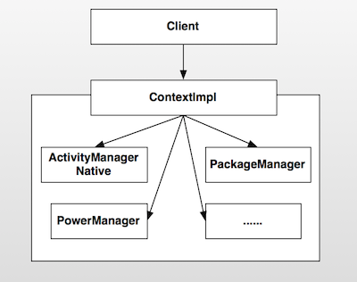

# 模式介绍

外观模式(也成为门面模式)要求一个子系统的外部与其内部的通信必须通过一个统一的对象进行。它提供一个高层次的接口，使得子系统更易于使用。

# 模式的使用场景
1. 在设计初期阶段，将不同的两个层分离；
2. 在开发阶段，子系统往往因为不断的重构演化而变得越来越复杂，大多数的模式使用时也都会产生很多很小的类，这本是好事，但也给外部调用它们的用户程序带来了使用上的困难，增加外观Facade可以提供一个简单的接口，减少它们之间的依赖。
3. 在维护一个遗留的大型系统时，可能这个系统已经非常难以维护和扩展了，但因为它包含非常重要的功能，新的需求开发必须依赖于它。

**个人理解：** 外观模式就是遥控器，控制电视的开关、音量、换台等各个模块。

# UML类图


- Client : 客户端程序。
- Facade : 对外的统一入口,即外观对象。
- SubSystemA : 子系统A。、
- SubSystemB : 子系统B。
- SubSystemC : 子系统C。
- SubSystemD : 子系统D。

# Android源码中的实现
在开发过程中，Context是最重要的一个类型。它封装了很多重要的操作，比如startActivity()、sendBroadcast()等，几乎是开发者对应用操作的统一入口。Context是一个抽象类，它只是定义了抽象接口，真正的实现在ContextImpl类中。它就是今天我们要分析的外观类。

在应用启动时，首先会fork一个子进程，并且调用ActivityThread.main方法启动该进程。ActivityThread又会构建Application对象，然后和Activity、ContextImpl关联起来，然后再调用Activity的onCreate、onStart、onResume函数使Activity运行起来。


ContextImpl.java

```java
class ContextImpl extends Context {
    @Override
    public void sendBroadcast(Intent intent) {
        warnIfCallingFromSystemProcess();
        String resolvedType = intent.resolveTypeIfNeeded(getContentResolver());
        try {
            intent.prepareToLeaveProcess(this);
            ActivityManager.getService().broadcastIntentWithFeature(
                    mMainThread.getApplicationThread(), getAttributionTag(), intent, resolvedType,
                    null, Activity.RESULT_OK, null, null, null, null /*excludedPermissions=*/,
                    null, AppOpsManager.OP_NONE, null, false, false, getUserId());
        } catch (RemoteException e) {
            throw e.rethrowFromSystemServer();
        }
    }

    @Override
    public void startActivity(Intent intent, Bundle options) {
        warnIfCallingFromSystemProcess();
        final int targetSdkVersion = getApplicationInfo().targetSdkVersion;

        if ((intent.getFlags() & Intent.FLAG_ACTIVITY_NEW_TASK) == 0
                && (targetSdkVersion < Build.VERSION_CODES.N
                        || targetSdkVersion >= Build.VERSION_CODES.P)
                && (options == null
                        || ActivityOptions.fromBundle(options).getLaunchTaskId() == -1)) {
            throw new AndroidRuntimeException(
                    "Calling startActivity() from outside of an Activity"
                            + " context requires the FLAG_ACTIVITY_NEW_TASK flag."
                            + " Is this really what you want?");
        }
        mMainThread.getInstrumentation().execStartActivity(
                getOuterContext(), mMainThread.getApplicationThread(), null,
                (Activity) null, intent, -1, options);
    }
    
    @Override
    public ComponentName startService(Intent service) {
        warnIfCallingFromSystemProcess();
        return startServiceCommon(service, false, mUser);
    }
    
    @Override
    public boolean stopService(Intent service) {
        warnIfCallingFromSystemProcess();
        return stopServiceCommon(service, mUser);
    }
}
```

ContextImpl 内部封装了很多不同子系统的操作，例如，Activity 的跳转、发送广播、启动服务、设置壁纸等。

这些工作并不是在 ContextImpl 中实现，而是转交给了具体的子系统进行处理。

通过 Context 这个抽象类定义了一组接口，ContextImpl 实现 Context 定义的接口，使得用户可以通过 Context 这个接口统一与 Android 系统进行交互，这样用户通常情况下就不需要对每个子系统进行了解。

例如启动 Activity 时我们调用的是startActivity方法，这个功能的内部实现实际上是Instrumentation完成的。而实际上ContextImpl封装了这个功能，我们不需要手动调用 mMainThread.getInstrumentation().execStartActivity 启动 Activity。我们与系统服务的交互都通过 Context 的高层接口。这样屏蔽了具体实现的细节，降低了使用成本。


ContextImpl的结构图如下 :




外观模式非常的简单，只是封装了子系统的操作，并且暴露接口让用户使用，避免了用户需要与多个子系统进行交互，降低了系统的耦合度、复杂度。如果没有外观模式的封装，那么用户就必须知道各个子系统的相关细节，子系统之间的交互必然造成纠缠不清的关系，影响系统的稳定性、复杂度。
