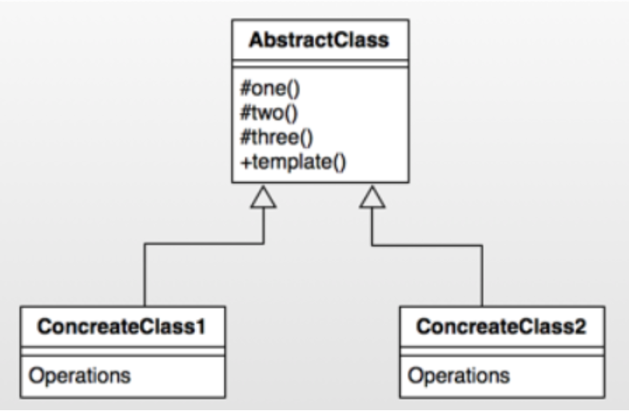

# 模式介绍
定义一个操作中的算法的框架，而将一些步骤延迟到子类中。使得子类可以不改变一个算法的结构即可重定义该算法的某些特定步骤。

个人理解：其实类似于一个基类、基线、通用类、Base类。我们项目中最常用的应该是BaseXXX之类的基础类，通用接口放在该类中，具体实现在各个子类。

**但特别要强调的是这个模式中特别强调了算法的结构，也即某些固定步骤不会变更，某些步骤又可以通过子类进行自定义。**

# 模式的使用场景
- 多个子类有公有的方法，并且逻辑基本相同时。
- 重要、复杂的算法，可以把核心算法设计为模板方法，周边的相关细节功能则由各个子类实现。
- 重构时，模板方法模式是一个经常使用的模式，把相同的代码抽取到父类中，然后通过钩子函数约束其行为。

# UML类图


**角色介绍**
AbstractClass : 抽象类，定义了一套算法框架。
ConcreteClass1 : 具体实现类1；
ConcreteClass2： 具体实现类2；

# Android源码中的实现

一个比较典型的例子就是AsyncTask，虽然被废弃了，但是仍然学习其设计模式。

在使用AsyncTask时，我们都有知道耗时的方法要放在doInBackground(Params... params)中，在doInBackground之前如果还想做一些类似初始化的操作可以写在onPreExecute方法中，当doInBackground方法执行完成后，会执行onPostExecute方法，而我们只需要构建AsyncTask对象，然后执行execute方法即可。我们可以看到，它整个执行过程其实是一个框架，具体的实现都需要子类来完成。而且它执行的算法框架是固定的，调用execute后会依次执行onPreExecute,doInBackground,onPostExecute,当然你也可以通过onProgressUpdate来更新进度。我们可以简单的理解为如下图的模式 :


下面我们看源码，首先我们看执行异步任务的入口, 即execute方法 :

```java
 public final AsyncTask<Params, Progress, Result> execute(Params... params) {
        return executeOnExecutor(sDefaultExecutor, params);
    }

    public final AsyncTask<Params, Progress, Result> executeOnExecutor(Executor exec,
            Params... params) {
        if (mStatus != Status.PENDING) {
            switch (mStatus) {
                case RUNNING:
                    throw new IllegalStateException("Cannot execute task:"
                            + " the task is already running.");
                case FINISHED:
                    throw new IllegalStateException("Cannot execute task:"
                            + " the task has already been executed "
                            + "(a task can be executed only once)");
            }
        }

        mStatus = Status.RUNNING;

        onPreExecute();

        mWorker.mParams = params;
        exec.execute(mFuture);

        return this;
    }

```

可以看到execute方法调用了executeOnExecutor方法，在该方法中会判断该任务的状态，如果不是PENDING状态则抛出异常，这也解释了为什么AsyncTask只能被执行一次。因此如果该任务已经被执行过的话那么它的状态就会变成FINISHED。

继续往下看，我们看到在executeOnExecutor方法中首先执行了**onPreExecute()**方法，并且该方法执行在UI线程。

然后将params参数传递给了mWorker对象的mParams字段，然后执行了exec.execute(mFuture)方法。

我们继续看mWorker的初始化，从代码中看出mWorker实际就是一个工作线程，call方法中调用了**doInBackground**接口，在finally中调用了postResult方法，该方法会发送一个message给内部类，最终调用到onPostExecute方法。
```java
     public AsyncTask(@Nullable Looper callbackLooper) {
         mWorker = new WorkerRunnable<Params, Result>() {
             public Result call() throws Exception {
                 mTaskInvoked.set(true);
                 Result result = null;
                 try {
                     Process.setThreadPriority(Process.THREAD_PRIORITY_BACKGROUND);
                     //noinspection unchecked
                     result = doInBackground(mParams);
                     Binder.flushPendingCommands();
                 } catch (Throwable tr) {
                     mCancelled.set(true);
                     throw tr;
                 } finally {
                     postResult(result);
                 }
                 return result;
             }
         };
 
         mFuture = new FutureTask<Result>(mWorker) {
             @Override
             protected void done() {
                 try {
                     postResultIfNotInvoked(get());
                 } catch (InterruptedException e) {
                     android.util.Log.w(LOG_TAG, e);
                 } catch (ExecutionException e) {
                     throw new RuntimeException("An error occurred while executing doInBackground()",
                             e.getCause());
                 } catch (CancellationException e) {
                     postResultIfNotInvoked(null);
                 }
             }
         };
     }
```
