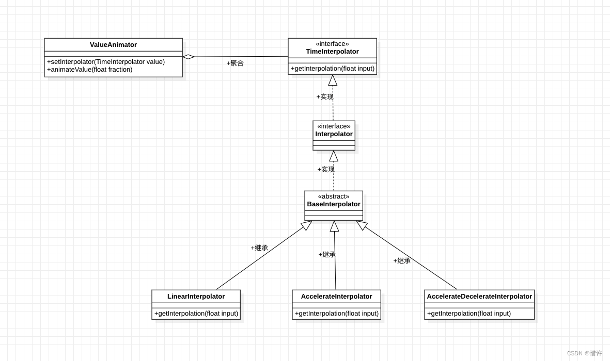

# 模式介绍

策略模式定义了一系列的算法，并将每一个算法封装起来，而且使它们还可以相互替换。

打个比方，策略模式就像「游戏技能栏」—— 随时切换不同技能（算法），Android 里的动画插值器、RecyclerView 布局都用它动态调整核心逻辑！


# 核心思想

**核心要素**：

- **策略接口**：定义算法规范（如 `BaseInterpolator`）
- **具体策略**：实现不同算法（如 `LinearInterpolator`、`BounceInterpolator`）
- **环境类**：持有策略引用并执行（如 `ValueAnimator`）

**类比场景**：

- 玩家（环境类）根据战况切换技能（具体策略）
- 技能效果独立开发，玩家只负责触发


# Android源码中的策略模式

属性动画的差值器就是典型的策略模式。


系统提供了九种默认的差值器分别如下：

| 动画名称                         | 效果                               |
| -------------------------------- | ---------------------------------- |
| AccelerateInterpolator           | 加速差值器，参数越大，速度越来越快 |
| DecelerateInterpolator           | 减速差值器，和加速查值器相反       |
| AccelerateDecelerateInterpolator | 先加速后减速                       |
| AnticipateInterpolator           | 先后退在加速前进                   |
| AnticipateOvershootInterpolator  | 以X/Y轴为轴的旋转度数              |
| BounceInterpolator               | 弹球效果插值                       |
| CycleInterpolator                | 周期运动插值                       |
| LinearInterpolator               | 匀速插值                           |
| OvershootInterpolator            | 先快速完成动画，再回到结束样式     |


我们分析下源码：我们常用的`LinearInterpolator`(线性差值器)、`AccelerateInterpolator`(加速差值器)、`DecelerateInterpolator`（减速差值器）继承`BaseInterpolator`,`BaseInterpolator` 实现`Interpolator`接口，而`Interpolator`又继承于`TimeInterpolator`接口，相关源码如下：


**策略接口：**

```java
// 策略基类
public interface TimeInterpolator {

    /**
     * Maps a value representing the elapsed fraction of an animation to a value that represents
     * the interpolated fraction. This interpolated value is then multiplied by the change in
     * value of an animation to derive the animated value at the current elapsed animation time.
     *
     * @param input A value between 0 and 1.0 indicating our current point
     *        in the animation where 0 represents the start and 1.0 represents
     *        the end
     * @return The interpolation value. This value can be more than 1.0 for
     *         interpolators which overshoot their targets, or less than 0 for
     *         interpolators that undershoot their targets.
     */
    float getInterpolation(float input);
}

// 继承基类，作为统一接口
public interface Interpolator extends TimeInterpolator {}

// 扩展了一个 getChangingConfiguration() 接口，作为抽象类统一给具体策略调用
abstract public class BaseInterpolator implements Interpolator {
    private @Config int mChangingConfiguration;
    /**
     * @hide
     */
    public @Config int getChangingConfiguration() {
        return mChangingConfiguration;
    }

    /**
     * @hide
     */
    void setChangingConfiguration(@Config int changingConfiguration) {
        mChangingConfiguration = changingConfiguration;
    }
}

```


具体策略类：

```java
// 线性策略
public class LinearInterpolator extends BaseInterpolator implements NativeInterpolator {

    public LinearInterpolator() {
    }

    public LinearInterpolator(Context context, AttributeSet attrs) {
    }

    public float getInterpolation(float input) {
        return input;
    }

    /** @hide */
    @Override
    public long createNativeInterpolator() {
        return NativeInterpolatorFactory.createLinearInterpolator();
    }
}


// 加速度策略
public class AccelerateInterpolator extends BaseInterpolator implements NativeInterpolator {
     public AccelerateInterpolator(float factor) {
        mFactor = factor;
        mDoubleFactor = 2 * mFactor;
    }
    
    ...
        
    public float getInterpolation(float input) {
        if (mFactor == 1.0f) {
            return input * input;
        } else {
            return (float)Math.pow(input, mDoubleFactor);
        }
    }

    /** @hide */
    @Override
    public long createNativeInterpolator() {
        return NativeInterpolatorFactory.createAccelerateInterpolator(mFactor);
    }
}
```


**UML类图如下：**




# 总结

策略模式主要用来分离算法，在相同的行为抽象下有不同的具体实现策略。
这个模式很好地演示了开闭原则，也就是定义抽象，注入不同的实现，而从达到很好的可扩展性。
