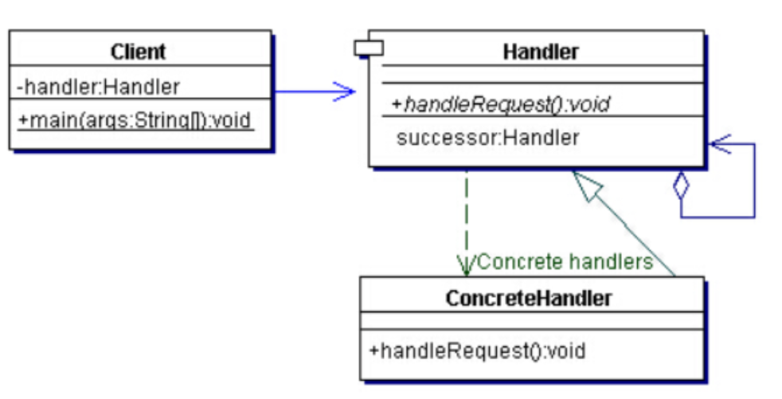
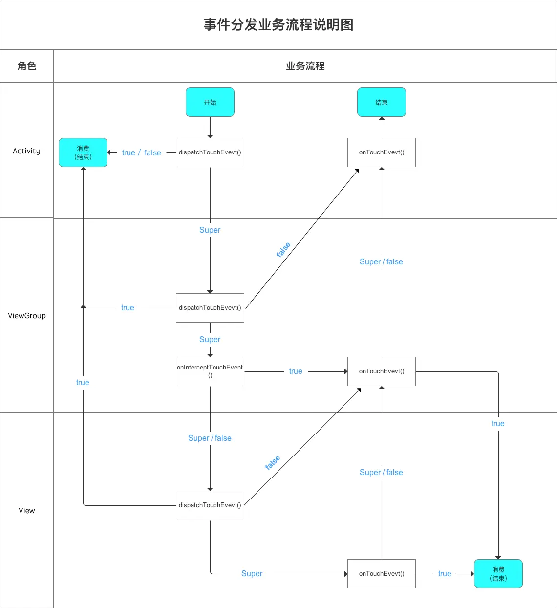

# 模式介绍

一个请求沿着一条“链”传递，直到该“链”上的某个处理者处理它为止。一般在一个请求可以被多个处理者处理或处理者未明确指定时使用。

责任链模式很好理解，就是链式调用，分支语句。

```java
public class SimpleResponsibility {
	public static void main(String[] args) {
		int request = (int) (Math.random() * 3);
		switch (request) {
		case 0:
			System.out.println("SMBother handle it: " + request);
			break;
		case 1:
			System.out.println("Aige handle it: " + request);
			break;
		case 2:
			System.out.println("7Bother handle it: " + request);
			break;
		default:
			break;
		}
	}
}
```


# UML类图



角色介绍：

- Client：客户端
- Handler：抽象处理者
- ConcreteHandler：具体处理者


# Android 源码中的模式实现

责任链模式在 Android 源码中比较类似的实现是 View 的 MotionEvent 事件分发。每当用户接触屏幕的时候，Android 都会将对应的事件包装成一个事件对象从 ViewTree 的顶部自上而下地分发传递。

事件分发机制如下图：



ViewGroup 的 dispatchTouchEvent 方法如下：

```java
    public boolean dispatchTouchEvent(MotionEvent ev) {
        if (mInputEventConsistencyVerifier != null) {
            mInputEventConsistencyVerifier.onTouchEvent(ev, 1);
        }

        // If the event targets the accessibility focused view and this is it, start
        // normal event dispatch. Maybe a descendant is what will handle the click.
        // 处理辅助功能
        if (ev.isTargetAccessibilityFocus() && isAccessibilityFocusedViewOrHost()) {
            ev.setTargetAccessibilityFocus(false);
        }

        boolean handled = false;
        // 安全检查：判断窗口是否被遮挡或处于不安全状态
        if (onFilterTouchEventForSecurity(ev)) {
            final int action = ev.getAction();
            final int actionMasked = action & MotionEvent.ACTION_MASK;

            // Handle an initial down.
            // 处理原始ACTION_DOWN事件
            // 新事件序列的开始
            if (actionMasked == MotionEvent.ACTION_DOWN) {
                // 取消上一个手势的事件
                // Throw away all previous state when starting a new touch gesture.
                // The framework may have dropped the up or cancel event for the previous gesture
                // due to an app switch, ANR, or some other state change.
                cancelAndClearTouchTargets(ev);
                // 重置拦截标志和状态
                resetTouchState();
            }

            // Check for interception.
            // 检查是否拦截事件
            final boolean intercepted;
            if (actionMasked == MotionEvent.ACTION_DOWN
                    // mFirstTouchTarget 保存能处理事件的子view链表
                    || mFirstTouchTarget != null) {
                // 通过 FLAG_DISALLOW_INTERCEPT 标志判断子View是否禁止父容器拦截
                final boolean disallowIntercept = (mGroupFlags & FLAG_DISALLOW_INTERCEPT) != 0;
                if (!disallowIntercept) {
                    // 调用拦截方法
                    intercepted = onInterceptTouchEvent(ev);
                    ev.setAction(action); // restore action in case it was changed
                } else {
                    intercepted = false;
                }
            } else {
                // There are no touch targets and this action is not an initial down
                // so this view group continues to intercept touches.
                // 非DOWN事件且无触摸目标，直接拦截
                intercepted = true;
            }

            // If intercepted, start normal event dispatch. Also if there is already
            // a view that is handling the gesture, do normal event dispatch.
            if (intercepted || mFirstTouchTarget != null) {
                ev.setTargetAccessibilityFocus(false);
            }

            // Check for cancelation.
            final boolean canceled = resetCancelNextUpFlag(this)
                    || actionMasked == MotionEvent.ACTION_CANCEL;

            // Update list of touch targets for pointer down, if needed.
            final boolean isMouseEvent = ev.getSource() == InputDevice.SOURCE_MOUSE;
            final boolean split = (mGroupFlags & FLAG_SPLIT_MOTION_EVENTS) != 0
                    && !isMouseEvent;
            TouchTarget newTouchTarget = null;
            boolean alreadyDispatchedToNewTouchTarget = false;
            if (!canceled && !intercepted) {
                // If the event is targeting accessibility focus we give it to the
                // view that has accessibility focus and if it does not handle it
                // we clear the flag and dispatch the event to all children as usual.
                // We are looking up the accessibility focused host to avoid keeping
                // state since these events are very rare.
                // 如果事件的目标是可访问性焦点，我们将其提供给具有可访问性焦点的视图。
                // 如果它不处理它，我们将清除标志并像往常一样将事件分发给所有子对象。
                // 我们正在寻找以无障碍访问为重点的主机，以避免保持状态，因为这些事件非常罕见。
                View childWithAccessibilityFocus = ev.isTargetAccessibilityFocus()
                        ? findChildWithAccessibilityFocus() : null;

                if (actionMasked == MotionEvent.ACTION_DOWN
                        || (split && actionMasked == MotionEvent.ACTION_POINTER_DOWN)
                        || actionMasked == MotionEvent.ACTION_HOVER_MOVE) {
                    final int actionIndex = ev.getActionIndex(); // always 0 for down
                    final int idBitsToAssign = split ? 1 << ev.getPointerId(actionIndex)
                            : TouchTarget.ALL_POINTER_IDS;

                    // Clean up earlier touch targets for this pointer id in case they
                    // have become out of sync.
                    removePointersFromTouchTargets(idBitsToAssign);

                    final int childrenCount = mChildrenCount;
                    if (newTouchTarget == null && childrenCount != 0) {
                        final float x = ev.getXDispatchLocation(actionIndex);
                        final float y = ev.getYDispatchLocation(actionIndex);
                        // Find a child that can receive the event.
                        // Scan children from front to back.
                        final ArrayList<View> preorderedList = buildTouchDispatchChildList();
                        final boolean customOrder = preorderedList == null
                                && isChildrenDrawingOrderEnabled();

                        // 查找能够接收事件的子View（逆序遍历，优先处理Z轴顶层的View）
                        final View[] children = mChildren;
                        for (int i = childrenCount - 1; i >= 0; i--) {
                            final int childIndex = getAndVerifyPreorderedIndex(
                                    childrenCount, i, customOrder);
                            final View child = getAndVerifyPreorderedView(
                                    preorderedList, children, childIndex);

                            // If there is a view that has accessibility focus we want it
                            // to get the event first and if not handled we will perform a
                            // normal dispatch. We may do a double iteration but this is
                            // safer given the timeframe.
                            if (childWithAccessibilityFocus != null) {
                                if (childWithAccessibilityFocus != child) {
                                    continue;
                                }
                                childWithAccessibilityFocus = null;
                                i = childrenCount;
                            }

                            if (!child.canReceivePointerEvents()
                                    || !isTransformedTouchPointInView(x, y, child, null)) {
                                ev.setTargetAccessibilityFocus(false);
                                continue;
                            }

                            newTouchTarget = getTouchTarget(child);
                            if (newTouchTarget != null) {
                                // Child is already receiving touch within its bounds.
                                // Give it the new pointer in addition to the ones it is handling.
                                newTouchTarget.pointerIdBits |= idBitsToAssign;
                                break;
                            }

                            resetCancelNextUpFlag(child);
                            if (dispatchTransformedTouchEvent(ev, false, child, idBitsToAssign)) {
                                // Child wants to receive touch within its bounds.
                                mLastTouchDownTime = ev.getDownTime();
                                if (preorderedList != null) {
                                    // childIndex points into presorted list, find original index
                                    for (int j = 0; j < childrenCount; j++) {
                                        if (children[childIndex] == mChildren[j]) {
                                            mLastTouchDownIndex = j;
                                            break;
                                        }
                                    }
                                } else {
                                    mLastTouchDownIndex = childIndex;
                                }
                                mLastTouchDownX = x;
                                mLastTouchDownY = y;
                                newTouchTarget = addTouchTarget(child, idBitsToAssign);
                                alreadyDispatchedToNewTouchTarget = true;
                                break;
                            }

                            // The accessibility focus didn't handle the event, so clear
                            // the flag and do a normal dispatch to all children.
                            ev.setTargetAccessibilityFocus(false);
                        }
                        if (preorderedList != null) preorderedList.clear();
                    }

                    if (newTouchTarget == null && mFirstTouchTarget != null) {
                        // Did not find a child to receive the event.
                        // Assign the pointer to the least recently added target.
                        newTouchTarget = mFirstTouchTarget;
                        while (newTouchTarget.next != null) {
                            newTouchTarget = newTouchTarget.next;
                        }
                        newTouchTarget.pointerIdBits |= idBitsToAssign;
                    }
                }
            }

            // Dispatch to touch targets.
            if (mFirstTouchTarget == null) {
                // No touch targets so treat this as an ordinary view.
                handled = dispatchTransformedTouchEvent(ev, canceled, null,
                        TouchTarget.ALL_POINTER_IDS);
            } else {
                // Dispatch to touch targets, excluding the new touch target if we already
                // dispatched to it.  Cancel touch targets if necessary.
                TouchTarget predecessor = null;
                TouchTarget target = mFirstTouchTarget;
                while (target != null) {
                    final TouchTarget next = target.next;
                    if (alreadyDispatchedToNewTouchTarget && target == newTouchTarget) {
                        handled = true;
                    } else {
                        final boolean cancelChild = resetCancelNextUpFlag(target.child)
                                || intercepted;
                        if (dispatchTransformedTouchEvent(ev, cancelChild,
                                target.child, target.pointerIdBits)) {
                            handled = true;
                        }
                        if (cancelChild) {
                            if (predecessor == null) {
                                mFirstTouchTarget = next;
                            } else {
                                predecessor.next = next;
                            }
                            target.recycle();
                            target = next;
                            continue;
                        }
                    }
                    predecessor = target;
                    target = next;
                }
            }

            // Update list of touch targets for pointer up or cancel, if needed.
            if (canceled
                    || actionMasked == MotionEvent.ACTION_UP
                    || actionMasked == MotionEvent.ACTION_HOVER_MOVE) {
                resetTouchState();
            } else if (split && actionMasked == MotionEvent.ACTION_POINTER_UP) {
                final int actionIndex = ev.getActionIndex();
                final int idBitsToRemove = 1 << ev.getPointerId(actionIndex);
                removePointersFromTouchTargets(idBitsToRemove);
            }
        }

        if (!handled && mInputEventConsistencyVerifier != null) {
            mInputEventConsistencyVerifier.onUnhandledEvent(ev, 1);
        }
        return handled;
    }
```