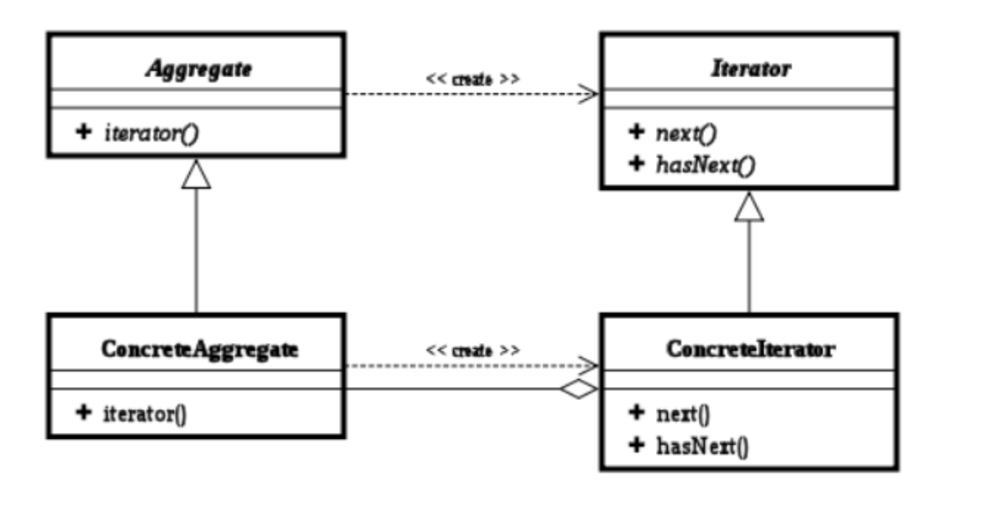

# 模式介绍
迭代器（Iterator）模式，又叫做游标（Cursor）模式。GOF给出的定义为：提供一种方法访问一个容器（container）对象中各个元素，而又不需暴露该对象的内部细节。

# UML类图



**角色介绍**
- 迭代器接口Iterator：该接口必须定义实现迭代功能的最小定义方法集比如提供hasNext()和next()方法。
- 迭代器实现类：迭代器接口Iterator的实现类。可以根据具体情况加以实现。
- 容器接口：定义基本功能以及提供类似Iterator iterator()的方法。
- 容器实现类：容器接口的实现类。必须实现Iterator iterator()方法。

# Android 源码中的使用

实际上，我们常见的java集合基本都有迭代器。以ArrayList为例

java.util.ArrayList
```java
public class ArrayList<E> extends AbstractList<E>
        implements List<E>, RandomAccess, Cloneable, java.io.Serializable {

    ...
    /**
     * Returns an iterator over the elements in this list in proper sequence.
     *
     * <p>The returned iterator is <a href="#fail-fast"><i>fail-fast</i></a>.
     *
     * @return an iterator over the elements in this list in proper sequence
     */
    public Iterator<E> iterator() {
        return new Itr();
    }

    private class Itr implements Iterator<E> {
        public boolean hasNext() {
            return cursor < limit;
        }

        @SuppressWarnings("unchecked")
        public E next() {
            checkForComodification();
            int i = cursor;
            if (i >= limit)
                throw new NoSuchElementException();
            Object[] elementData = ArrayList.this.elementData;
            if (i >= elementData.length)
                throw new ConcurrentModificationException();
            cursor = i + 1;
            return (E) elementData[lastRet = i];
        }

        @Override
        public void forEachRemaining(Consumer<? super E> action) {
            Objects.requireNonNull(action);
            final int size = ArrayList.this.size;
            int i = cursor;
            if (i < size) {
                final Object[] es = elementData;
                if (i >= es.length)
                    throw new ConcurrentModificationException();
                for (; i < size && modCount == expectedModCount; i++)
                    action.accept(elementAt(es, i));
                // update once at end to reduce heap write traffic
                cursor = i;
                lastRet = i - 1;
                checkForComodification();
            }
        }

        final void checkForComodification() {
            if (modCount != expectedModCount)
                throw new ConcurrentModificationException();
        }
    }
}
```

在如上代码中：
- ArrayList中维护一个静态内部类Itr作为迭代器。
- java中的写法一般都是通过iterator()来生成Iterator,保证iterator()每次生成新的实例
- hasNext方法主要判断是否超出当前ArrayList最大值。next方法获取下一个元素。
- forEachRemaining()是java1.8新增的Iterator接口中的默认方法，对集合中剩余的元素进行操作，直到元素完毕或者抛出异常。这里重要的是剩余元素。

**forEachRemaining()解释**
 从如下代码可以看出，当我们使用while循环加if判断break的方式遍历前5个元素后，再使用forEachRemaining()接口遍历，它侧重点在于剩余变量，即未被遍历的元素。
```java
import java.util.*;
public class Test
{
	public static void main(String[] args)
	{
		//创建一个元素类型为Integer的集合
		Collection<Integer> collection =  new HashSet<>();
		for (int i=0;i<10 ;i++) {
			//向集合中添加元素
			collection.add(i);
		}
		//获取该集合的迭代器
		Iterator<Integer> iterator= collection.iterator();
		//调用forEachRemaining()方法遍历集合元素
		int i=0;
		while(iterator.hasNext()) {
			System.out.println(iterator.next());
			i++;
			if (i==5) break;
		}
		System.out.println("--------------");
		//调用forEachRemaining()方法遍历集合元素
		iterator.forEachRemaining(ele -> System.out.println(ele));
		
	}
}
这时输出：
0
1
2
3
4
--------------
5
6
7
8
9
```
