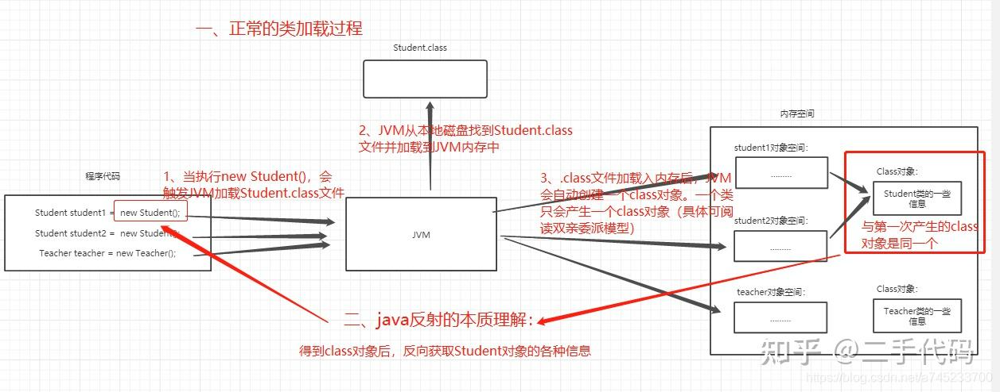
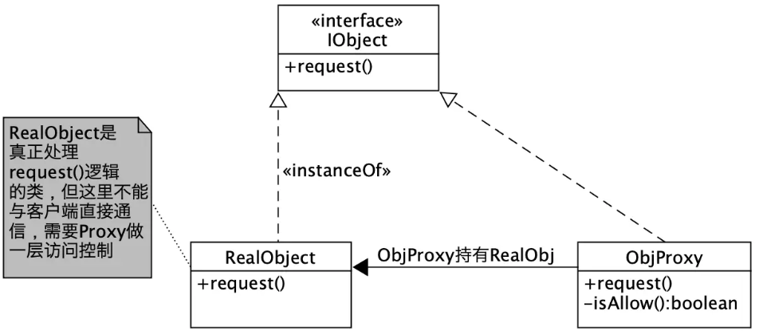
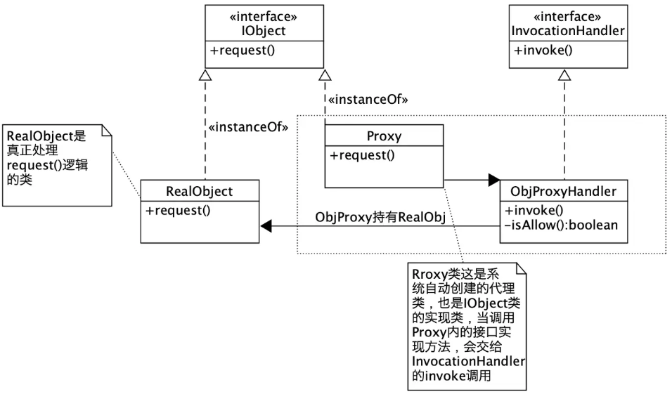

# 反射

## 1 概念

JAVA反射机制是在运行状态中，对于任意一个类，都能够知道这个类的所有属性和方法；对于任意一个对象，都能够调用它的任意一个方法；这种动态获取的信息以及动态调用对象的方法的功能称为java语言的反射机制。

- Java反射机制的核心是在程序运行时动态加载类并获取类的详细信息，从而操作类或对象的属性和方法。
- **本质是JVM得到class对象之后，再通过class对象进行反编译，从而获取对象的各种信息。**
- Java属于先编译再运行的语言，程序中对象的类型在编译期就确定下来了，而当程序在运行时可能需要动态加载某些类，这些类因为之前用不到，所以没有被加载到JVM。
- 通过反射，可以在运行时动态地创建对象并调用其属性，**不需要提前在编译期知道运行的对象是谁。**

## 2 原理



## 3 作用/应用场景

- 如果调用的时来自网络的二进制.class文件，而没有java代码，那么在编写程序时，就无法通过new来实例化对象。
- **注解**本身只起标记作用，但需要利用反射机制，根据注解标记调用注解解释器，执行行为。
- 有的类在用到时再加载到JVM中，减少JVM启动时间
- 动态代理
- 避免将程序写死在代码中，如果将类的类名等信息写在配置文件中，再利用反射机制实例化对象，这样就可以只改配置文件，不用重新编译

## 4 常用类

- Java.lang.Class;

- Java 反射机制的起源和入口，用于获取与类相关的各种信息

- Java.lang.reflect.Constructor;
- Java.lang.reflect.Field;
- Java.lang.reflect.Method;
- Java.lang.reflect.Modifier;

**Class类常用方法**

- getFields()—— 获得类的public类型的属性
- getDeclaredFields()—— 获得类的所有属性
- getField(String name)—— 获得类的指定属性
- getMethods()—— 获得类的public类型的方法
- getMethod (String name,Class [] args)—— 获得类的指定方法
- getConstrutors()—— 获得类的public类型的构造方法
- getConstrutor(Class[] args)—— 获得类的特定构造方法
- newInstance()—— 通过类的无参构造方法创建对象
- getName()—— 获得类的完整名字
- getPackage()—— 获取此类所属的包
- getSuperclass()—— 获得此类的父类对应的Class对象

#  动态代理

## 1 代理模式

代理模式是指**给某一个对象提供一个代理对象，并由代理对象控制对原对象的引用。**它可以在原对象的基础上增强原对象的功能，比如增加日志，增加事务操作等。

个人理解，代理模式就类似于中介，房东（业务类）有卖房（方法）的需求（方法的具体实现），而中介（代理类）要协助房东卖房（实现卖房接口）并且在此基础上，为买方提供一些房子信息、照片、带看房等额外服务（原对象的增强，增加事务操作）

### 1.1 静态代理

静态代理是指在程序运行前就已经存在的编译好的代理类是为静态代理。实现静态代理有四个步骤：

1. 定义`业务接口`
2. `被代理类`实现`业务接口`
3. 定义`代理类`并实现`业务接口`
4. 最后通过`客户端`调用（这里理解为main方法里的内容）



**静态代理实例**

- 业务接口

```java
package com.study.Proxy;

public interface IMyWork {
    void workHard();
}
```

- 被代理类实现业务接口

```java
package com.study.Proxy;

public class MyWorkImpl implements IMyWork {

    @Override
    public void workHard() {
        System.out.println("work hard!");
    }
}
```

- 定义代理类并实现业务接口

```java
package com.study.Proxy;

public class MyWorkProxy implements IMyWork {

    IMyWork work;
    public MyWorkProxy(IMyWork work) {
        this.work = work;
    }

    @Override
    public void workHard() {
        System.out.println("Sleep on time!");
        System.out.println("Eat on time!");
        if (work != null) {
            work.workHard();
        } else {
            System.out.println("error!");
        }
        System.out.println("Play games!");
    }
}
```

- **客户端调用**

```java
package com.study.Proxy;

public class Main {
    public static void main(String[] args) {
        IMyWork myWork = new MyWorkImpl();
        MyWorkProxy myWorkProxy = new MyWorkProxy(myWork);
        myWorkProxy.workHard();
    }
}
```

### 1.2 动态代理

**为什么需要动态代理？**

静态代理中存在一些缺点

1. 代理类和业务类都实现了接口，代码重复
2. 新增接口，两个类都要新增，不好维护
3. 代理对象只服务于一种类型的对象，如果是多类型的，每一种对象都代理，规模稍大就无法胜任

因此需要动态代理。

**动态代理是什么？**

在程序运行期间根据需要**动态创建**`代理类`及其实例来完成具体的功能。



**动态代理实例**

- 接口和实现类和静态代理一样。还是使用`IMyWork.java`和`MyWorkImpl.java`
- 创建`InvocationHandler`接口的实现类

```java
package com.study.Proxy;

import java.lang.reflect.InvocationHandler;
import java.lang.reflect.Method;

public class MyInvocationHandler implements InvocationHandler {
    //这里target引用的类型并不指向具体的接口
    private Object target;

    //创建代理对象时传入具体的业务类对象
    public MyInvocationHandler(Object target) {
        this.target = target;
    }

    //当创建代理对象时，会回调该接口
    @Override
    public Object invoke(Object proxy, Method method, Object[] args) throws Throwable {

        System.out.println("Sleep on time!");
        System.out.println("Eat on time!");
        Object returnValue = method.invoke(target, args);
        System.out.println("Play games!");
        return returnValue;
    }
}
```

- 客户端

```java
package com.study.Proxy;

import java.lang.reflect.Proxy;

public class Main {
    public static void main(String[] args) {
        //创建具体的业务类对象
        IMyWork target = new MyWorkImpl();
        //创建handler，传入具体的业务对象
        //由于未指定具体类型，所以兼容许多不同类型
        MyInvocationHandler handler = new MyInvocationHandler(target);

        //新建一个代理对象，强转为具体业务接口的类型
        IMyWork proxyMyWork = (IMyWork) Proxy.newProxyInstance(
            	//第一个参数指定类加载器，传入当前Main类的类加载器
                Main.class.getClassLoader(),
                //指定代理类和被代理类需要实现的接口
                //这样生成的代理类和被代理类就实现了相同的接口
                target.getClass().getInterfaces(),
                //用来处理方法调用，传入自己实现的handler
                handler);
        proxyMyWork.workHard();
    }
}
```

从代码中可以看出，动态代理并没有和静态代理一样，自己定义代理类，实例化代理对象，而是实现`InvocationHandler`接口，由系统去完成代理类和代理对象的创建。