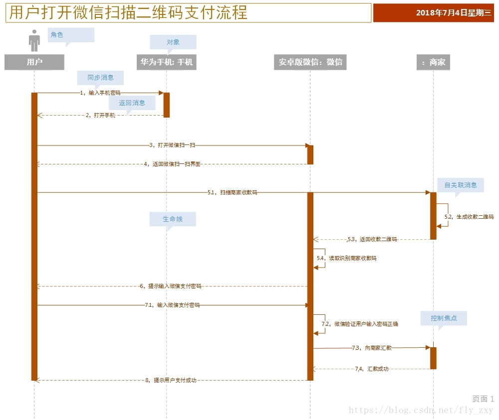
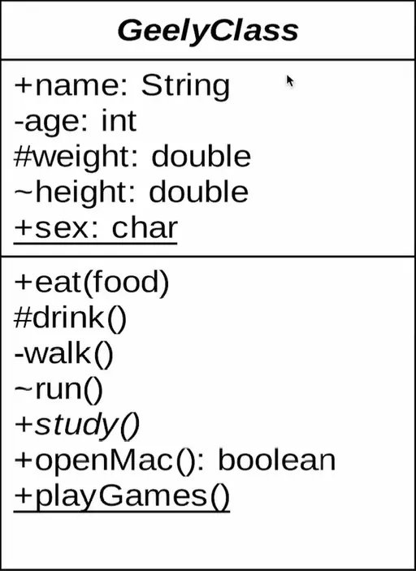
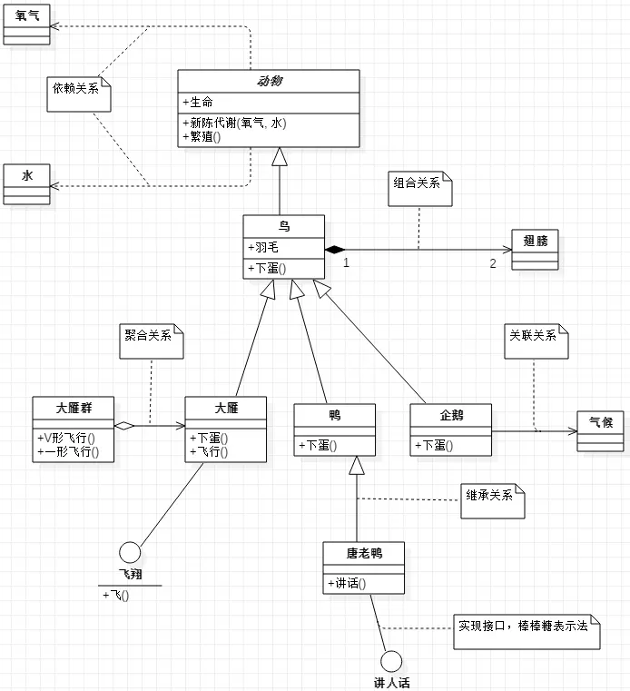
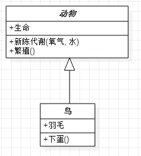
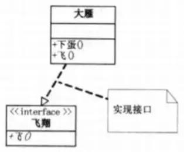
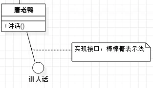
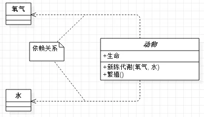
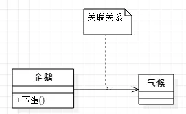
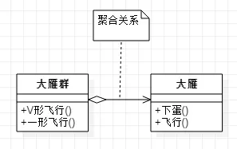
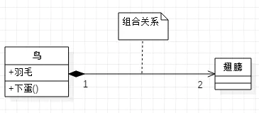

# 时序图


时序图, 是一种UML交互图. 通过描述对象之间发送消息的时间顺序显示多个对象之间的动态协作


## 1 时序图的元素


7种元素


- **角色(Actor)**

  系统角色, 可以是人活着其他系统, 子系统. 以一个小人图标表示.

- **对象(Object)**

  对象位于时序图顶部, 以一个矩形表示, 对象命名方式有三种:

1. 对象名和类名. 例如: loginServiceObject:LoginService
2. 只显示类名,不显示对象. 例如: LoginService
3. 只显示对象名, 不显示类名, 例如: loginServiceObject


- **生命线(LifeLine)**

  每个对象和底部中心都有一条垂直的虚线, 这就是生命线

- **控制焦点(Activation)**

  控制焦点代表时序图中在对象时间线上某段时期执行的操作。以一个很窄的矩形表示。

- **消息(Message)**

  表现代表对象之间发送的信息。消息分为三种类型。

1. **同步消息**: 发送者把**控制**传递给接收者, 之后停止活动, 等待消息的接收者放弃或者返回控制. 一条实线+实心箭头表示. 用以表示同步的意义
2. **异步消息**: 发送者通过消息把信号传递给接收者, 然后继续自己的活动, 不等待接收者返回消息或者控制. 一条实线+大于号表示. 用以表示并发工作的意义
3. **返回消息**: 返回消息表示从过程调用返回.以小于号+虚线表示.


- **自关联消息**

  表示方法的自身调用或者一个对象内的一个方法调用另外一个方法. 以一个半闭合的长方形+下方实心剪头表示

- **组合片段**  (不常用)


## 2 举个例子




# 类图


UML类图种, 类使用包含**类名, 属性, 方法且带有分割线的矩形表示**


## 1 基本组成




解释如下:


```java
"-" 表示private
"#" 表示protected
"~" 表示default
"_" 表示static
斜体表示抽象
```


## 2 类之间的关系





### 2.1 泛化(Generalization)


表示


- 类与类之间的继承关系
- 接口与接口之间的继承关系
- 类对接口的实现


#### (1) 继承


继承使用空心三角形+实线表示


#### (2) 实现


- 使用空心三角形+虚线表示
  
- 使用实线表示
  


### 2.2 依赖


对于两个相对独立的对象，当一个对象负责构造另一个对象的实例，或者依赖另一个对象的服务时，这两个对象之间主要体现为依赖关系。


依赖关系用虚线箭头表示.

如图, 动物依赖氧气和水. 调用新陈代谢方法需要氧气类和水类的实例作为参数




### 2.3 关联


对于两个相对独立的对象，当一个对象的实例与另一个对象的一些特定实例存在固定的对应关系时，这两个对象之间为关联关系。


用实线箭头表示.


企鹅需要‘知道’气候的变化，需要‘了解’气候规律。当一个类‘知道’另一个类时，可以用关联。




### 2.4 聚合


表示一种弱的‘拥有’关系，即has-a的关系，体现的是A对象可以包含B对象，但B对象不是A对象的一部分。 两个对象具有各自的生命周期。


用空心的菱形+实线箭头表示。


每一只大雁都属于一个大雁群，一个大雁群可以有多只大雁。当大雁死去后大雁群并不会消失，两个对象生命周期不同。




### 2.5 组合


组合是一种强的‘拥有’关系，是一种contains-a的关系，体现了严格的部分和整体关系，部分和整体的生命周期一样。


用实心的菱形+实线箭头表示，还可以使用连线两端的数字表示某一端有几个实例。


鸟和翅膀就是组合关系，因为它们是部分和整体的关系，并且翅膀和鸟的生命周期是相同的。

