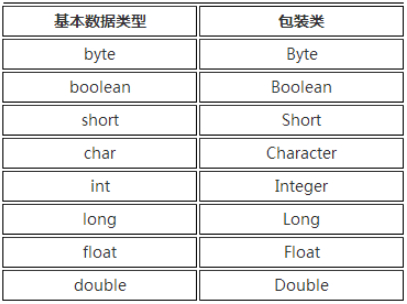
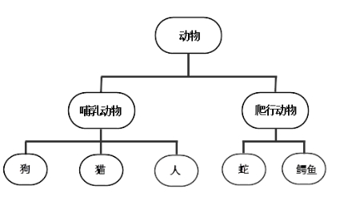
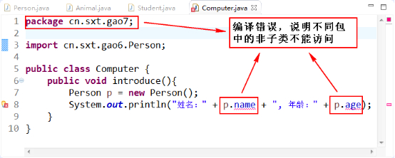
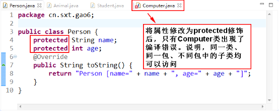
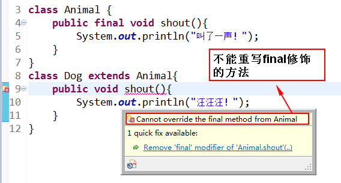
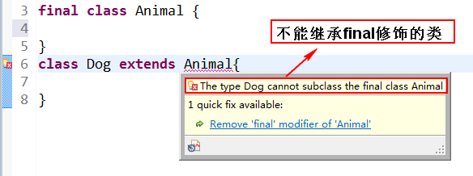
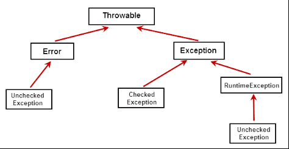

# 1 包装类

**基础**

- 常用的基本数据类型不是对象，但是实际应用中经常需要将基本数据转化成对象，以便于操作。
- Java再设计类时为每个基本数据类型设计了一个对应的类进行代表，这样八个和基本数据类型对应的类统称为包装类（Wrapper Class）。
- 包装类均位于java.lang包，对应关系如图：



包装类

```java
public static void main(String[] args) {
    Integer a = new Integer(3);
    Integer b = Integer.valueOf(20);  //推荐这种写法
    System.out.println(a);
}
```

**用途**

- 作为和基本数据类型对应的类型存在，方便涉及到对象的操作。
- 包含每种基本数据类型的相关属性，如最大值、最小值。
- 包含相关的操作方法

- 作用是：在基本数据类型、包装类对象、字符串之间提供相互之间的转化

**自动装箱**

- 基本类型的数据处于需要对象的环境中时，会自动转为“对象”。
- 只需要 Integer i = 5; 这样的语句就能从基本数据类型转换成包装类

- 因为JVM为我们执行了 Integer i = Integer.valueOf(5) 这样的操作，也就是自动装箱。

**自动拆箱**

- 每当需要一个值时，对象会自动转成基本数据类型。
- 不需要再显式调用 intValue() 等转型方法

- 如 int i = 5; 这个过程就是自动拆箱。

- 自动拆箱通过调用包装类的 intValueOf()、doubleValue() 等方法实现。

# 2 继承

**作用：**

- 实现代码的重用
- 子类是父类的扩展

**举例：动物类的继承**



- 哺乳动物继承了动物
- 动物的特性，哺乳动物都有

**【示例】使用extends实现继承**

```java
public class TestExtends {
    public static void main(String[] args) {
        Student stu = new Student();
        stu.name = "张小凡";
        stu.height = 172;
        stu.rest();
    }
}
 //父类
class Person{           
    String name;
    int height;
    public void rest(){
        System.out.println("休息一会");
    }
}
//子类
class Student extends Person{
    String major;
    public void study(){
        System.out.println("学习两小时");
    }
}
```

父类拥有的变量和方法，子类都有

**要点：**

- 父类也称基类、派生类
- Java只有单继承，没有多继承
- Java中接口有多继承
- 定义一个类，没调用extends，则它的父类是：java.lang.Object。

# 3 重写 override

- 子类可以用自身的行为替换父类的行为
- 重写是实现多态的必要条件

**【示例】方法的重写**

```java
public class TestOverride {
    public static void main(String[] args) {
        Horse h = new Horse();
        h.run();
    }
}
class Vehicle{
    public void run(){
        System.out.println("跑……");
    }
    public void stop(){
        System.out.println("停止!");
    }
}
class Horse extends Vehicle{
    public void run(){                  //继承了父类的run()方法，但是重写
        System.out.println("四蹄纷飞");  //则覆盖了父类的方法
    }
}
```

# 4 String 类

StringBuilder 和 StringBuffer 称为“可变字符序列”，常用StringBuilder类。

**常用方法列表**

- 重载的方法 **public StringBuilder append(…)**

- 添加字符序列，返回自身对象。

- 方法 **public StringBuilder delete(int start,int end)**

- 删除从start开始到end-1为止的一段字符序列，返回自身对象。

- 方法 **public StringBuilder deleteCharAt(int index)**

- 移除此序列指定位置上的 char，返回自身对象。

- 重载的方法 **public StringBuilder insert(…)**

- 在指定位置插入字符序列，返回自身对象。

- 方法 **public StringBuilder reverse()**

- 将字符序列逆序，返回自身对象。

- 方法 **public String toString()**

- 返回此序列中数据的字符串表示形式。

# 5 toString 方法

Object类中定义有 `public String toString()`方法，其返回值是 String 类型。Object 类中 toString方法的源码为：

```
public String toString() {
	return getClass().getName() + "@" + Integer.toHexString(hashCode());
}        //类名+@+16进制的hashcode(哈希值) 
```

**【示例】toString()方法测试和重写toString()方法**

```java
public class TestObject {
    public static void main(String[] args) {
        TestObject to = new TestObject();
        System.out.println(to.toString());
        Person2 p2 = new Person2("小凡", 24);
        System.out.println(p2.toString());
    }
    public String toString(){
        return "测试Object对象";
    }
}
class Person2{
    String name;
    int age;
    @Override
    public String toString(){
        return name+"，年龄："+age;
    }
    public Person2(String name, int age ){
        this.name = name;
        this.age = age;
    }
}
//输出结果：
//    测试Object对象
//    小凡，年龄：24
```

# 6 == 和 equals

== 代表比较双方是否相同。

- 基本类型：判断值是否相等
- 引用类型：判断地址是否相等，即是否为同一个对象

equals方法：public boolean equals(Object obj)

- 提供定义“对象内容相等”的逻辑
- 默认比较两个对象的地址是否相同，是则返回true，否则返回false
- 可以根据实际情况重写equals方法

**【示例】equals方法测试**

```java
public class TestEquals {
    public static void main(String[] args) {
        Object obj;
        String str;
        User u1 = new User(1000,"小凡","123456");
        User u2 = new User(1000,"小凡","123456");
        System.out.println(u1 == u2);
        System.out.println(u1.equals(u2));
    }
}
class User{
    int id;
    String name;
    String pwd;

    public User(int id, String name, String pwd) {
        super();
        this.id = id;
        this.name = name;
        this.pwd = pwd;
    }
}
输出结果：
    false    //值不同，所以是false
    false    //两个对象地址不同，所以是false
```

**【示例】自定义类重写equals方法**

在User类中重写equals方法，作用是：以id为唯一判断依据判断两个对象是否相等。

```java
public class TestEquals {
    public static void main(String[] args) {
    
    ......
    
    }
}
class User{
    
    ......

    public User(int id, String name, String pwd) {
        
    ......
    
    }
    @Override
    public boolean equals(Object obj) {
        if (this == obj)     //如果传进来的对象和本对象相等则返回true
        return true;
        if (obj == null || getClass() != obj.getClass()) 
        return false;        //如果对象为空或对象类型不同则返回false
        User user = (User) obj;    //强制转型
        return id == user.id;      //以id为判断标准
    }
}
//输出结果：
//    false
//    true        //两个对象的id相同，所以是true
```

# 7 super 关键字

**super是直接父类对象的引用**

- 可以通过super来访问父类中被子类覆盖的方法或属性。
- 使用super调用普通方法，语句没有位置限制，可以在子类中随便调用。
- Java默认都会调用super()，一般都可省略。

**【示例】super关键字的使用**

```java
public class TestSuper {
    public static void main(String[] args) {
        ChildClass cc = new ChildClass();
        cc.f();
    }
}
class FatherClass{        //父类
    public int value;
    public void f(){
        value = 100;
        System.out.println("父类值为："+value);
    }
}
class ChildClass extends FatherClass{    //子类
    public int value;
    public void f(){
        super.f();        //调用父类的f()方法
        value = 200;
        System.out.println("子类值为："+value);
        System.out.println(" ------------");
        System.out.println(value);
        System.out.println(super.value);    //输出父类的value的值
    }
}
输出结果为：
    父类值为：100
    子类值为：200
    -------------
    200
    100
```

# 8 继承树追溯

**构造方法调用顺序：**

- 系统默认构造方法第一句总是：super(...)来调用父类对应的构造方法。
- 子类先向上追溯到父类，父类在追溯到Object类
- 再依次向下执行类的初始化和构造方法，直到当前子类为止

```java
public class TestSuper02 {
    public static void main(String[] args) {
        new ChildClass02();    //构造子类对象
    }
}
class FatherClass02{
    public FatherClass02(){
        super();        //不加super()方法，系统默认自动生成
        System.out.println("调用父类");
    }
}
class ChildClass02 extends FatherClass02{
    public ChildClass02(){
        super();    //调用子类构造方法，先上溯到父类
        System.out.println("调用子类");
    }
}
输出结果：
    调用父类
    调用子类        //由输出结果可以看出，即使指构造子类对象，父类对象
                              //的构造方法同样也被调用了
```

# 9 封装

**含义**

- 把复杂的内部细节全部封装起来，只给我们暴露简单的接口。
- 把对象的属性和操作结合为一个独立的整体，并尽可能隐藏对象的内部实现细节。

**优点**

- 提高代码的安全性
- 提高代码的复用性
- “高内聚”：封装细节，便于修改内部代码，提高可维护性
- “低耦合”：简化外部调用，便于扩展和写作

**访问控制符**

|   |   |   |   |   |
|---|---|---|---|---|
|修饰符|同一个类|同一个包|子类|所有类|
|private|√||||
|default|√|√|||
|protected|√|√|√||
|public|√|√|√|√|

- private表示私有，只有自己的类能访问
- default表示默认没有修饰符修饰，只有同一个包的类能访问
- protected表示可以被同一个包的类以及其他包中的子类访问
- public表示可以被该项目的所有包中的所有类访问

**protected访问权限修饰符**

需要注意的是：不同包的非子类无法访问，但是不同包的子类可以访问





**封装的细节**

**类的属性的处理**

- 一般使用private权限
- 提供相应的get/set方法来访问相关属性，这些方法通常是public修饰的，以提供对属性的赋值与读取操作**（注意：boolean变量的get方法是is开头！）**
- 一些只用于本类的辅助性方法可以用private修饰，希望其他类调用的方法用public修饰

**【示例】JavaBean的封装实例**

```java
public class TestPrivate {
    private int id;
    private String name;
    private int age;
    private boolean man;

    public void setName(String name){    //setName命名有规则，不能乱写
        this.name = name;
    }
    public String getName(){
        return this.name;         
    }
    public void setAge(int age){     //如果想要对年龄进行条件限制或其他操作
        if ( age>=1 && age<=130 ) {  //只需要在setAge中设置，不需要在外部
            this.age = age;          //类设置。实现了高内聚
        }    
        else{
            System.out.println("请输入正常的年龄！");
        }
    }
    public int getAge(){
        return this.age;
    }
}
class Person3{
    public static void main(String[] args) {
        TestPrivate tp = new TestPrivate();
//        tp.age = 14;
        tp.setAge(14);        //设置年龄
        System.out.println(tp.getAge());    //通过getAge获取刚刚赋的值
    }
}
输出结果：
    14
如果输入值为-14，则输出结果为：
    请输入正常的年龄！
    0
```

# 10 多态

多态是指同一个方法调用，由于对象不同可能会有不同的行为。

**多态的要点**

- 多态是方法的多态，与属性无关
- 存在的3个必要条件：继承、方法重写、父类引用指向子类对象
- 父类引用指向子类对象后，用父类引用调用子类重写的方法时，多态就出现了。

```java
public class TestPolym {
    public static void main(String[] args) {
        Animal a = new Animal();
        animalShout(a);
        Dog d = new Dog();
        animalShout(d);
        animalShout(new Cat());
    }    //通过多态可以实现不同子类对象对方法的调用而只需要一个animalShout方法
    static void animalShout(Animal a){
        a.shout();
    }   //传的具体是哪一个类就调用哪一个类的方法。大大提高了程序的可扩展性。
}
class Animal {
    public void shout() {
        System.out.println("叫了一声！");
    }
}
class Dog extends Animal {
    public void shout() {
        System.out.println("汪汪汪！");
    }
    public void seeDoor() {
        System.out.println("看门中....");
    }
}
class Cat extends Animal {
    public void shout() {
        System.out.println("喵喵喵喵！");
    }
}        // 有了多态，只需要让增加的这个类继承Animal类就可以了。
         //如果没有多态，我们这里需要写很多重载的方法。
         //每增加一种动物，就需要重载一种动物的喊叫方法。非常麻烦。
输出结果：
    叫了一声！
    汪汪汪！
    喵喵喵喵！
```

**对象的转型**

- 父类引用指向子类对象。这个过程为向上转型，属于自动类型转换。
- 向上转型后的父类引用变量只能调用它编译类型的方法，不能调用它运行时类型的方法。这时，我们就需要进行类型的强制转换，我们称之为向下转型！

```
public class TestCasting{
    public static void main(String[] args) {
        Object obj = new String("沈阳理工大学"); // 向上可以自动转型
        // obj.charAt(0) 无法调用。编译器认为obj是Object类型而不是String类型

        String str = (String) obj; // 向下转型
        System.out.println(str.charAt(0)); // 位于0索引位置的字符
        System.out.println(obj == str); // true.他们俩运行时是同一个对象
    }
}
```

# 11 final 关键字

**final关键字的作用**

- 修饰变量：被他修饰的**变量不可改变**。一旦赋了初值，就不能被重新赋值。

  
`final double PI = 3.1415926535898`  

- 修饰方法：该方法**不可被子类重写**。但是可以重载！

  
`final void study(){}`  

- 修饰类：修饰的类**不能被继承**。比如Math、String

  
`final class A{}`  

**【示例1】final修饰方法**



**【示例2】final修饰类**



# 12 抽象方法和抽象类

**抽象方法：**

- 使用abstract修饰的方法，没有方法体，只有声明。
- 子类必须要给抽象方法提供具体的实现。

**抽象类：**

- 包含抽象方法的类就是抽象类。
- 通过abstract方法定义规范，然后要求子类必须定义具体实现。
- 通过抽象类，可以做到严格限制子类的设计，使子类之间更加通用。
- 意义在于：为子类提供统一的、规范的模板。

**【示例】抽象类和抽象方法的基本用法**

```java
public abstract class TestAbstract {
    public abstract void test();
    public static void main(String[] args) {
        TestAbstract ta = new Childclass();
        ta.test();
    }
}
class Childclass extends TestAbstract{
    public void test(){
        System.out.println("实现抽象类");
    }
}
```

**要点**

- 有抽象方法的类只能定义成抽象类
- 抽象类不能实例化，即不能用new来实例化抽象类
- 抽象类可以包含属性、方法、构造方法。但是构造方法不能用来new实例，只能用来被子类调用。
- 抽象类只能被继承。
- 抽象方法必须被子类实现。

# 13 接口

**与抽象类的区别**

- 接口就是比“抽象类”还“抽象”的“抽象类”。
- 实现了规范和具体实现的分离。
- 接口不提供任何实现，接口中所有方法都是抽象方法
- 接口是两个模块之间的通信的标准，通信的规范
- 只能定义常量，不能定义变量

**声明格式**

```
[访问修饰符]  interface 接口名   [extends  父接口1，父接口2…]  {
常量定义；  
方法定义；
}
```

**详细说明**

- 访问修饰符：只能是public或者默认
- 接口名：和类名采用相同命名机制
- extends：接口可以多继承
- 常量：接口中的属性只能是常量，默认为：public static final（可以不写）修饰。
- 方法：方法只能是：public abstract，可省略。

**要点**

- 子类通过implements来实现接口中的规范。
- 接口不能创建实例，但是可用于声明引用变量类型。
- 一个类实现了接口，必须实现接口中所有的方法，并且这些方法只能是public。

**【示例】接口的创建和实现**

```java
public class MyInterface {
    public static void main(String[] args) {
        Angel a = new Angel();
//      Volant a = new Angel();  //只能实现Volant接口中的fly()方法  
        a.helpOther();
        a.fly();
    }
}
interface Volant{
    int HEIGHT = 1000;
    void fly(); //public abstract
}
interface Honaest{
    void helpOther();
}
class Angel implements Volant,Honaest{  //实现类可以实现多个父接口
    public void helpOther(){
        System.out.println("Help others!");
    }
    public void fly(){
        System.out.println("I believe I can fly!");
    }
}
输出结果：
    Help others!
    I believe I can fly!
```

**接口的多继承**

- 接口完全支持多继承。
- 子接口扩展某个父接口，将会获得父接口中所定义的一切。

```
interface A {
    void testa();
}
interface B {
    void testb();
}
/**接口可以多继承：接口C继承接口A和B*/
interface C extends A, B {
    void testc();
}
public class Test implements C {
    public void testc() {
    }
    public void testa() {
    }
    public void testb() {
    }
}
```

# 14 内部类

**非静态内部类**

- 必须即存在一个外部类对象里。如果有一个非静态内部类对象那么一定存在对应的外部类对象。
- 非静态内部类可以直接访问外部类的成员，但外部类不能直接访问非静态内部类成员。
- 非静态内部类不能有静态方法、静态属性和静态初始化块。
- 成员变量访问要点

- 内部类里方法的局部变量：变量名。
- 内部类属性：this.变量名。
- 外部类属性：外部类名.this.变量名。

**静态内部类**

```
static class ClassName{
    //类体
}
```

- 存在静态内部类对象，不一定存在对应的外部类对象。
- 静态内部类的实例方法不能直接访问外部类的示例方法。
- 静态内部类看做外部类的一个静态成员。
- 通过 “静态内部类.名字” 的方式访问静态内部类的静态成员。
- 通过 “new 静态内部类()” 访问静态内部类的实例。

**【示例】静态内部类**

```java
class Outer{
    //相当于外部类的一个静态成员
    static class Inner{
    }
}
public class TestStaticInnerClass {
    public static void main(String[] args) {
        //通过 new 外部类名.内部类名() 来创建内部类对象
        Outer.Inner inner =new Outer.Inner();
    }
}
```

# 15 异常

**处理过程**

- **抛出异常：**在执行一个方法时，如果发生异常，则这个方法生成代表该异常的一个对象，停止当前执行路径，并把异常对象提交给JRE。
- **捕获异常：**JRE得到该异常后，寻找相应的代码来处理该异常。JRE在方法的调用栈中查找，从生成异常的方法开始回溯，直到找到相应的异常处理代码为止。

**异常分类**

- 所有异常的根类为java.lang.Throwable
- Throwable下面又派生两个子类：Error和Exception



**Error**

- 程序无法处理的错误，表示运行应用程序中较严重问题。
- 大多错误与人无关，而表示JVM（Java虚拟机）出现的问题

**Exception**

- 是程序本身能够处理的异常
- Exception类是所有异常类的父类

## 15.1 捕获异常

**通过3个关键词来实现：try-catch-finally**

- try来执行一段程序，如果出现异常，系统抛出一个异常
- 可以通过它的类型来捕获（catch）并处理它
- 最后一步时通过finally语句为异常处理提供一个统一的出口，finally所指定的代码都要被执行
- catch语句可以有多条，finally语句最多只能有一条

**详解**

- try

- 在执行过程中，当任意一条语句产生异常时，就会跳过该条语句中后面的代码。
- 代码中可能会产生并抛出一种或几种类型的异常对象，它后面的catch语句要分别对这些异常做相应的处理。

- catch

- toString ()方法，显示异常的类名和产生异常的原因。
- getMessage()方法，只显示产生异常的原因，但不显示类名。
- printStackTrace()方法，用来跟踪异常事件发生时堆栈的内容。
- 先捕获子类异常再捕获父类异常，越是顶层的类，越放在下面。

**【示例】**

```java
public static void main(String[] args) {
    FileReader reader = null;
    try {
        reader = new FileReader("f:/b.txt");
        char c1 = (char)reader.read();
        System.out.println(c1);
    } catch (FileNotFoundException e) {     //子类异常在父类异常前面
        e.printStackTrace();
    } catch (IOException e){
       e.printStackTrace();
    } finally {
        try {
            if(reader!= null){
                reader.close();
            }
        } catch (IOException e){
            e.printStackTrace();
        }
    }
}
```

## 15.2 抛出异常

当异常产生时，不一定立刻处理它，可以再把异常throws出去

在一些情况下，当前方法并不需要处理发生的异常，而是向上传递给调用它的方法处理。

如果一个方法抛出多个已检查异常，就必须在方法的首部列出所有的异常，之间以逗号隔开。

**【示例】典型代码**

```java
import java.io.FileNotFoundException;
import java.io.FileReader;
import java.io.IOException;

public class TestClassException {
    public static void main(String[] args) {
        try {
            readFile("joke.txt");
        } catch (FileNotFoundException e) {
            System.out.println("所需文件不存在");
        } catch (IOException e) {
            System.out.println("文件读写错误");
        }
    }
    public static void readFile(String filename) throws FileNotFoundException, IOException{
        FileReader in = new FileReader(filename);
        int tem = 0;
        try {
            tem = in.read();
            while (tem != -1) {
                System.out.println((char) tem);
                tem = in.read();
            }
        } finally {
            in.close();
        }
    }
}
```