# Java 虚拟机

Java虚拟机需要解决的核心问题：

1. 将开发人员编写的Java代码编译为中间状态的Bytecode
2. 再在运行阶段针对具体的平台，将字节码翻译为目标平台对应的机器码

JVM中的daemon线程是VM自身使用的线程，比如执行垃圾回收操作的工作线程

**为什么需要JVM**

Java文件必须先通过编译器javac，将代码编译为.class文件，然后JVM把class文件解释成各个平台可以识别的机器码，最终实现跨平台运行代码。

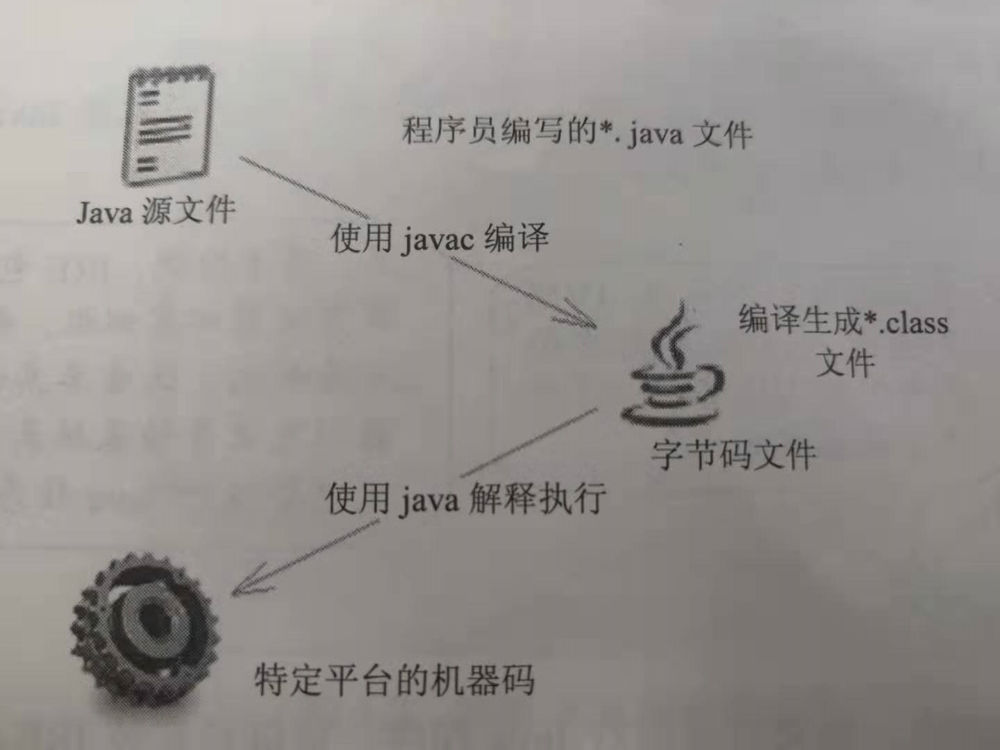

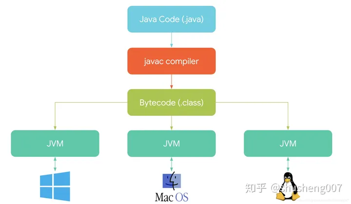

## 1 JVM架构核心模块

### 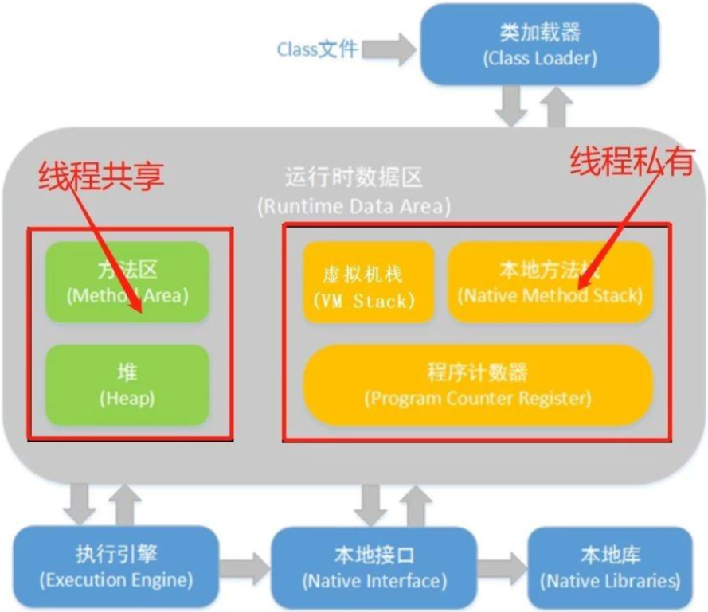

## 2 类加载器（ClassLoader）

类加载器帮助应用程序将字节码流以自定义的方式加载到虚拟机中。

**ClassLoader类型：**

- Bootstrap ClassLoader

- 由C/C++语言编写完成，它加载的类通常位于`[JAVA_HOME]/lib`中

- Extension ClassLoader

- 负责JRE扩展目录中的各种类的加载，例如`[JAVA_HOME]/lib/ext`中的内容

- System ClassLoader

- 应用程序类加载器，用于加载CLASSPATH中的各种类对象，可通过`ClassLoader.getSystemClassLoader()`获取。应用没有自定义ClassLoader，则默认使用System ClassLoader

- User ClassLoader

- 由应用程序自己定义，继承自`java.lang.ClassLoader`

**双亲委派模型**

1. 首先，用户自定义的ClassLoader（最底层实现）在Cache中查询被加载对象是否存在，如果存在就直接返回结果
2. 不存在则会优先委派它的上一级（System ClassLoader）执行加载动作
3. System ClassLoader也遵循同样的逻辑，直到模型最顶端
4. 只有当父类类加载器反馈无法完成该加载请求时，子类才会尝试自己去加载。

注意：在Cache中查询和类加载器加载是两个不同的概念。

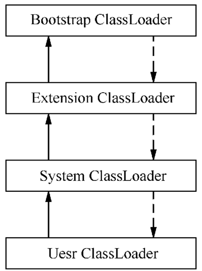

**ClassLoader加载流程**

1. Loading：**查找和加载**目标类数据
2. Linking：检验目标类是否合法有效

1. Verification
   **检验**加载的数据是否合法
2. Preparation
   为类变量和其他数据**分配**内存空间，并**初始化为默认值**
3. Resolution
   将符号引用**转换**为直接引用的过程
   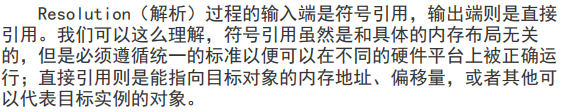

1. Initialization
   为上述步骤中的对象做**初始化**操作

## 3 运行时数据区（Runtime Data Areas）

Runtime Data Areas是JVM在程序运行过程中所需的数据区域，由Stack、Heap、MethodArea、Program Counter Register多个部分组成

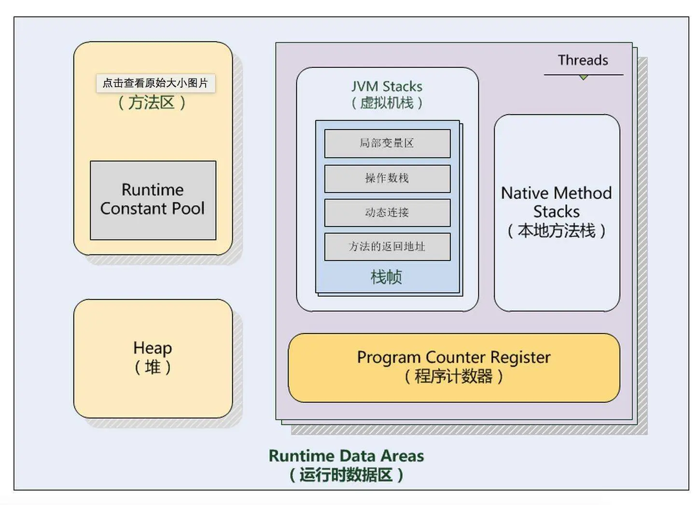

### 3.1 程序计数器（Program Counter Register）

- 线程私有
- 可以看作是当前线程执行的字节码的**行号指示器**
- 虚拟机规范中**唯一没有OutOfMemoryError的区域**。
- **用来在线程切换后能恢复到正确的执行位置**，各个线程的计数器互不影响，独立存储
- 字节码解释器工作时就是通过改变这个计数器的值来选取下一条需要执行的字节码指令

### 3.2 虚拟机栈（VM Stack）

- 线程私有
- **每个方法被执行的时候都会创建一个栈帧用于存储局部变量表，操作栈，动态链接，方法出口等信息**
- 每一个方法被调用的过程就对应一个栈帧在虚拟机栈中从入栈到出栈的过程
- 虚拟机栈执行的是Java方法服务

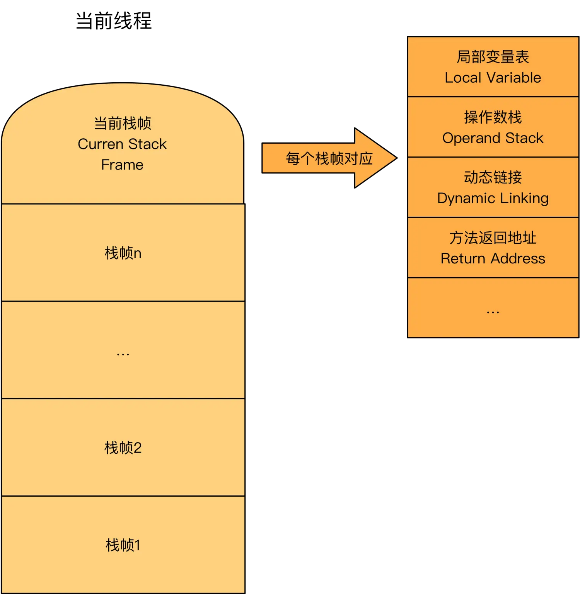

### 3.3 本地方法栈（ Native Method Stack）

- 线程私有
- 为虚拟机使用到的Native方法服务

### 3.4 堆（Heap）

- 线程共享
- Java虚拟机管理内存最大的一块内存区域
- GC管理的主要区域

java虚拟机规范对这块的描述是:**所有对象实例及数组都要在堆上分配内存**。

但随着**JIT编译器**的发展和**逃逸分析技术**的成熟，这个说法也不是那么绝对，但是大多数情况都是这样的。

**即时编译器**:可以把Java的字节码（包括需要被解释的指令的程序）转换成可以直接发送给处理器的指令的程序

**逃逸分析**:通过逃逸分析来决定某些实例或者变量是否要在堆中进行分配，如果开启了逃逸分析，即可将这些变量直接在栈上进行分配，而非堆上进行分配。这些变量的指针可以被全局所引用，或者其其它线程所引用。

### 3.5 方法区（Method Area）

- 线程共享
- 存放每个Class结构中的运行时常量池、方法数据、方法的源代码等

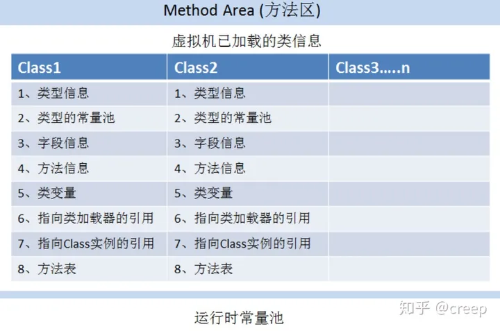

**JVM为什么使用元空间替换永久代？**

1. 避免OOM异常，元空间存在于本地内存，理论上本地内存足够就不会出现OOM
2. 当使用元空间时，可以加载多少类的元数据由系统的实际可用空间来控制，不需要开发人员设置永久代大小

# 垃圾回收

堆内存分为：新生代和老年代。

内存大小：

- 新生代:老年代=1:2
- Eden:S0:S1=8:1:1

方法区不在堆内存中

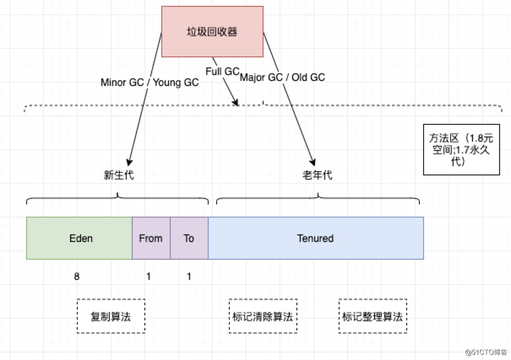

## 1 分代垃圾回收机制

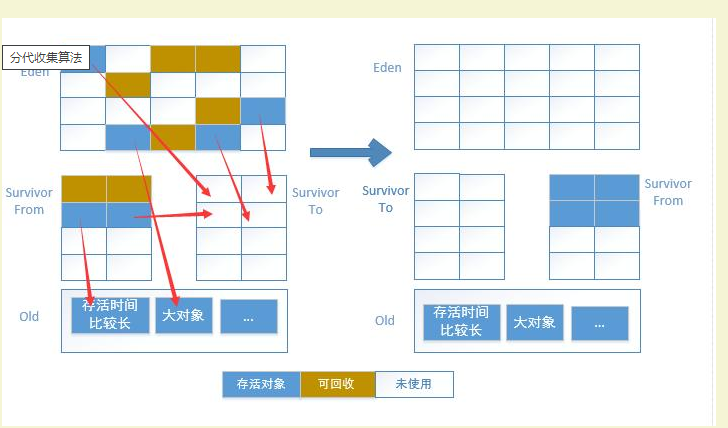

1. 内存空间的申请请求首先考虑从Eden区分配，新创建的对象会被分配到新生代中
2. 当Eden区无法满足请求（即内存占满），触发一次 Minor GC，清理Eden、From Survivor区中的垃圾

1. 清理完成后，Eden、From Survivor中无法被回收的对象会被转移到To Survivor区
2. 互换两个Survivior区的标记，From变为To，To变为From，这样就保证了To区始终为空

1. 然后根据以下条件，将年轻代对象复制到老年代空间中

1. Survivor已满，则会进行复制
2. 对象的存活时间达到一定阈值：每执行一次Minor GC，年龄增加1，超过阈值（默认15）后对象会被复制到老年代空间

1. 如果老年代空间满了，则会触发一次 Full GC。若Full GC无法满足程序的内存请求，则很可能触发OOM报错

**老年代空间分配担保规则**

Minor GC前，JVM会比较当前新生代中所有**对象的大小**和老年代**可用空间的大小**

1. 可用空间大小>新生代对象大小，直接触发Minor GC
2. 可用空间大小<新生代对象大小，则比较**老年代可用空间大小**是否大于之前每次Minor GC后**进入老年代的对象的平均大小**

1. 大于，则触发Minor GC，GC后S区和老年代都放不下，则触发Full GC
2. 小于，触发Full GC

Full = Minor + Major

**判断对象是否存活**

主流使用“可达性分析算法”

基本思路：

- 通过“GC Roots”对象为起点，搜索所有经过的路径为引用链
- 当一个对象到GC Roots没有任何引用跟它连接则证明对象是可回收的

**可以作为GC Roots的对象：**

1. 虚拟机栈(栈桢中的本地变量表)中的引用的对象
2. 方法区中的类静态属性引用的对象，一般指被static修饰引用的对象，加载类的时候就加载到内存中
3. 方法区中常量引用的对象
4. 本地方法栈中JNI引用的对象

**要真正宣告死亡需要两个过程：**

1. 可达性分析后没有发现引用链
2. 查看对象是否有重写finalize方法

1. 如果有重写且在方法内完成自救（比如再建立引用），则不会进行回收。（注意：一个类的finalize只执行一次，这就会出现一样的代码第一次自救成功第二次失败的情况）
2. 如果类重写finalize且还没调用过，会将这个对象放到一个叫做F-Queue的序列里，这边finalize不承诺一定会执行，这么做是因为如果里面死循环的话可能会使F-Queue队列处于等待，严重会导致内存崩溃

## 2 垃圾回收算法

### 2.1 标记-清除 算法

1. **标记阶段**：遍历所有的GC Roots对象，对从GC Roots对象可达的对象都打上一个标识标识一般在对象的header中），将其记录为可达对象
2. **清除阶段**：遍历堆内存，回收所有没有标记为可达的对象

**缺点：**

1. 效率低。两个阶段都需要遍历，所以耗时严重。且GC时需要停止应用程序，体验较差
2. 空间问题。标记清除会产生大量不连续的内存碎片，导致可能无法给大对象分配内存

### 2.2 复制算法（Minor GC）

1. 将内存分为相等大小的A、B两块，每次只是用其中一块
2. 当A内存用完，将可达的对象复制到B内存
3. 清除A内存所有对象

**优点：**不产生内存碎片；少遍历一次，效率提高

**缺点：**

1. 将内存缩小为原来的一半，浪费了一半内存空间，代价太高
2. 若对象存活率很高，那复制一遍需要的时间也是不容忽视的

因此，目前主流虚拟机使用复制算法来回收新生代对象，也不需要按照1：1划分内存空间，而是分为Eden、S0、S1三个区域，比例8:1:1，也即上面提到的分代垃圾回收机制中新生代的垃圾回收方式。

### 2.3 标记-整理算法（Major GC）

1. 标记阶段：与标记-清除算法一致
2. 整理阶段：让所有存活的对象，都向内存的一端移动，然后直接清理吊端边线之外的内存

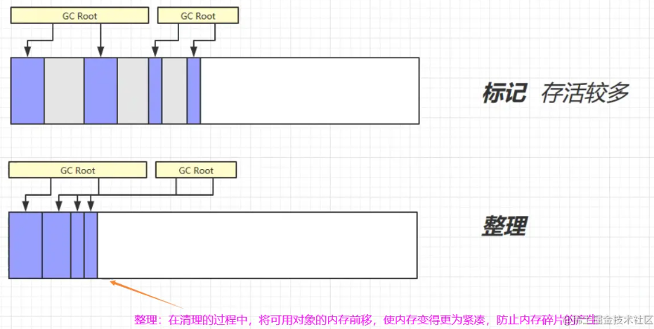

## 3 常见垃圾回收器

### 3.1 CMS垃圾回收器

CMS 全称 Concurrent Mark Sweep 并发标记清除垃圾回收器。是一种以获取最短停顿时间为目的的垃圾回收器。

任何垃圾回收器在进行工作的时候都会出现 STW，Stop the World 停止用户进程

整个实现过程分为五个步骤

1. **初始标记**：暂停所有线程，用可达性分析来标记对象，这也是 CMS 垃圾回收器第一个 STW 的时候
2. **并发标记**：并发标记的时候 GC 线程和用户线程是同时存在的，这个过程中会记录所有可达的对象（但是这个过程结束过后由于用户线程一直在运行所以还会产生新的引用更新）
3. **并发预清理**：这个阶段用户线程和 GC 线程同时运行，GC 线程会进行一下预清理的动作
4. **重新标记**：重新标记这个阶段会暂停用户线程，将上一步并发标记过程中用户线程引起的更新进行修正，这个时间会比初始标记时间长，但是会比并发标记时间短一点
5. **并发清除**：在所有需要清理的对象都被标记完过后就会执行最后一步清理的动作。清理的时候用户线程是可以继续运行的，GC 线程只清理标记的区域

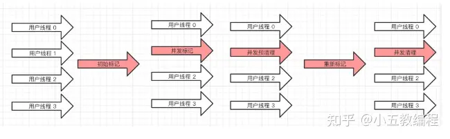

### 3.2 G1垃圾回收器

G1 全称 Garbage-First 是一种面向服务器的垃圾回收器，通过将堆内存划分为多个 Region 来实现可预测的停顿时间模型。

G整个实现过程分为四个步骤

1. **初始标记**：通过可达性分析标记 GC Roots 的直接关联对象，这个阶段与 CMS 一样需要 STW
2. **并发标记**：并发标记是通过 GC Roots 找到存活的对象，这个阶段 GC 线程是与用户线程同时运行的，并且这个阶段的时间比初始标记长
3. **最终标记**：最终标记跟 CMS 的重新标记一样，也是为了修正并发标记过程中因用户线程继续运行而导致产生新的引用更新；同样的这里也需要 STW
4. **筛选回收**：筛选回收这里会对每个 Region 的回收成本进行排序，根据用户期望的停顿时间来制定收回计划，这也就是可预测的停顿时间模型的体现之处，这个阶段 GC 线程是与用户线程同时运行的。

在 G1 当中，新生代和老年代已经不再是物理隔离，而都是被划分一个个 Region 区域。正是由于这种可预测的时间停顿模型让 G1 成为了一个高吞吐量的垃圾回收器。

G1 能充分利用 CPU，多核环境下可以缩短 STW 的时间。