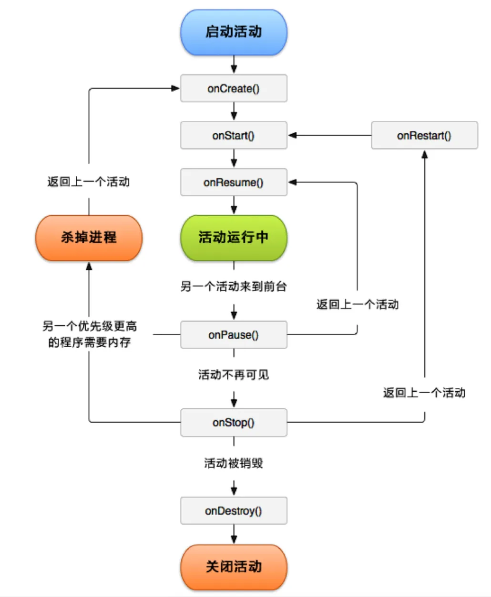
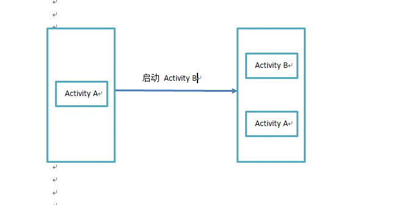
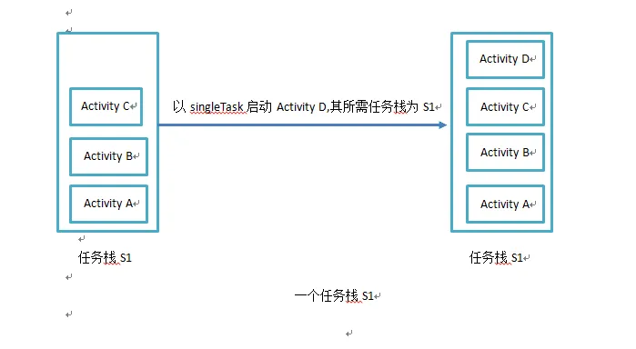
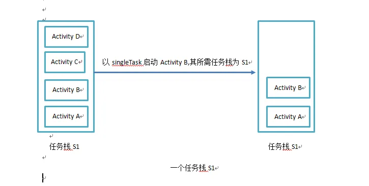
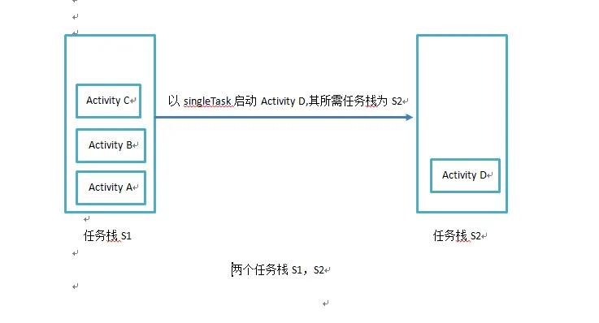
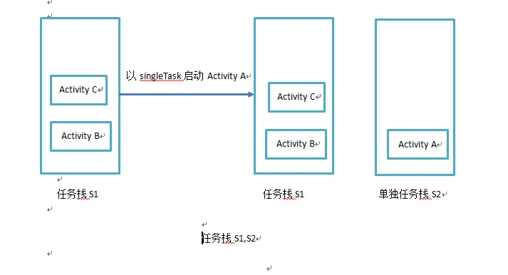
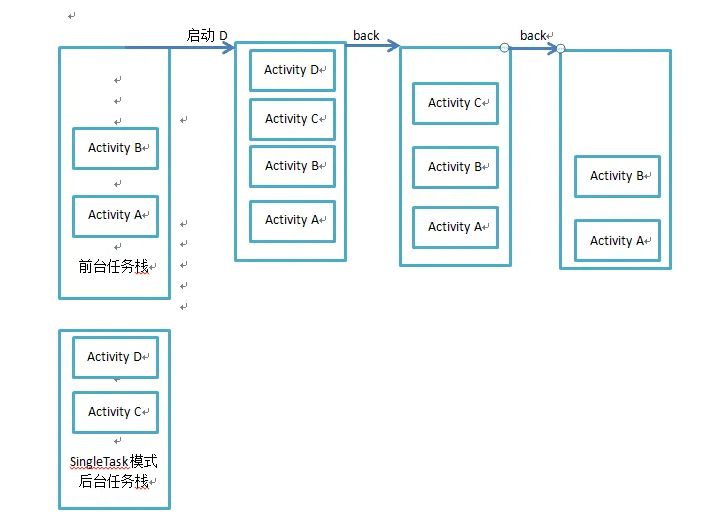
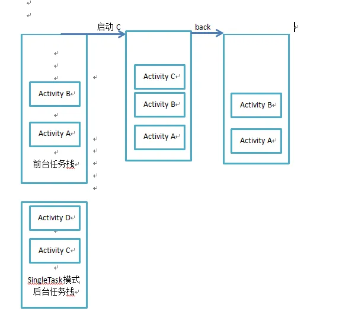

# 1 简介


- Activity 是一种可以包含用户界面的组件, 用于和用户进行交互.
- 一个应用程序可以有零个或多个 Activity, 但是没有 Activity 的很少见

# 2 基本用法

#### 2.1 使用 Android Studio 手动创建一个 Activity

右键包→New→Activity→Empty Activity

- Generate Layout 表示会自动为 MainActivity 创建一个对应的布局文件
- Launcher Activity 表示会自动将 MainActivity 设置为当前项目的主 Activity.
- Backwards Compatibility 表示会为项目启动向下兼容旧版系统的模式


需要知道, 项目中的任何 Activity 都应该重写 onCreate() 方法

```kotlin
class Mainactivity : AppCompatActivity() {
    override fun onCreate(savedInstancesState: Bundle?) {
        super.onCreate(savedInstanceState)
    }
}
```

#### 2.2 布局文件

android:layout_width="match_parent"
当前元素的宽度和父元素的宽度一样

android:layout_height="wrap_content"
当前元素的高度只能刚好包含里面的内容

#### 2.3 在 Activity 中加载这个布局


```kotlin
class MainActivity : AppCompatActivity() {
    override fun onCreate(savedInstancesState: Bundle?) {
        super.onCreate(savedInstanceState)
        setContentView(R.layout.first_layout)
    }
}
```


可以看到, 这里调用了 setContentView() 方法来给当前 Activity 加载一个布局. 该方法中传入的是一个布局文件的 id

值得一提的是, 项目中添加的任何资源都会在R文件种生成一个相应的资源 id, 因此在创建 first_layout.xml 时, 其 id 就已经添加到 R 文件中了


#### 2.4 AndroidManifest 文件中注册

所有的 Activity 都需要在 AndroidManifest.xml 中进行注册才能生效.

```xml
<manifest xmlns:android="http://schemas.android.com/apk/res/android"
    package="com.sunrise.ledsgpioclient">
    <application
        android:allowBackup="true"
        android:icon="@mipmap/ic_launcher"
        android:label="@string/app_name"
        android:roundIcon="@mipmap/ic_launcher_round"
        android:supportsRtl="true">
        <activity android:name=".MainActivity">
            <intent-filter>
                <action android:name="android.intent.action.MAIN" />
                <category android:name="android.intent.category.LAUNCHER" />
            </intent-filter>
        </activity>
    </application>
</manifest>
```


Activity 的注册声明放在  标签内, 通过  标签来对 Activity 进行注册. 在  标签中, 我们使用 android:name 指定具体注册哪个 Activity, .MainActivity 表示 com.sunrise.ledsgpioclient.MainActivity. 由于最外层已经指定了 package, 因此, 只需要写 .MainActivity 即可.


**主Activity**
在  标签内增加标签 , 并在该标签内 添加  这两句表示将该 Activity 声明为主 Activity


#### 2.5 Intent

**显式 Intent**

Intent 可以实现多个 Activity 之间跳转
在主 Activity 中添加一个按钮, 然后在按钮的点击事件中, 增加如下代码:

```kotlin
button1.setOnClickListener {
    val intent = Intent(this, SecondActivity::class.java)
    startActivity(intent)
}
```


对应的java代码

```java
button1.setOnClickListener(new View.OnClickListener() { 
    @Override 
    public void onClick(View v) { 
    Intent intent1 = new Intent(MainActivity.this, SecondActivity.class); 
    startActivity(intent1); 
    } 
});
```


首先构建一个 Intent 对象, 第一个对象传入参数 this 也就是 MainActivity 作为上下文, 第二个参数传入 SecondActivity::class.java 作为目标 Activity.
	这样做的目的就是在 MainActivity 的基础上打开 SecondActivity.

**隐式 Intent**

隐式 Intent 并不明确指出想要启动哪个Activity, 而是指定一些列更为抽象的 action 和 category 等信息, 然后让系统分析这个 Intent, 并帮我们找出合适的 Activity 去启动.

现在, 通过在 SecondActivity 的 AndroidManifest.xml配置文件中  标签下配置  的内容, 可以指定当前 Activity 能够响应的 action 和 category, 代码如下

```xml
<activity android:name=".SecondActivity">
    <intent-filter>
        <action android:name="com.sunrise.ledsgpioservice.ACTION_START" />
        <category android:name="android.intent.category.DEFAULT" />
    </intent-filter>
</activity>
```

只有  和  中的内容同时匹配 Intent 中指定的 action 和 category, 这个 Activity 才能相应该 Intent.

修改 MainActivity 中按钮的点击事件

```kotlin
button1.setOnClickListener {
    val intent = Intent("com.sunrise.ledsgpioservice.ACTION_START")
    startActivity(intent)
}
//由于 android.intent.category.DEFAULT 是一种默认的 category. 在调用 startActivity() 方法时, 会自动将这个 category 添加到 Intent 中.
```

值得一提的是, 每个 Intent 只能绑定一个 action, 但是能指定多个 category.
修改 MainActivity 按钮点击事件, 增加一个 category.

```kotlin
button1.setOnClickListener {
    val intent = Intent(this, SecondActivity::class.java)
    intent.addCategory("com.sunrise.ledsgpioservice.MY_CATEGORY")
    startActivity(intent)
}
```

#### 2.6 其他

**向其他 Activity 传递数据**

Intent 提供了 putExtra() 方法的重载

```kotlin
//MainActivity
val data = "abc"
intent.putExtra("extra_data", data)
```

putExtra() 方法是使用键值对的方式传递数据,

- 第一个参数是键, 用于之后从 Intent 中取数据,
- 第二个参数是要传递的数据


取数据

```kotlin
//SecondActivity
val extraData = intent.getStringExtra("extra_data")
```

在这里我们查看 intent 的源码发现, intent 实际上调用的是父类的 getIntent() 方法, 该方法会获得


**返回数据给上一个 Activity**

```kotlin
//MainActivity
button1.setOnClickListener {
    val intent = Intent(this, SecondActivity::class.java)
    startActivityForResult(intent, 1)
}
```


startActivityForResult() 方法期望在 Activity 销毁的时候能够返回一个结果给上一个 Activity. 方法接受两个参数

- 第一个参数是 Intent
- 第二个参数是请求码, 用于在之后的回调中判断数据的来源


startActivityForResult() 方法启动 SecondActivity, 请求码唯一即可, 接下来在 SecondActivity 中给点击事件中添加逻辑


```kotlin
button2.setOnClickListener {
    val intent = Intent()
    intent.putExtra("data_return", "Hello World!")
    setResult(RESULT_OK, intent)
    finish()
}
```


setResult() 两个参数

- 第一个参数: 向上一个 Activity 返回处理结果, 一般只用 RESULT_OK | RESULT_CANCLED 这两个.
- 第二个参数则把带有数据的 Intent 传递回去, 最后调用 finish() 销毁当前的 Activity


在 MainActivity 中, 我们是使用 startActivityForResult() 方法来启动 SecondActivity 的, 在 SecondActivity 被销毁之后会回调上一个 Activity 的 OnActivityResult() 方法, 因此, 需要在 MainActivity 中重写这个方法来获得返回的数据


```kotlin
override fun onActivityResult(requestCode: Int, resultCode: Int, data: Intent?) {
    super.onActivityResult(requestCode, resultCode, data)
    when (requestCode) {
        1 -> if (resultCode == RESULT_OK) {
        val returnedData = data?.getStringExtra("data_return")
        Log.d("MainActivity", "returned data is $returnedData")
        }
    }
}
```


onActivityResult() 有3个参数:

- requestCode: 在启动 Activity 时传入的请求码
- resultCode: 返回数据时传入的处理结果
- data: 携带着返回数据的 Intent.


注意: 我们可能同时启动多个 Activity, 返回多个结果, 这时就需要用 when() 判断 requestCode 来分别接收数据

# 3 生命周期



Activity 是可以层叠的。每启动一个新的 Activity，就会覆盖在原 Activity 上，然后点击 Back 键会销毁最上面的 Activity，下面的 Activity 就会重新显示出来。

Android 使用**任务**（Task）来管理 Activity，一个任务就是**一组存放在栈内的 Activity 的集合**，这个栈也称为**返回栈**（back stack）。

每当启动一个新的 Activity，就会在返回栈中入栈，并处于栈顶的位置。
	每当按下 Back 键或者调用 finish() 方法销毁一个 Activity 时，处于栈顶的 Activity 就会出栈。


**Activity 四种状态**

- 运行状态

- Activity 位于返回栈的栈顶时，Activity 就会处于运行状态。

- 暂停状态

- Activity 不再处于栈顶的位置，但是依然可见，则进入暂停状态。
  对话框形式的 Activity 不会占满整个屏幕，只会占用屏幕中间的部分区域。这种 Activity 可见，但是不在栈顶，系统也不愿意回收这种 Activity。

- 停止状态

- Activity 不再处于栈顶的位置，并且完全不可见。

- 销毁状态

- 一个 Activity 从返回栈种移除后就变成了销毁状态。

# 4 启动模式

Activity 有四种启动模式：

- standard
- singleTop
- singleTask
- singleInstance

### 4.1 standard

- 默认启动模式
  不显式指定的情况下自动使用这种模式

- 每次启动都会创建一个该 Activity 的新实例。
  例如：Activity A启动了Activity B，则就会在A所在的栈顶压入一个新的Activity。
  

  

**特殊场景**

- 如果在 Service 或 Application 中启动一个 Activity，其并没有所谓的任务栈，可以使用标记为 **Flag** 来解决。即为带启动的 Activity 指定 FLAG_ACTIVITY_NEW_TASK 标记位，创建一个新栈

### 4.2 singleTop

- 栈顶复用模式
- 当 Activity 的启动模式为 singleTop 时，在启动 Activity 时如果发现返回栈的栈顶已经是该 Activity，则认为可以直接使用它，不会再创建新的 Activity 实例。
- 并回调以下方法，由于不会重建一个 Activity 实例，因此不会回调生命周期的其他方法。

```java
@Override
protected void onNewIntent(Intent intent) {
    super.onNewIntent(intent);
}
```


**应用场景**
在通知栏点击收到的通知，然后需要启动一个Activity，这个Activity就可以用singleTop，否则每次点击都会新建一个Activity。

### 4.3 singleTask

- 栈内复用模式，当 Activity 的启动模式为 singleTask时，每次启动该 Activity，系统首先会在返回栈种检查是否存在该 Activity 的实例，如果发现已经存在则直接使用该实例，并把返回栈中这个 Activity 之上的所有 Activity 全部出栈，如果没有发现就会创建一个新的 Activity 实例。
- 该模式下，可通过 AndroidManifest.xml 文件中  属性指定该 Activity 需要加载到哪个栈中。


```xml
<activity android:name=".Activity1"
	android:launchMode="singleTask"
	android:taskAffinity="com.yc.task"
	android:label="@string/app_name">
</activity>
```

**taskAffinity 值**

- 如果 Activity 没有明确指出该 Activity 的 taskAffinity，该属性值等于 Application 指定的值，如果 Application 也没指定，则默认的值等于包名

**一般有一下三种情况**





**应用场景**

- 大多数App的主页。

- 对于大多应用，一般是从主页点击 回退 按钮退出应用。那么就要保证，不管启动多少个 Activity，只要跳转到主页面的 Activity 中，都应将主页面的 Activity 上方所有的 Activity 移除。以保证退出应用时，所有的 Activity 都能销毁。

### 4.4 singleInstance

单例模式，新创建了一个返回栈来管理 singleInstance 模式的 Activity。用来实现其他程序和我们的程序共享这个 Activity 的实例。即一旦该模式的Activity实例已经存在于某个栈中，任何应用再激活该Activity时都会重用该栈中的实例。


### 4.5 特殊情况交互

- 特殊情况——前台栈和后台栈的交互
  假如目前有两个任务栈。前台任务栈为AB，后台任务栈为CD，这里假设CD的启动模式均为singleTask,现在请求启动D，那么这个后台的任务栈都会被切换到前台，这个时候整个后退列表就变成了ABCD。当用户按back返回时，列表中的activity会一一出栈。
  如下图

  
  如果不是请求启动D而是启动C，那么情况又不一样，如下图。
  

# 5 Activity 的 Flags

介绍几个常用的，用于设定 Activity 的启动模式。可以在启动 Activity 时，通过 Intent 的 addFlags() 方法设置

- FLAG_ACTIVITY_NEW_TASK：singleTask 模式
- FLAG_ACTIVITY_SINGLE_TOP：singleTop 模式