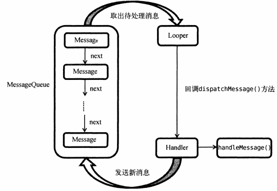
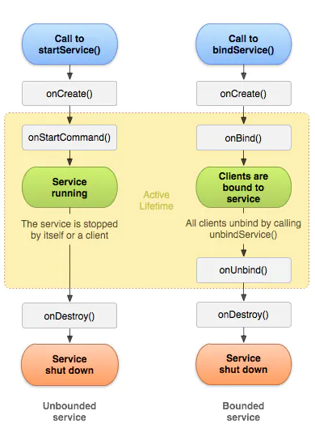
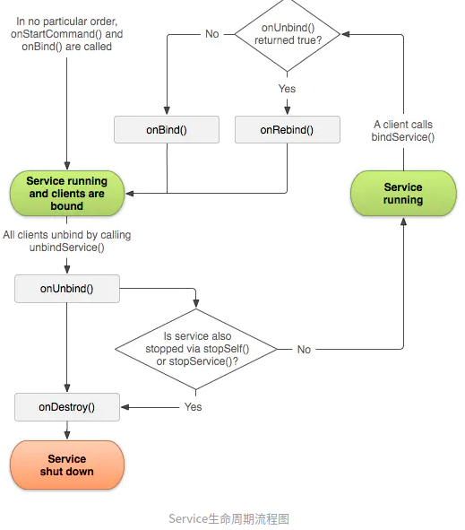

# 1 异步消息处理机制

Android异步消息处理主要由4个部分组成：Message、Handler、MessageQueue、Looper

1. **Message**：在线程之间传递的消息，用于不同线程交换数据。
2. **Handler**：处理者，用于发送和处理消息。发送用 `sendMessage()`，接收用 `handleMessage()`。
3. **MessageQueue**：消息队列，存放所有通过Handler发送的消息。每个线程**只有一个**MessageQueue 对象。
4. **Looper**：每个线程消息队列的管家。调用Looper的`loop()`方法后，会进入无限循环中，每当  
    **MessageQueue** 中有消息，就会将它取出，传给 Handler 的`handleMessage()` 方法。每个线程**只有一个** Looper 对象。

**整体流程：**

1. 主线程创建一个Handler 对象，重写 `handleMessage()` 方法。
2. 子线程创建一个 Message 对象，通过 Handler 将消息发出去。
3. 消息被添加到MessageQueue的队列中等待被处理
4. Looper一直尝试从MessageQueue中取待处理的消息，分发给Handler的 `handleMessage()` 方法中。



# 2 AsyncTask（已在Android 11中正式被弃用）

1. AsyncTask 是一个抽象类，需要创建一个子类集成该抽象类
2. AsyncTask指定了3个泛型参数

3. Params：执行AsyncTask需要传入的参数，用于在后台任务中使用
4. Progress：后台任务执行时，如果需要在界面显示当前进度，则使用这里指定的泛型作为返回值类型
5. Result：返回值，使用这里的泛型作为返回值类型

**一个最简单的自定义AsyncTask**

```java
class DownloadTask extends AsyncTask<Void, Integer, Boolean> {

}
```

第一个参数：表示执行AsyncTask时，不需要传入参数给后台任务。

第二个参数：表示整型数据来作为进度显示单位

第三个参数：表示使用Boolean反馈执行结果。

3. 重写4个常用方法

4. onPreExecute()：后台任务开始执行前调用，用于进行一些界面上的初始化操作
5. doInBackground(Params)：该方法中所有代码都在子线程中执行，**在这里处理所有的耗时操作**，如果需要更新UI元素（更新进度条），可以调用`publishProgress(Progress)` 方法完成
6. onProgressUpdate(Progress)：当后台任务调用了`publishProgress(Progress)`方法时，`onProgressUpdate(Progress)`就会被调用，该方法携带的参数就是后台任务传递过来的。这个方法中可以对UI进行操作。
7. onPostExecute(Result)：后台任务执行完毕通过retur语句进行返回时，这个方法会被调用。返回的数据传递到该方法中。可以利用返回的数据进行一些UI操作。

# 3 Service生命周期





- **onCreate()**：⾸次创建服务时，系统将调⽤此⽅法。如果服务已在运⾏，则不会调⽤此⽅法，该⽅法只调⽤⼀ 次。

- **onStartCommand()**： 当另⼀个组件通过调⽤ startService() 请求启动服务时，系统将调⽤此⽅法。
- **onDestroy()**： 当服务不再使⽤且将被销毁时，系统将调⽤此⽅法。 onBind()： 当另⼀个组件通过调⽤
- **bindService()** 与服务绑定时，系统将调⽤此⽅法。
- **onUnbind()**： 当另⼀个组件通过调⽤ unbindService() 与服务解绑时，系统将调⽤此⽅法。
- **onRebind()**： 当旧的组件与服务解绑后，另⼀个新的组件与服务绑定， onUnbind() 返回true时，系统将调⽤此⽅ 法。

# 4 Service基本用法

## 4.1 创建服务

1. 创建一个服务类 MyService，继承 Service 类。
2. 类中自动重写了 onBind() 方法，该方法是 Service 类中唯一一个抽象方法，必须在子类中实现。
3. 重写 onCreate()、onStartCommand()、onDestroy() 三个方法
4. AndroidManifest.xml 文件中注册服务

```xml
<service
	android:name=".MyService"
    android:enabled="true"
	android:exported=“true">
	...
</service>
```

## 4.2 启动和停止服务

**启动服务**

```java
Intent startIntent = new Intent(this, MyService.class);
startService(startIntent);
```

**停止服务**

```java
Intent stopIntent = new Intent(this, MyService.class);
stopService(stopIntent);
```

## 4.3 活动和服务通信

示例：在MyService 中欧给你提供一个下载功能，思路是创建一个专门的 Binder 对象对下载功能进行管理。

```java
public class MyService extends Service {
	private DlBinder mBinder = new DlBinder();
    class DlBinder extends Binder {
    	public void startDownload() {
        	//TODO
        }
        public int  getProgress() {
        	//TODO
            return 0;
        }
    }
    
    @Override
    public IBinder onBinder(Intent intent) {
    	return mBinder;
    }
}
```

解析：

1. 在 MyService 类中新建了一个 DlBinder 内部类，继承自 Binder。
2. DlBinder 提供开始下载和查看进度条两个方法。
3. 在MyService 中创建了 DlBinder 类的实例，在 onBind() 方法中返回这个实例

**绑定服务**

在完成 MyService 的内容后，需要活动来绑定服务，当活动和服务绑定后，就可以调用该服务里的 Binder 提供的方法了。以下为部分关键代码：

```java
public class MainActivity extends AppCompatActivity {
	private MyService.DlBinder dBinder;
    private ServiceConnection conn = new ServiceConnection() {
    	@Override
        public void onServiceDisconnected(ComponentName name) {
        }
        
        @Override
        public void onServiceConnected(ComponentName name, IBinder service) {
        	dBinder = (MyService.DlBinder) service;
            dBinder.startDownload();
            dBinder.getProgress();	//调用 Binder 中的两个方法
        }
    }
    
    
    @Override
    protected void onCreate(Bundle saveInstanceState) {
    	...
		Intent bindIntent = new Intent(this, MyService.class);
        bindService(bindIntent, conn, BIND_AUTO_CREATE);	//绑定服务
        
        unbindService(conn);	//解绑服务
    }
}
```

注：BIND_AUTO_CREATE 是一个标志位，表示活动和服务进行绑定后自动创建服务

# 5 IntentService

背景：

1. 直接在服务中处理一些耗时的操作容易出现ANR，因此代码设计时常常在服务的每个方法中开启一个子线程进行耗时操作。
2. 但是这种服务一旦开启就会一直运行，必须调用 stopService() 或者 stopSelf() 方法才能停下来
3. 这样设计存在遗漏的可能性

因此，Android 提供了一个 IntentService 类解决这种问题。该类的特性是 **这个服务在运行结束后会自动停止**。

```java
public class MyIntentService extends IntentService {
	public MyIntentService() {
    	super("MyIntentService");
    }
    
    @Override
    protected void onHandleIntent(Intent intent) {
        //TODO
    	Log.d("MyIntentService", "Thread id is " + Thread.currentThread().getId());
    }
    
    @Override
    public void onDestroy() {
    	super.onDestroy();
        Log.d("MyIntentService", "onDestroy");
    }
}
```

解析：

1. 首先要提供一个无参构造函数，并且必须内部调用父类的有参构造函数。
2. 在子类中实现 onHandleIntent() 这个抽象方法，在该类中实现逻辑
3. 根据 IntentService 的特性，服务在结束后会自动停止，因此在 onDestroy() 中打印一行log以证实服务是不是停掉了