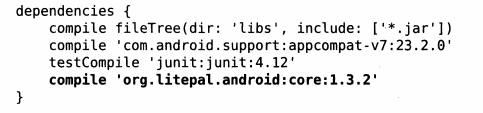
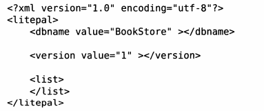
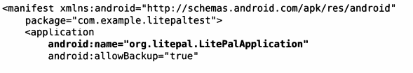

# 1 简介

数据持久化就是将临时数据保存到存储设备中, 保证即使手机或电脑关机的情况下, 这些数据不会丢失.


# 2 持久化方式

## 1 文件存储

### 2.1 将数据存储到文件中

Context 类提供了一个方法: `openFileOutput()` 可以实现该功能.

`openFileOutput()` 提供两个参数, 该方法返回一个 `FileOutputStream` 对象

1. 文件名: 创建的文件的名称

文件默认存储到 /data/data/<package_name>/files/ 目录下

1. 文件的操作模式

1. MODE_PRIVATE 默认模式,当指定相同文件名时,写入内容覆盖源文件
2. MODE_APPEND 如果文件存在,就往文件里追加内容,不存在就创建

**[代码示例]**

```java
public void save() {
	String data = "Data";
    FileOutputStream out = null;
    BufferedWriter writer = null;
    try {
    	out = openFileOutput("data", Context.MODE_PRIVATE);
        writer = new BufferedWriter(new OutputStreamWriter(out));
        writer.write(data);
    } catch (IOException e) {
    	e.printStackTrace();
    } finally {
    	try {
        	if (writer != null) {
            	writer.close();
            }
        } catch (IOException e) {
        	e.printStackTrace();
        }
    }
}
```

### 2.2 从文件中读取数据

相对的, Context 还提供了一个方法: `openFileInput()` 用于从文件中读取数据

`openFileInput()` 方法只接收一个参数, 即要读取的文件名. 返回一个 FileInputStream 对象.

系统会自动到 /data/data/<package_name>/files/ 目录下加载该文件

**[代码示例]**

```java
    public String load() {
        FileInputStream in = null;
        BufferedReader reader = null;
        StringBuilder content = new StringBuilder();

        try {
            in = getContext().openFileInput("data");
            reader = new BufferedReader(new InputStreamReader(in));
            String line = "";
            while ((line = reader.readLine()) != null) {
                content.append(line);
            }
        } catch (Exception e) {
            e.printStackTrace();
        } finally {
            if (reader != null) {
                try {
                    reader.close();
                } catch (IOException e) {
                    e.printStackTrace();
                }
            }
        }
        return content.toString();
    }
```

# 3 SharedPreferences

SharedPreference 使用 **键值对** 的方式存储数据

## 3.1 获取 SharedPreferences 对象

### 3.1.1 Context 类中的 `getSharedPreferences()` 方法

```bash
两个参数
1. 指定 SharedPreferences 文件名，存放在 /data/data/<package_name>/shared_prefs/ 目录下。
2. 指定操作模式，只有一种模式可选，MODE_PRIVATE，和直接传入0效果相同。表示只有当前应用程序可以对该文件进行读写。
```

### 3.1.2 Activity 类中的 `getSharedPreferences()` 方法

```plain
只接收一个 **操作模式** 参数。该方法自动将当前活动的类名作为 SharedPreferences 文件名
```

### 3.1.3 PreferenceManager 类中的 `getDefaultSharedPreferences()` 方法

```plain
静态方法，只接收一个 Context 参数。
使用当前应用程序的包名作为前缀来命名 SharedPreferences 文件
```

## 3.2 向 SharedPreferences 文件中存储数据

1. 调用 `getSharedPreferences()` 方方法获取 `SharedPreferences`对象
2. 调用 SharedPreferences 对象的 `edit()` 方法，获取一个 `Shared Preferences.Editor` 对象。
3. 向 `Shared Preferences.Editor` 对象中添加数据，例如 `putString()` `putBoolean()` 等
4. 调用 `apply()` 方法将添加的数据提交

**[代码示例]**

```java
SharedPreferences.Editor editor = getSharedPreferences(
    默认值"data", MODE_PRIVATE).edit();
editor.putString("name", "Tom");
editor.putInt("age", 28);
editor.putBoolean("married", false);
editor.apply();
```

## 3.3 从 SharedPreferences 中读取数据

1. SharedPreferences 提供了一系列 get 方法来读取数据, 与 SharedPreferences.Editor 的 put 方法相对应
2. get 方法接收两个参数

1. 键, 对应 put 方法设置的键
2. 默认值, 当找不到该键时, 返回默认值

**[代码示例]**

```java
SharedPreferences pref = getSharedPreferences(
    "data", MODE_PRIVATE);
String name = pref.getString("name", "");
int age = pref.getInt("age", 0);
Boolean married = pref.getBoolean("married", false);
```

# 4 SQLite

常用数据类型: integer(整型), real(浮点型), text(文本类型), blob(二进制)

## 4.1 创建数据库

**[代码示例]**

```java
public class MyDatabaseHelper extends SQLiteOpenHelper {
    private Context mContext;
    public static final String CREATE_BOOK = 
        "create table Book(" +
            "id integer primary key autoincrement, " +
            "author text, " +
            "price real, " +
            "pages integer, " +
            "name text)";

    public MyDatabaseHelper(Context context, String name, 
                            SQLiteDatabase.CursorFactory factory, 
                            int version) {
        super(context, name, factory, version);
        mContext = context;
    }

    @Override
    public void onCreate(SQLiteDatabase db) {
        db.execSQL(CREATE_BOOK);	//建表
        Toast.makeText(mContext, "Create succeeded", 
                       Toast.LENGTH_SHORT).show();
    }

    @Override
    public void onUpgrade(SQLiteDatabase sqLiteDatabase, 
                          int i, int i1) {
    }
}
public void MainActivity extends AppCompatActivity {
    @Override
    protected void onCreate(Bundle savedInstanceState) {
        super.onCreate(savedInstanceState);
        setContentView(R.layout.activity_main);
        MyDatabaseHelper dbHelper = new MyDatabaseHelper(
            this, "BookStore.db", null, 1);
        dbHelper.getWritableDatabase();
    }
}
```

- `execSQL()` 新建一张表, 如果该表已存在, 不会再创建一次.

## 4.2 升级数据库

回调方法 `onUpgrade()` 是用来升级数据库的.

对于已经有一张 Book 表的数据库, 再添加一张 Category 表.

```java
create table Category (
    id integer primary key autoincrement,
    category_name text,
    category_code integer)
public class MyDatabaseHelper extends SQLiteOpenHelper {
    ...;

    public static final String CREATE_CATEGORY = "create table Category(" +
            "id integer primary key autoincrement, " +
            "category_name text, " +
            "category_code integer)";

    @Override
    public void onUpgrade(SQLiteDatabase db, int i, int i1) {
        //如果数据库中有表,就删除
        db.execSQL("drop table if exists Book");
        db.execSQL("drop table if exists Category");
        onCreate(db);
    }
    
    @Override
    public void onCreate(SQLiteDatabase db) {
        db.execSQL(CREATE_BOOK);
        db.execSQL(CREATE_CATEGORY);
        Toast.makeText(mContext, "Create succeeded", Toast.LENGTH_SHORT).show();
    }
}
```

- 在 BookStore.db 数据库中已经存在 Book 表, 正常情况下无论怎么再创建, 都不会再回调 `onCreate()` 方法,  也就无法再新建表了. 因此需要在 `onUpgrade()` 方法里先删除表再重新创建.

## 4.3 数据变更

CRUD: 

- C(Create), 添加, 对应SQL命令: insert
- R(Retrieve), 查询, 对应SQL命令: select 
- U(Update), 更新, 对应SQL命令: update
- D(Delete), 删除, 对应SQL命令: delete

前面用的 `getWritableDatabase()` 或者 `getReadableDatabase()` 方法不仅可以用于创建和更新数据库, 还会返回一个 SQLiteDatabase 对象, 借助该对象可以进行 CRUD 操作.

### 4.3.1 添加数据

```java
private void insertData() {
    SQLiteDatabase db = dbHelper.getWritableDatabase();
    ContentValues values = new ContentValues();
    values.put("name", "The Da Vinci Code");
    values.put("author", "Dan Brown");
    values.put("price", 14);

    //第二个参数是 id, 创建表的时候已经设置成自增, 不需要再手动赋值
    db.insert("Book", null, values);
}
```

ContentValue: 

- 和 Bundle 类很类似, 都是使用 HashMap 的泛型形式来存储的, 并且都是`HashMap<String, Object>()`。
- 和 Bundle 不同的是: Bundle 可以存储 Object 对象, 但是 Contentvalues 却只能存储基本类型的数据，相当于 `HashMap<String,基本数据类型>` 这种形式。

### 4.3.2 更新数据

```java
private void updateData() {
    SQLiteDatabase db = dbHelper.getWritableDatabase();
    ContentValues values = new ContentValues();
    values.put("price", 13);

    db.update("Book", values, "name = ?",
            new String[] { "The Da Vinci Code"});
}
```

`update()` 方法中

- 第3个参数表示更新所有 name = ? 的行, 对应 SQL 语句的 where. "?" 是一个占位符
- 第4个参数为第3个参数每个占位符指定相应内容.
- 该代码的意思是, 修改 <The Da Vinci Code> 书的价格为13.

### 4.3.3 删除数据

```java
private void deleteData() {
    SQLiteDatabase db = dbHelper.getWritableDatabase();
    ContentValues values = new ContentValues();
    values.put("price", 13);

    db.delete("Book", "pages > 500", 
              new String[] { "The Da Vinci Code"});
}
```

`delete()` 方法中

- 第2第3个参数用于约束删除某一行或者某几行数据
- 该代码表示, 删除页码大于500的书.

### 4.3.4 查询数据

SQLiteDatabase 提供一个 query() 方法进行数据查询.

| query() 方法参数 | 对应SQL部分               | 描述                            |
| ---------------- | ------------------------- | ------------------------------- |
| table            | from table_name           | 指定查询的表名                  |
| columns          | select column1, column2   | 制定查询的列名                  |
| selection        | where column = value      | 指定 where 的约束条件           |
| selectionArgs    | -                         | 为 where 中的占位符提供具体的值 |
| groupBy          | group by column           | 指定需要 group by 的列          |
| having           | having column = value     | 对 group by 后的结果进一步约束  |
| orderBy          | order by column1, column2 | 指定查询结果的排列方式          |

```java
private void queryData() {
    SQLiteDatabase db = dbHelper.getWritableDatabase();
    Cursor cursor = db.query("Book", null, null, 
                             null, null, null, null);
    if (cursor.moveToFirst()) {
        do {
            String name = cursor.getString(
                cursor.getColumnIndex("name"));
        } while (cursor.moveToNext());
    }
    cursor.close();
}
```

- query() 只指定第一个参数表明查询 Book 表的所有数据
- 查询完之后得到 cursor 对象, 调用 moveToFirst() 将指针移动到第一位, 然后开始遍历.
- 最后调用 close() 方法关闭 Cursor.

# 5 LitePal 开源库

大多开源项目都会将版本提交到 jcenter 上, 只需要在 app/build.gradle 文件的 dependencies 闭包中添加该依赖即可.

## 5.1 配置 LitePal

**1>** 添加依赖



compile 现在用 implementation 代替

**2>** 配置 litepal.xml 文件:

- 在 app/src/main 目录创建一个 assets 文件夹目录
- 在该目录下新建一个 litepal.xml 文件, <dbname> 指定数据库名, <version> 制定数据库版本号, <list> 指定所有的映射模型										



**3>** 配置 LitePalApplication

修改 AndroidManifest.xml 中的代码:



## 5.2 创建和升级数据库

**1>** 定义一个 Java Bean 类 "Book".

定义 id, author, price, pages, name 几个字段, 生成相应的 getter setter 方法

**2>** 在 litepal.xml 中的 <list> 标签中增加代码

```xml
<list>
  <mapping class="com.example.litepaltest.Book"></mapping>
</list>
```

- <mapping> 标签声明要配置的映射模型类, 必须使用**完整包名.**

**3>** 进行任意数据库操作, BookStore.db, 因为在 litepal.xml 中已经定义好数据库名称了

```java
public class MainActivity extends AppCompatActivity {

    private MyDatabaseHelper dbHelper;
    
    @Override
    protected void onCreate(Bundle savedInstanceState) {
        super.onCreate(savedInstanceState);
        setContentView(R.layout.activity_main);
        Connector.getDatabase();
    }
}
```

**4>** 升级数据库只需要在 Book 类中添加新字段即可

```java
public class Book {
    ...

    //新增字段以及相应的getter setter方法
    private String press;	
    public String getPress() {
        return press;
    }
    public void setPress(String press) {
        this.press = press;
    }
}
```

**5>** 新增一张 Category 表, 只需要新建一个 Category 类以及在 litepal.xml <list> 中新增即可

```xml
<list>
  <mapping class="com.example.litepaltest.Book"></mapping>
  <mapping class="com.example.litepaltest.Category"></mapping>
</list>
```

## 5.3 添加数据

**1>** 给 Book 类添加继承结构

现在可以直接继承 LitePalSupport 类, DataSupport 类被废弃了.

```java
public class Book extends DataSupport {
    ...
}
```

**2>** 在主活动中添加数据

```java
public class MainActivity extends AppCompatActivity {

    @Override
    protected void onCreate(Bundle savedInstanceState) {
        super.onCreate(savedInstanceState);
        setContentView(R.layout.activity_main);
        Book book = new Book();
        book.setName("Book A");
        book.setAuthor("zzf");
        book.setPages(454);
        book.setPrice(13);
        book.setPress("unknow");
        book.save();	//添加好数据之后,用save()方法保存到表中
    }
}
```

## 5.4 更新数据

**1>** 最简单的方式就是对**已存储的对象**进行重新赋值, 然后调用 `save()` 方法即可.

是否为已存储对象根据调用 `model.isSaved()` 方法返回的结果判断

- 调用过 `model.save()` 方法添加数据, model 就会被认为已存储对象
- model 对象是通过 LitePal 提供的查询 API 查询出来的

```java
public class MainActivity extends AppCompatActivity {

    @Override
    protected void onCreate(Bundle savedInstanceState) {
        super.onCreate(savedInstanceState);
        setContentView(R.layout.activity_main);
        Book book = new Book();
        book.setName("Book A");
        book.setAuthor("zzf");
        book.setPages(454);
        book.setPrice(13);
        book.setPress("unknow");
        book.save();
        book.setPrice(14);
        book.save();
    }
}
```

- 当发现对象是已存储的, 就不会再向数据库中添加一条新数据, 而是更新已有数据


**2>** 还可以使用 `updateAll()` 方法, 也是继承自 DataSupport 类

```java
protected void onCreate(Bundle savedInstanceState) {
    super.onCreate(savedInstanceState);
    setContentView(R.layout.activity_main);
    Book book = new Book();
    book.setName("Book A");
    book.setAuthor("zzf");
    book.setPages(454);
    book.setPrice(13);
    book.setPress("unknow");
    book.save();
    
    Button updateData = (Button) findViewById(R.id.update_data);
    updateData.setOnClickListener(new View. OnClickListener() {
        @Override
        public void onClick(View v) {
            Book book = new Book();
            book.setPrice(14);
            book.setPress("Anchor");
            book.updateAll("name = ? and author = ?",
                           "Book A", "zzf");
            
        }
    });
}
```

- 先 new 一个 Book 对象, 然后把要更新的数据复制给该对象
- 调用 updateAll() 方法执行更新操作, 代码的意思是, 查找 name 是 "Book A " 以及 作者是 "zzf" 的书籍, 然后将它的价格改为14, 出版社改为 "Anchor"

## 5.5 删除数据

**1>** 直接调用 `delete()` 方法

**2>** 调用 `deleteAll()` 方法

```java
DataSupport.deleteAll(Book.class, "price < ?", "15");
```

## 5.6 查询数据

**1>** 查询表中的所有数据

```java
List<Book> books = DataSupport.findAll(Book.class);
for (Book book: books) {
    ...
}
```

**2>** 其他常用查询方法

`select()` 指定查询哪几列数据, 对应SQL 中的 select

```java
List<Book> books = DataSupport.select("name", "author").find(Book.class);
```

`where()` 指定约束条件, 对应 SQL 中的 where

```java
List<Book> books = DataSupport.where("pages > ?", "400");
```

`order()`指定结果的排列方式, 对应 SQL 中的 order by.

```java
List<Book> books = DataSupport.order("price desc").find(Book.class);
```

`limit()` 指定查询结果的数量

```java
List<Book> books = DataSupport.limit(3).find(Book.class);
```

`offset()` 指定查询结果的偏移量, 比如查第 2 3 4 条.

```java
List<Book> books = DataSupport.limit(3).offset(1).find(Book.class);
```

任意组合

```java
List<Book> books = 
    DataSupport.select("name", "author", "pages")
               .where("pages > ?", "400")
               .order("pages")
               .limit(10).offset(1)
               .find(Book.class);
```

- 查询 Book 表中第 11~20条数据, 并且满足: 页数大于400, 显示 name, author, pages 这三列数据, 结果按照页数升序排列.