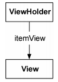
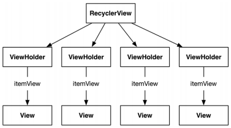

# 1. 原理

**ViewHolder**

ViewHolder 只做一件事：容纳 View 视图



【示例】ViewHolder 子类

```java
public class ListTest extends RecycleView.ViewHolder {
	public ImageView mImageViewTest;
    
    public ListTest(View view) {
    	super(view);
        
        mImageViewTest = (ImageView) view.findViewById(R.id.imageViewTest);
    }
}
```

创建 ListTest 类来获取自定义的 mImageViewTest 和 RecycleView.ViewHolder 的超类传入的 itemView。

【示例】ViewHolder 使用

```java
ListTest test = new ListTest(inflater.inflate(R.layout.list_row, parent, false));
View view = test.itemView;
ImageView imageViewTest = test.mImageViewTest;
```

**RecycleView**

RecycleView 通过 Adapter 创建 ViewHolder，ViewHolder 引用 itemView。



**Adapter**

Adapter 是 RecycleView 和 ViewHolder 沟通的桥梁，负责：

1. 创建必要的 ViewHolder
2. 绑定 ViewHolder 至模型层数据

**RecycleView 可能发起的会话**

1. 调用 Adapter 的 getItemCount() 方法，获取数组列表中包含多少个对象
2. 调用 Adapter 的 onCreateViewHolder(ViewGroup v, int i) 方法创建 ViewHolder 及其要显示的视图
3. 调用 onBindViewHolder(ViewHolder v, int i) 传入 ViewHolder 及其位置

# 2. 使用

## 基本使用


**添加依赖**
在在build.gradle文件中添加依赖

```java
dependencies {
    ...
    implementation 'androidx.recyclerview:recyclerview:1.2.1'
}
```


**添加一个列表item的布局文件item_xxx.xml**

```xml
<?xml version="1.0" encoding="utf-8"?>
<LinearLayout xmlns:android="http://schemas.android.com/apk/res/android"
    android:layout_width="match_parent"
    android:layout_height="match_parent"
    android:orientation="vertical">

    <androidx.cardview.widget.CardView
        android:layout_width="match_parent"
        android:layout_height="wrap_content"
        android:layout_margin="10dp" >

        <LinearLayout
            android:layout_width="match_parent"
            android:layout_height="wrap_content"
            android:orientation="horizontal">

            <ImageView
                android:layout_width="100dp"
                android:layout_height="100dp"
                android:scaleType="centerCrop"
                android:src="@drawable/test" />

            <TextView
                android:layout_width="match_parent"
                android:layout_height="wrap_content"
                android:layout_gravity="center_vertical"
                android:layout_marginStart="30dp"
                android:text="这是一段文本"
                android:textColor="#000000" />
        </LinearLayout>

    </androidx.cardview.widget.CardView>
</LinearLayout>
```


**定义Adapter、ViewHolder类**

```java
public class VerticalAdapter extends RecyclerView.Adapter<VerticalViewHolder>{
    @NonNull
    @Override
    public VerticalViewHolder onCreateViewHolder(@NonNull ViewGroup parent, int viewType) {

        // LayoutInflater用于加载布局，from方法获取LayoutInflater对象
        LayoutInflater layoutInflater = LayoutInflater.from(parent.getContext());

        // 获取RecycleView中保存的每个item的布局
        RecyclerView itemView = (RecyclerView) layoutInflater.inflate(R.layout.item_vertical, parent, false);

        // 将itemView返回给ViewHolder
        return new VerticalViewHolder(itemView);
    }

    @Override
    public void onBindViewHolder(@NonNull VerticalViewHolder holder, int position) {

    }

    @Override
    public int getItemCount() {
        return 0;
    }
}

class VerticalViewHolder extends RecyclerView.ViewHolder {

    public VerticalViewHolder(@NonNull View itemView) {
        super(itemView);
    }
}
```


**在MainActivity中添加RecycleView相关逻辑**

```java
public class VerticalRecycleViewActivity extends AppCompatActivity {

    RecyclerView mRecycleView;

    @Override
    public void onCreate(@Nullable Bundle savedInstanceState, @Nullable PersistableBundle persistentState) {

        setContentView(R.layout.activity_vertical);

        // 创建RecycleView对象
        mRecycleView = findViewById(R.id.vertical_rv);

        // 设置RecycleView的方向：水平/垂直
        LinearLayoutManager linearLayoutManager = new LinearLayoutManager(this, LinearLayoutManager.VERTICAL, false);

        // 设置LayoutManager
        mRecycleView.setLayoutManager(linearLayoutManager);

        // 设置Adapter绑定数据
        mRecycleView.setAdapter(new VerticalAdapter());
        super.onCreate(savedInstanceState, persistentState);

    }
}
```

## 布局管理器

RecyclerView提供了三种布局管理器：

- LinearLayoutManager 线性布局管理器
- StaggeredGridLayoutManager 瀑布流布局管理器
- GridLayoutManager 网格布局管理器
  这三种布局管理器都是通过setLayoutManager方法来设置, 以LinearLayoutManager为例，只需要在MainActivity中添加该布局管理器即可。
  有两种方式都可以实现该功能。

1. **构造方法中直接传入布局参数**

```java
LinearLayoutManager linearLayoutManager = new LinearLayoutManager(this, LinearLayoutManager.VERTICAL, false);
```


1. **也可以通过 setOrientation() 方法设置布局参数**

```java
LinearLayoutManager layoutManager = new LinearLayoutManager(MainActivity.this);
layoutManager.setOrientation(RecyclerView.HORIZONTAL);
mRecyclerView.setLayoutManager(layoutManager);
```