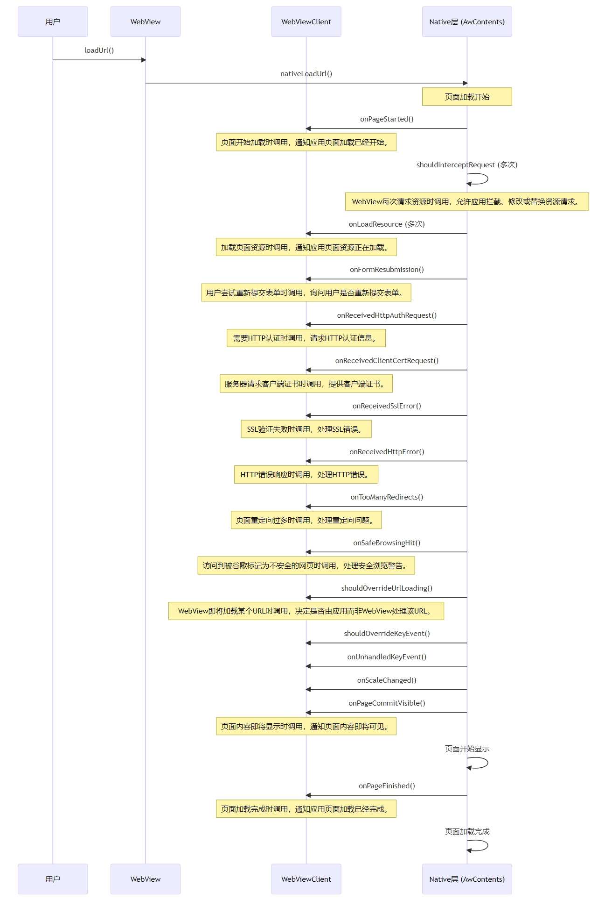
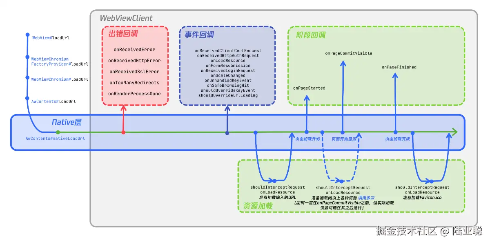

# 前言

在Android开发中，WebView用于显示网页和执行JavaScript。

理解其加载流程和事件回调对于开发一个功能丰富且用户友好的基于Web的应用至关重要。

本文将详细介绍 WebView 加载一个URL时的整个流程和相关的事件回调。


# 一、WebView加载流程时序图

当用户通过 `WebView` 加载一个URL时，整个过程涉及多个组件和一系列复杂的交互。下面是一个 `WebView` 加载URL的时序图，以及对每个回调事件的详细说明。



上面的时序图展示了从开始加载URL到页面加载完成的整个过程中WebView和WebViewClient的交互。每个回调都在特定的时机被触发，以处理不同的事件和状态变化。

# 二、WebView 加载过程中的原生层处理及代码示例


 

## 2.1 触发加载

用户或应用触发 `loadUrl()` 方法，开始加载指定的URL。在实际应用中，可能需要处理网络不可用的情况。以下是如何检查网络状态并相应地处理的示例代码：

```java
if(isNetworkAvailable()) {
    webView.loadUrl("http://www.example.com");
} else {
    Toast.makeText(context, "Network is unavailable", Toast.LENGTH_LONG).show();
}

public boolean isNetworkAvailable() {
    ConnectivityManager connectivityManager 
          = (ConnectivityManager) getSystemService(Context.CONNECTIVITY_SERVICE);
    NetworkInfo activeNetworkInfo = connectivityManager.getActiveNetworkInfo();
    // 通过获取NetworkInfo接口的状态判断是否连接网络
    return activeNetworkInfo != null && activeNetworkInfo.isConnected();
}
```

## 2.2 原生层处理

`WebView` 调用其底层实现（通常是 `AwContents` 的 `nativeLoadUrl()` 方法）来开始网络请求。在这个阶段，开发者可能需要添加自定义的用户代理或处理重定向。示例代码如下：

```java
webView.getSettings().setUserAgentString("CustomUserAgent");
webView.setWebViewClient(new WebViewClient() {
    @Override
    public boolean shouldOverrideUrlLoading(WebView view, String url) {
        if (Uri.parse(url).getHost().equals("www.example.com")) {
            // This is my web site, so do not override; let my WebView load the page
            return false;
        }
        // Otherwise, the link is not for a page on my site, so launch another Activity that handles URLs
        Intent intent = new Intent(Intent.ACTION_VIEW, Uri.parse(url));
        startActivity(intent);
        return true;
    }
});
```

代码解读：

1. `webView.getSettings().setUserAgentString("CustomUserAgent");` 这行代码设置了 `WebView` 的用户代理字符串。用户代理字符串通常被用于标识浏览器的类型和版本，以及其他相关的用户信息。通过设置一个自定义的用户代理字符串，开发者可以模拟特定的浏览器行为，或者提供额外的标识信息。在这个例子中，`CustomUserAgent` 可以作为一个占位符，实际应用中可以替换为你想要设置的特定字符串。
2. 创建一个新的 `WebViewClient` 并重写了 `shouldOverrideUrlLoading` 方法。`shouldOverrideUrlLoading(WebView view, String url)` 方法在 `WebView` 尝试加载 URL 时被调用。这个方法的返回值决定了 `WebView` 是否应该加载给定的 URL。

## 2.3 页面加载的各阶段

在页面加载的各个阶段，开发者可以通过 `onPageStarted()` 和 `onLoadResource()` 方法来显示加载指示器或日志资源加载情况。例如：

```java
webView.setWebViewClient(new WebViewClient() {
    @Override
    public void onPageStarted(WebView view, String url, Bitmap favicon) {
        super.onPageStarted(view, url, favicon);
        progressBar.setVisibility(View.VISIBLE);
    }

    @Override
    public void onLoadResource(WebView view, String url) {
        super.onLoadResource(view, url);
        Log.d("WebView", "Resource Loaded: " + url);
    }

    @Override
    public void onPageFinished(WebView view, String url) {
        super.onPageFinished(view, url);
        progressBar.setVisibility(View.GONE);
    }
});
```


## 2.4 处理特殊事件

在加载过程中，`WebView` 可能会遇到需要特殊处理的情况，如SSL错误处理。以下是如何处理SSL错误的示例：

```java
webView.setWebViewClient(new WebViewClient() {
    @Override
    public void onReceivedSslError(WebView view, SslErrorHandler handler, SslError error) {
        final AlertDialog.Builder builder = new AlertDialog.Builder(context);
        builder.setMessage(R.string.notification_error_ssl_cert_invalid);
        builder.setPositiveButton("continue", (dialog, which) -> handler.proceed());
        builder.setNegativeButton("cancel", (dialog, which) -> handler.cancel());
        final AlertDialog dialog = builder.create();
        dialog.show();
    }
});
```

## 2.5 页面内容显示

当页面即将可见时，`onPageCommitVisible()` 方法被调用。这是更新UI或进行最后调整的好时机。例如：

```java
webView.setWebViewClient(new WebViewClient() {
    @Override
    public void onPageCommitVisible(WebView view, String url) {
        super.onPageCommitVisible(view, url);
        // Perform actions when page is almost visible
        Toast.makeText(context, "Page almost visible", Toast.LENGTH_SHORT).show();
    }
});
```

通过这些示例和解决方案，可以更好地理解和利用 `WebView` 的各种功能。


# 三、AwContents

本节介绍时序图中的`AwContents`。`AwContents` 是 Android WebView 的一个核心组件，它在 Android WebView 架构中扮演着非常重要的角色。`AwContents` 是 Chromium 项目的一部分，它负责管理 WebView 的内容渲染和事件处理。在 Android 系统中，`AwContents` 作为 WebView 的底层实现，提供了与 Chromium 引擎的直接交互接口。

## 3.1 主要功能和职责

1. **内容渲染**： `AwContents` 负责将网页内容渲染到 WebView 组件上。它使用 Chromium 的渲染引擎（Blink）来解析 HTML、CSS 和 JavaScript，确保网页内容能够正确显示。
2. **事件处理**： 它处理来自上层 WebView 和 WebViewClient 的各种事件和请求，如页面加载、资源请求、导航事件等，并将这些事件转发到 Chromium 引擎。
3. **JavaScript 交互**： `AwContents` 提供了与 JavaScript 代码交互的接口，允许 Android 应用与网页中的 JavaScript 代码进行通信。
4. **安全和隐私**： 它实现了多种安全措施，如同源策略、内容安全策略等，以保护用户的安全和隐私。
5. **网络请求管理**： `AwContents` 管理所有网络请求，包括图片、CSS 文件、JavaScript 文件等资源的加载。它支持自定义网络请求的处理，例如通过 `shouldInterceptRequest()` 方法拦截和修改请求。

## 3.2 架构和实现

`AwContents` 是一个桥接类，它连接了 Android 的 WebView API 和 Chromium 的底层实现。在 Android WebView 的架构中，`AwContents` 位于 Java 层和 native 层之间，它通过 JNI（Java Native Interface）与 native 代码进行交互。

在 native 层，`AwContents` 对应的实现是 `content::WebContents`，这是 Chromium 中用于管理网页内容的核心类。`WebContents` 负责页面的生命周期管理、渲染进程管理和页面内容的实际渲染。

## 3.3 使用场景

开发者通常不直接与 `AwContents` 交互，而是通过 `WebView` 提供的高级 API 来进行开发。然而，了解 `AwContents` 的工作原理对于解决 WebView 中的高级问题、性能优化以及实现自定义功能非常有帮助。

`AwContents` 是 Android WebView 中的一个关键组件，它使得 WebView 能够利用 Chromium 引擎的强大功能，提供高性能和高兼容性的网页浏览体验。


## 四、利用WebView回调函数检测白屏

在Android开发中，使用WebView时偶尔会遇到白屏问题，这通常是由于网页加载不完全、资源加载失败或者JavaScript错误等原因引起的。利用WebView的回调函数可以帮助我们检测并诊断这种白屏问题。以下是一些策略和步骤，展示如何使用WebView的回调函数来检测白屏：

## 4.1 使用`onPageStarted`和`onPageFinished`检测加载时间

白屏可能是因为页面加载时间过长。通过记录`onPageStarted`和`onPageFinished`之间的时间差，可以判断页面是否在合理的时间内完成加载。

```java
webView.setWebViewClient(new WebViewClient() {
    long startTime;

    @Override
    public void onPageStarted(WebView view, String url, Bitmap favicon) {
        super.onPageStarted(view, url, favicon);
        startTime = System.currentTimeMillis();
    }

    @Override
    public void onPageFinished(WebView view, String url) {
        super.onPageFinished(view, url);
        long loadTime = System.currentTimeMillis() - startTime;
        if (loadTime > ACCEPTABLE_LOAD_TIME) {
            // 记录或处理加载时间过长的情况
        }
    }
});
```

## 4.2 利用`onReceivedError`和`onReceivedHttpError`检测加载错误

这些回调函数可以帮助我们捕获在加载过程中发生的错误，这些错误可能会导致页面内容无法正确显示，从而出现白屏。

```java
webView.setWebViewClient(new WebViewClient() {
    @Override
    public void onReceivedError(WebView view, WebResourceRequest request, WebResourceError error) {
        super.onReceivedError(view, request, error);
        // 处理加载错误
    }

    @Override
    public void onReceivedHttpError(WebView view, WebResourceRequest request, WebResourceResponse errorResponse) {
        super.onReceivedHttpError(view, request, errorResponse);
        // 处理HTTP错误
    }
});
```

## 4.3 使用`shouldInterceptRequest`监控资源加载

如果关键资源（如CSS或JavaScript文件）加载失败，可能会导致页面显示不完整或白屏。通过`shouldInterceptRequest`可以监控这些资源的加载情况。

```java
webView.setWebViewClient(new WebViewClient() {
    @Override
    public WebResourceResponse shouldInterceptRequest(WebView view, WebResourceRequest request) {
        // 检查请求的资源，记录加载失败的资源
        return super.shouldInterceptRequest(view, request);
    }
});
```

## 4.4 使用`onPageCommitVisible`

`onPageCommitVisible`在页面内容即将显示时调用，如果在这个阶段页面内容为空或不完整，可能是一个白屏的迹象。但是，`onPageCommitVisible`回调本身并不能直接提供页面内容的信息，我们需要结合其他方法来实现这个目标。一种可能的方法是在`onPageCommitVisible`回调中使用`evaluateJavascript`来检查页面的DOM结构。例如，我们可以检查某个关键元素是否存在，或者是否有内容。以下是一个示例：

```java
webView.setWebViewClient(new WebViewClient() {
    @Override
    public void onPageCommitVisible(WebView view, String url) {
        super.onPageCommitVisible(view, url);

        // 检查页面内容是否可见或部分内容是否缺失
        view.evaluateJavascript("(function() { return document.getElementById('keyElement').innerHTML; })();", new ValueCallback<String>() {
            @Override
            public void onReceiveValue(String value) {
                if (value == null || value.isEmpty()) {
                    // 如果关键元素不存在或没有内容，那么可能存在白屏问题
                    Log.e("WebView", "Key element is missing or empty");
                }
            }
        });
    }
});
```

在这个示例中，我们假设`keyElement`是页面中的一个关键元素，我们通过JavaScript代码获取这个元素的内容，然后在回调中检查这个内容是否存在。如果不存在，那么可能存在白屏问题。

实际的检查方法可能需要根据你的具体需求进行调整。例如，你可能需要检查多个元素，或者使用更复杂的JavaScript代码来检查页面的状态。

## 4.5 结合JavaScript和`evaluateJavascript`

通过注入JavaScript代码检查DOM元素的存在或内容，可以帮助确认页面是否正确渲染。

```java
webView.evaluateJavascript("(function() { return document.body.innerHTML; })();", new ValueCallback<String>() {
    @Override
    public void onReceiveValue(String html) {
        if (html.isEmpty()) {
            // 处理白屏情况
        }
    }
});
```

通过上述方法，结合日志记录和异常处理机制，可以有效地检测和诊断WebView中的白屏问题。这些技术不仅可以帮助开发者提高应用的稳定性和用户体验，还可以在开发和测试阶段快速定位问题。

# 五、结论

`WebView` 的加载流程涉及复杂的交互和多个阶段，每个阶段都可能触发不同的事件回调。作为开发者，理解这些过程和回调的时机及其作用是非常重要的。这不仅可以帮助我们更有效地使用 `WebView`，还可以在开发过程中预见并解决潜在问题，从而创建更加稳定和可靠的应用。