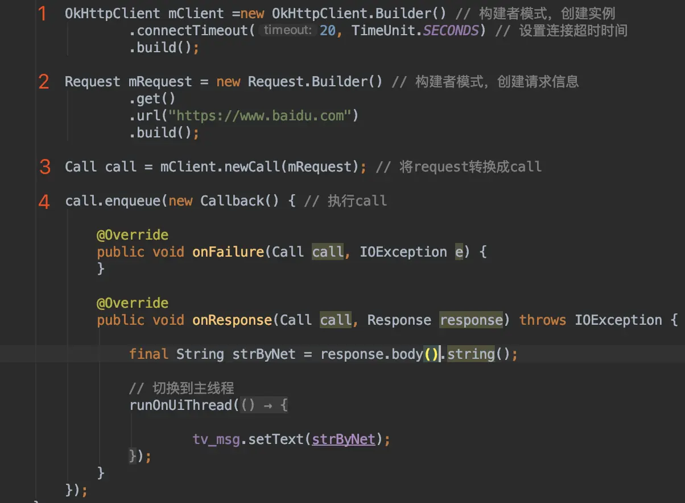
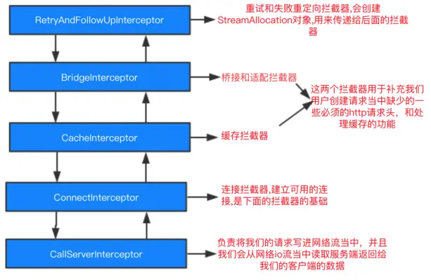

# 示例

## 源码

```java
 OkHttpClient mClient = new OkHttpClient.Builder() // 构建者模式，创建实例
                .connectTimeout(20, TimeUnit.SECONDS) // 设置连接超时时间
                .build();

Request mRequest = new Request.Builder() // 构建者模式，创建请求信息
        .get()
        .url("https://www.baidu.com")
        .build();

Call call = mClient.newCall(mRequest); // 将request转换成call

// 异步请求
call.enqueue(new Callback() { // 执行call

    @Override
    public void onFailure(Call call, IOException e) {
    }

    @Override
    public void onResponse(Call call, Response response) throws IOException {

        final String strByNet = response.body().string();

        // 切换到主线程
        runOnUiThread(new Runnable() {

            @Override
            public void run() {

                tv_msg.setText(strByNet);
            }
        });
    }
});
```

## 上传文件

```java
   /**
     * 上传文件
     * */
    private void doUpload(File file, String userId, String msg) {

        // 接口地址
        OkHttpClient client = new OkHttpClient.Builder()
                .connectTimeout(30, TimeUnit.SECONDS) // 超时时间
                .build();

        RequestBody fileRequestBody1 = RequestBody.create(MediaTypeUtils.UPLOAD_FILE.value, file);

        // 可传多个
        MultipartBody body = new MultipartBody.Builder()
                .setType(MultipartBody.FORM)
                .addFormDataPart("userId", userId)
                .addFormDataPart("msg", msg)
                .addFormDataPart("file", "myFileName", fileRequestBody1)
                .build();

        Request rb = new Request.Builder()
                .header("Authorization", "Client-ID " + UUID.randomUUID())
                .url(ApiUtils.TestPostUpload)
                .post(body)
                .build();

        Call call = client.newCall(rb);
        call.enqueue(new Callback() {

            @Override
            public void onFailure(Call call, IOException e) {

                Log.e("lybj", "接口调用失败");
            }

            @Override
            public void onResponse(Call call, Response response) throws IOException {

                final String string = response.body().string();
                runOnUiThread(new Runnable() {

                    @Override
                    public void run() {

                        tv_msg.setText(string);
                    }
                });
            }
        });
    }
```

**接口封装：**

```java
public interface ApiUtils {

    String BaseUri = "http://192.168.0.102:8081/TestOkhttp3_war_exploded/";

    // post提交json
    String TestPost = BaseUri + "TestPost";

    // 上传文件
    String TestPostUpload = BaseUri + "TestPostUpload";
}

public enum MediaTypeUtils {

    JSON_UTF_8(MediaType.parse("application/json; charset=utf-8")),  // 设置Json数据传输并指定Utf-8为编码集
    UPLOAD_FILE(MediaType.parse("multipart/form-data")); // 上传文件

    public MediaType value;

    MediaTypeUtils(MediaType value) {
        this.value = value;
    }
}
```


# 原理



按照1、2、3、4的顺序依次分析。

## 1、okhttp创建

想要使用网络请求的话，需要初始化，而 OkHttpClient 也是提供了建造者模式方便我们快速的初始化对象。

首先看看提供了哪些属性

**OkHttpClient 扩展属性**

```java
final Dispatcher dispatcher;  //重要：分发器,分发执行和关闭由request构成的Call
final Proxy proxy;  //代理
final List<Protocol> protocols; //协议
final List<ConnectionSpec> connectionSpecs; //传输层版本和连接协议
final List<Interceptor> interceptors; //重要：拦截器
final List<Interceptor> networkInterceptors; //网络拦截器
final ProxySelector proxySelector; //代理选择
final CookieJar cookieJar; //cookie
final Cache cache; //缓存
final InternalCache internalCache;  //内部缓存
final SocketFactory socketFactory;  //socket 工厂
final SSLSocketFactory sslSocketFactory; //安全套接层socket 工厂，用于HTTPS
final CertificateChainCleaner certificateChainCleaner; // 验证确认响应证书 适用 HTTPS 请求连接的主机名。
final HostnameVerifier hostnameVerifier;    //  主机名字确认
final CertificatePinner certificatePinner;  //  证书链
final Authenticator proxyAuthenticator;     //代理身份验证
final Authenticator authenticator;      // 本地身份验证
final ConnectionPool connectionPool;    //连接池,复用连接
final Dns dns;  //域名
final boolean followSslRedirects;  //安全套接层重定向
final boolean followRedirects;  //本地重定向
final boolean retryOnConnectionFailure; //重试连接失败
final int connectTimeout;    //连接超时
final int readTimeout; //read 超时
final int writeTimeout; //write 超时
```

拦截器：

可以简单的把拦截器理解为Hook，Hook就是在源码中插入我们自己的代码，那我们就可以在客户端发起请求和服务器响应请求后返回数据中间的这一段时间进行对拦截器的操作。

拦截器可以分为内部拦截器和外部拦截器

1. 内部拦截器：okhttp系统的拦截器，有5个
2. 外部拦截器：就是我们自己定义的拦截器




继续查看它的Builder类

```java
public static final class Builder {
   ...
    public Builder() {
      dispatcher = new Dispatcher();
      protocols = DEFAULT_PROTOCOLS;
      connectionSpecs = DEFAULT_CONNECTION_SPECS;
      eventListenerFactory = EventListener.factory(EventListener.NONE);
      proxySelector = ProxySelector.getDefault();
      cookieJar = CookieJar.NO_COOKIES;
      socketFactory = SocketFactory.getDefault();
      hostnameVerifier = OkHostnameVerifier.INSTANCE;
      certificatePinner = CertificatePinner.DEFAULT;
      proxyAuthenticator = Authenticator.NONE;
      authenticator = Authenticator.NONE;
      connectionPool = new ConnectionPool();
      dns = Dns.SYSTEM;
      followSslRedirects = true;
      followRedirects = true;
      retryOnConnectionFailure = true;
      connectTimeout = 10_000;
      readTimeout = 10_000;
      writeTimeout = 10_000;
      pingInterval = 0;
    }

    public OkHttpClient build() {
      return new OkHttpClient(this);
    }
    ...
}
```

这就简单了，都设置了默认值，那么我们在外边调用的时候就很简单了，只需要这么写就可以了。

```java
OkHttpClient mClient = new OkHttpClient.Builder() // 构建者模式，创建实例
                           .build();
```

## 2、Request对象创建

先看一下Request类的属性

```java
final HttpUrl url; // 接口地址
final String method; // post还是get
final Headers headers; // Http消息的头字段
final RequestBody body; // 它是抽象类， 有些请求需要我们传入body实例，如果是GET请求，body对象传的是null，如果是POST请求，就需要我们去设定了。
final Object tag;
```

而Request也是使用了建造者模式，可以直接通过Builder构建对象

```java
 Request mRequest = new Request.Builder() // 构建者模式，创建请求信息
                .url("https://www.baidu.com")
                .build();
```

## 3、Call对象创建

call是个接口，实际进行请求的是RealCall，我们来创建它

文件位置：OkHttpClient.java

```plain
@Override public Call newCall(Request request) {
  return new RealCall(this, request, false /* for web socket */);
}

// RealCall方法
RealCall(OkHttpClient client, Request originalRequest, boolean forWebSocket) {
  final EventListener.Factory eventListenerFactory = client.eventListenerFactory();

  this.client = client; // 第1步创建的okHttpClient实例
  this.originalRequest = originalRequest; // 第2步创建的request实例
  this.forWebSocket = forWebSocket;
  this.retryAndFollowUpInterceptor = new RetryAndFollowUpInterceptor(client, forWebSocket); // 重定向拦截器，后面会说

  // TODO(jwilson): this is unsafe publication and not threadsafe.
  this.eventListener = eventListenerFactory.create(this);
}
```

**第 3 步就是创建realcall对象，真正的请求是交给了 RealCall 类，它实现了Call方法，它是真正的核心代码。**

## 4、RealCall

这一步其实是关键，也是请求的真正执行的地方

```java
// equeue方法调用
call.enqueue(new Callback(){ ... });

// equeue()源码
@Override 
public void enqueue(Callback responseCallback) {
    // 1
    synchronized (this) {
      if (executed) throw new IllegalStateException("Already Executed");
      executed = true;
    }
    captureCallStackTrace();

    // 2
    client.dispatcher().enqueue(new AsyncCall(responseCallback));
  }


// AsyncCall类 对我们的回调进行封装，继承Runnable接口
final class AsyncCall extends NamedRunnable {
    private final Callback responseCallback;
    AsyncCall(Callback responseCallback) {
        super("OkHttp %s", redactedUrl());
        this.responseCallback = responseCallback;
    }
}
```

1. synchronized (this) 确保每个call只能被执行一次不能重复执行
2. 利用dispatcher调度器，来进行实际的执行`client.dispatcher().enqueue(new AsyncCall(responseCallback))`


**继续看Dispatcher类**

```java
synchronized void enqueue(AsyncCall call) {
    // 1 正在运行的任务总数不能超过 maxRequests
    if (runningAsyncCalls.size() < maxRequests && runningCallsForHost(call) < maxRequestsPerHost) {
        // 2 将请求添加到异步请求队列中
        runningAsyncCalls.add(call);
        // 3 通过线程池执行
        executorService().execute(call);
    } else {
        // 4 如果超过了maxRequests，将其放到等待队列
        readyAsyncCalls.add(call);
    }
}
```

1. runningAsyncCalls是正在运行的任务， runningAsyncCalls.size() < maxRequests 那么这一句的解释就是，总任务数不能超过maxRequests这个值（默认64，可设置调度器调整），runningCallsForHost(call) < maxRequestsPerHost) 这句解释就是：当前主机的请求数不能超过5个。
2. 如果符合条件，就将正在请求的runnable添加到正在执行的异步请求队列之中。
3. 然后通过线程池执行这个AsyncCall
4. 如果正在执行的任务数已经超过了设置的最大值，或者当前网络请求的主机数超过了设置的最大值，那么就会将AsyncCall加入到readyAsyncCalls 这个等待队列中。


我们继续往下看 `executorService().execute(call)`

```java
public synchronized ExecutorService executorService() {
    if (executorService == null) {
        executorService = new ThreadPoolExecutor(0, Integer.MAX_VALUE, 60, TimeUnit.SECONDS, new SynchronousQueue<Runnable>(), Util.threadFactory("OkHttp Dispatcher", false));
    }
    return executorService;
}
```

参数意义：核心线程数、最大线程数、非核心线程回收时间60、单位秒。另外，最大值是`Integer.MAX_VALUE`不会影响性能，因为上一步骤已经限制了最大任务总数

继续往下 `executorService.execute(call)` 会执行call对象的`run()`方法，而run()方法实际是在父类NamedRunnable里，实际上是调用了`execute()`方法，该方法又由子类 AsyncCall实现，最终也就是调用了 `AsyncCall.execute()`

**总结一下：executorService.execute(call) -> NamedRunnable.run() -> AsyncCall.execute()**

## 5、AsyncCall.execute()

```java
@Override
protected void execute() {
    boolean signalledCallback = false;
    try {
        // 1 
        Response response = getResponseWithInterceptorChain();
        // 2
        if (retryAndFollowUpInterceptor.isCanceled()) {
            signalledCallback = true;
            responseCallback.onFailure(RealCall.this, new IOException("Canceled"));
        } else {
            signalledCallback = true;
            // 3
            responseCallback.onResponse(RealCall.this, response);
        }
    } catch (IOException e) {
        if (signalledCallback) {
            // Do not signal the callback twice!
            Platform.get().log(INFO, "Callback failure for " + toLoggableString(), e);
        } else {
            responseCallback.onFailure(RealCall.this, e);
        }
    } finally {
        // 4
        client.dispatcher().finished(this);
    }
}
```

1. 执行拦截器链，返回Response
2. 判断拦截器链中的重定向拦截器是否已经取消了，如果取消了，就执行responseCallback.onFailure() ，这个也就是我们在外边在第3步，传过来的回调方法Callback()中的onFailure()方法。
3. 如果没取消，则走onResponse也就是Callback()中的onResponse()方法。返回结果。当然这里都是在子线程里面的。
4. 这句其实就是调用了，dispatcher方法中的finished方法。