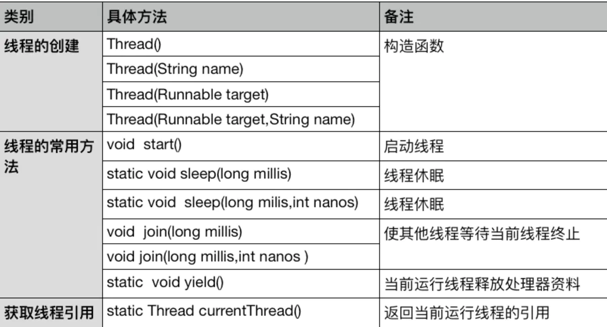
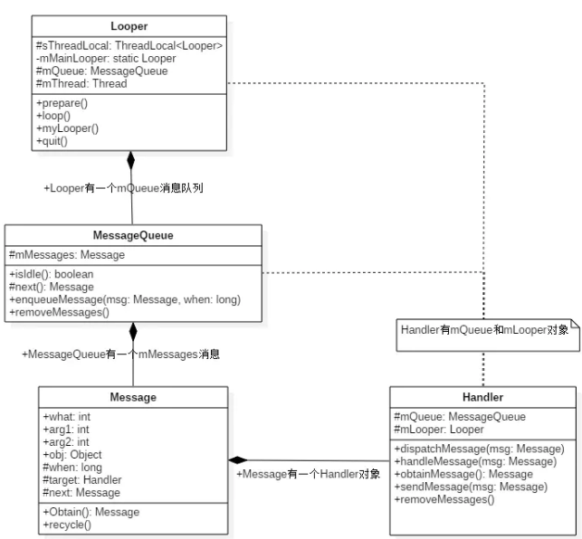
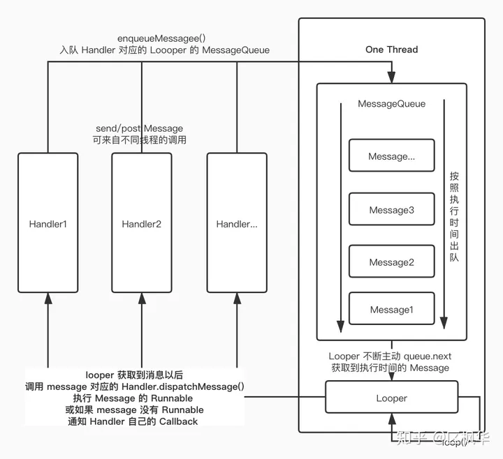
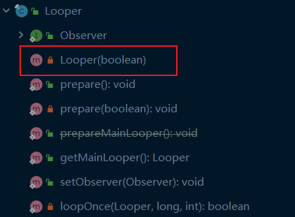
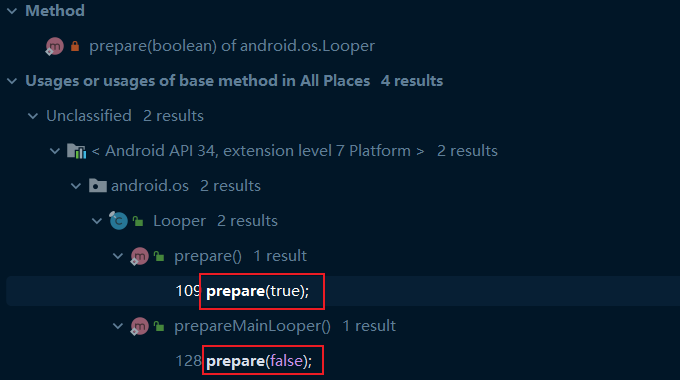
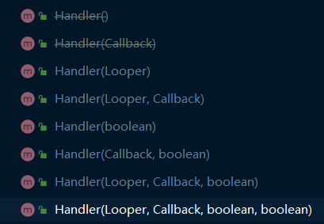
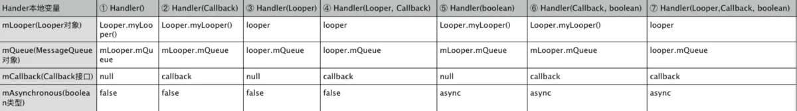

# Thread

## 1 线程概念

### 1.1 进程


进程：资源分配的最小单位
线程：CPU调度的基本单位
一个进程至少一个线程，叫主线程。进程是程序执行的一个实例。

#### 1.1.1 进程优点

每个进程都有自己的独立的一块内存空间、一组资源系统。内部数据和状态完全独立。

- 进程由操作系统调度，简单稳定。
- 进程之间隔离性好，一个进程崩溃不会影响其他进程。

#### 1.1.2 进程缺点

- 进程消耗内存大，进程间切换代价高。
- 进程切换也需要保持上下文环境。

### 1.2 线程

线程是进程的一个实体，CPU调度和分配的基本单位。
线程共享进程资源

同类的多线程共享一组系统资源，线程本身的数据通常只有CPU的**寄存器数据**，一个共程序执行的**堆栈**。线程切换代价小。

JVM中
线程隔离：本地方法栈、虚拟机栈、程序计数器
线程共享：堆、方法区

## 2 Android线程

Android线程，一般指Android虚拟机线程，是通过系统调用创建的Linux线程。
虚拟机线程具有运行Java代码的runtime

### 2.1 Thread类

[Thread.java](http://androidxref.com/6.0.1_r10/xref/libcore/libart/src/main/java/java/lang/Thread.java)

```java
public class Thread implements Runnable {
    //Code
}
```

上面代码从侧面说明了线程是“可执行的代码”

```java
public  interface Runnable {
    public abstract void run();
}
```

Runnable是一个接口类，唯一提供的方法就是run()。

#### 2.1.1 Thread使用

##### （1）继承Thread：

```java
public  MyThread extends Thread{}
MyThread  mt=new MyThread();
mt.start();
```

##### （2）直接使用Runnable

```java
new Thread(Runnable runnable).start();
```

#### 2.1.2 Thread常用方法和字段

**常用方法**


**常用字段**

```java
    volatile ThreadGroup group;
    //每一个线程都属于一个group，当线程被创建是，就会加入一个特定的group，当前程运行结束，会从这个group移除。
    volatile boolean daemon;
    //当前线程不是守护线程，守护线程只会在没有非守护线程运行下才会运行
    volatile String name;
    //线程名称
    volatile int priority;
    //线程优先级，Thread的线程优先级取值范围为[1,10]，默认优先级为5
    volatile long stackSize;
    //线程栈大小，默认是0，即使用默认的线程栈大小(由dalvik中的全局变量gDvm.stackSize决定)
    Runnable target;
    //一个Runnable对象，Thread的run()方法中会转调target的run()方法，这是线程真正处理事务的地方。
    private static int count = 0;

    /**
     * Holds the thread's ID. We simply count upwards, so
     * each Thread has a unique ID.
     */
    private long id;
    //线程id，通过递增的count得到该id，如果没有显式给线程设置名字，那么久会使用Thread+id当前线程的名字。注意这里不是真正的线程id，即在logcat中打印的tid并不是这个id，那tid是指dalvik线程id

    /**
     * Normal thread local values.
     */
    ThreadLocal.Values localValues;
    //本地线程存储(TLS)数据
```

#### 2.1.3 create()方法

Thread一共有9个构造函数，其中8个最终都调用了create()方法。
[Thread.java](http://androidxref.com/6.0.1_r10/xref/libcore/libart/src/main/java/java/lang/Thread.java) 402行

```java
    private void create(ThreadGroup group, Runnable runnable, String threadName, long stackSize) {
        //步骤一 ，通过静态函数currentThread获取创建线程所在的当前线程
        Thread currentThread = Thread.currentThread();

        //步骤二 ，将创建线程所在的当前线程的一些属性赋值给即将创建的线程
        if (group == null) {
            group = currentThread.getThreadGroup();
        }

        if (group.isDestroyed()) {
            throw new IllegalThreadStateException("Group already destroyed");
        }

        this.group = group;

        synchronized (Thread.class) {
            id = ++Thread.count;
        }

        if (threadName == null) {
            this.name = "Thread-" + id;
        } else {
            this.name = threadName;
        }

        this.target = runnable;
        this.stackSize = stackSize;

        this.priority = currentThread.getPriority();

        this.contextClassLoader = currentThread.contextClassLoader;

        // Transfer over InheritableThreadLocals.
        if (currentThread.inheritableValues != null) {
            inheritableValues = new ThreadLocal.Values(currentThread.inheritableValues);
        }

        // add ourselves to our ThreadGroup of choice
        //步骤三，通过调用ThreadGroup的addThread方法将新线程添加到group中。 
        this.group.addThread(this);
    }
```

#### 2.1.4 Thread生命周期

线程共6种状态。这些状态由Thread.State这个枚举类型表示。
可以通过getState()方法获得当前具体的状态类型。
Thread.java 78行

```java
    public enum State {
        /**
         * The thread has been created, but has never been started.
         */
        NEW,
        /**
         * The thread may be run.
         */
        RUNNABLE,
        /**
         * The thread is blocked and waiting for a lock.
         */
        BLOCKED,
        /**
         * The thread is waiting.
         */
        WAITING,
        /**
         * The thread is waiting for a specified amount of time.
         */
        TIMED_WAITING,
        /**
         * The thread has been terminated.
         */
        TERMINATED
    }
```

**说明如下：**

- NEW：新建但未启动的线程状态。new Thread(Runnable runnable )之后，start()之前。
- RUNNABLE：可运行线程状态。可能在运行，可能不在运行。
- BLOCKED：受阻塞并且正在等待监视锁的某一线程的线程状态。

- 等待某个操作的返回（例如IO），返回前线程不会继续后面的代码
- 等待“锁”，其他线程或程序释放之前，线程不会继续执行
- 等待触发条件
- 线程执行了sleep()方法
- 线程被suspend()方法挂起

- WAITING：某一等待线程的线程状态。线程调用了Object.wait()或者Thread.join()并且未运行，就会进入该状态。
- TIMED_WAITING：具有指定等待时间的某一等待线程的线程状态。调用了Thread.sleep()或者加上超时值的Object.wait()、Thread.join()并且未运行，进入该状态
- TERMINATED：已终止线程状态。run()执行结束或者抛出异常结束。

#### 2.1.5 线程启动

Thread.java 1058行

```java
    public synchronized void start() {
         //保证线程只启动一次
        checkNotStarted();

        hasBeenStarted = true;

        nativeCreate(this, stackSize, daemon);
    }

    private void checkNotStarted() {
        if (hasBeenStarted) {
            throw new IllegalThreadStateException("Thread already started");
        }
    }
```

## 3 线程阻塞

1. sleep()
   毫秒为单位。
   线程在指定时间内进入阻塞，不能获得CPU时间
2. suspend()和resume()
   suspend()使线程进入阻塞状态，不会自动恢复
   调用resume()之后才能让线程重新进入可执行状态。
3. yield()
   使线程放弃当前分得的CPU时间，但是不使线程阻塞，即线程仍处于可执行状态，随时可能再次分得CPU时间。
4. wait()和notify()
   wait使线程进入阻塞，有参数：以毫秒为单位的一段时间作为参数。没有参数：调用notify线程重新进入可执行状态。

wait()和notify()属于Object类,所有对象都可以使用这一对方法.
这些方法必须在synchronized方法或块中调用.
notify()是对调用wait()方法的所有线程中随机选择一个接触阻塞
notifyAll()解除所有调用wait()方法的线程的阻塞.

## 4 线程安全

1 隐式锁: synchronized
2 显示锁: java.util.concurrent.lock
3 关键字: volatile
4 原子操作: java.util.concurrent.atomic

# Handler

## 1 前言

**什么是 Handler？**

- Handler 是一个 "**可以通过关联一个消息队列来发送和处理消息, 发送或处理 Runnable 对象**" 的一个处理程序.
- 一个 Handler 关联一个单个的线程和消息队列.
- 当创建一个新的 Handler 时就将它绑定到了一个线程或线程上的消息队列. 这个 Handler 将为这个消息队列提供消息或 Runnable 对象，处理消息队列释放出来的消息或 Runnable 对象。

## 2 原理详解

从上图可以看出，一个线程，对应一个Message Queue、一个Looper、一个或多个Handler

### 2.1 消息机制

- [Message](http://androidxref.com/6.0.1_r10/xref/frameworks/base/core/java/android/os/Message.java) : 消息
- [MessageQueue](http://androidxref.com/6.0.1_r10/xref/frameworks/base/core/java/android/os/MessageQueue.java) : 消息队列
- [Handler](http://androidxref.com/6.0.1_r10/xref/frameworks/base/core/java/android/os/Handler.java) : 消息管理类向消息池发送各种消息事件
- [Looper](http://androidxref.com/6.0.1_r10/xref/frameworks/base/core/java/android/os/Looper.java) : 不断的循环执行, 按照分发机制将消息分发给目标处理者

### 2.2 结构图





### 2.3 Message的几个常见参数

- public int what：消息实体的唯一标识
- public int arg1：消息实体参数
- public int arg2：消息实体参数2
- public Object obj：消息实体中的存储对象
- Handle target：执行消息的Task

### 2.4 子线程Handler实例

```java
class LooperThread extends Thread {
    public Handler mHandler;
    public void run() {
        //Flag 1
        Looper.prepare();   
        //Flag 2
        mHandler = new Handler(Looper.myLooper()) {  
            public void handleMessage(Message msg) {
                //编写消息处理逻辑. 
                Message msg=Message.obtain();
            }
        };
       //Flag 3
        Looper.loop();  
    }
}
```

#### FLAG 1 **Looper.prepare()**

代码在 [Looper.java](http://androidxref.com/6.0.1_r10/xref/frameworks/base/core/java/android/os/Looper.java) 82行

```java
     /** Initialize the current thread as a looper.
      * This gives you a chance to create handlers that then reference
      * this looper, before actually starting the loop. Be sure to call
      * {@link #loop()} after calling this method, and end it by calling
      * {@link #quit()}.
      */
    public static void prepare() {
        prepare(true);
    }
```

翻译：

1. 初始化Looper
2. 之后可以在实际开始循环之前创建handlers引用该looper
3. 确保调用该方法之后，调用loop()，结束时调用quit()

**prepare(boolean) 方法**

这里面的入参boolean表示Looper是否允许退出，true就表示允许退出

代码在 [Looper.java](http://androidxref.com/6.0.1_r10/xref/frameworks/base/core/java/android/os/Looper.java) 的86行

```java
    private static void prepare(boolean quitAllowed) {
         //每个线程只允许执行一次该方法，第二次执行的线程的TLS已有数据，则会抛出异常。
        if (sThreadLocal.get() != null) {
            throw new RuntimeException("Only one Looper may be created per thread");
        }
        //创建Looper对象，并且保存到当前线程的TLS区域。
		//static final ThreadLocal<Looper> sThreadLocal = new ThreadLocal<Looper>();
        sThreadLocal.set(new Looper(quitAllowed));
    }
```

**ThreadLocal.set()**

设置当前线程的线程局部变量的值

```java
   /**
     * Sets the current thread's copy of this thread-local variable
     * to the specified value.  Most subclasses will have no need to
     * override this method, relying solely on the {@link #initialValue}
     * method to set the values of thread-locals.
     *
     * @param value the value to be stored in the current thread's copy of
     *        this thread-local.
     */
    public void set(T value) {
        Thread t = Thread.currentThread();
        ThreadLocalMap map = getMap(t);
        if (map != null)
            map.set(this, value);
        else
            createMap(t, value);
    }
```

ThreadLocal的set(T) 方法中

1. 首先拿到当前线程Thread对象中的ThreadLocalMap的实例map
2. 然后将需要保存的值保存到map里面。
   换句话说，每个线程引用的ThreadLocal副本值都是保存在Thread对象里面的。存储结构为ThreadLocalMap类型，ThreadLocalMap保存的类型为ThreadLocal，值为副本值

**Looper(boolean) 构造函数**

```java
   private Looper(boolean quitAllowed) {
        // 创建MessageQueue对象
        mQueue = new MessageQueue(quitAllowed);
        // 记录当前线程
        mThread = Thread.currentThread();
    }
```

通过上面代码，我们发现就是创建了一个MessageQueue，并且把当前线程赋值给本地Thread变量mThread。这样就实现了Looper和MessageQueue的关联，以及Thread和Looper的关联

如下是Looper的整体结构，从Looper类的结构可以看出，只有一个构造函数，并且是私有的，调用的地方只有内部的两个方法：prepare()，prepareMainLooper()。那么Looper这个类的对象不能直接创建，只能通过这两个方法调用。





**prepareMainLooper()**

```java
    /**
     * Initialize the current thread as a looper, marking it as an
     * application's main looper. The main looper for your application
     * is created by the Android environment, so you should never need
     * to call this function yourself.  See also: {@link #prepare()}
     */
    public static void prepareMainLooper() {
         // 设置不允许退出的Looper
        prepare(false);
        synchronized (Looper.class) {
            //将当前的Looper保存为Looper。每个线程只允许执行一次
            if (sMainLooper != null) {
                throw new IllegalStateException("The main Looper has already been prepared.");
            }
            sMainLooper = myLooper();
        }
    }
```

初始化当前当前线程的looper。并且标记为一个程序的主Looper。由Android环境来创建应用程序的主Looper。因此这个方法不能由咱们来调用。

解析：

- 首先是调用了 prepare(false)，参数为 false，不允许退出的 Looper
- 其次 做了sMainLooper的非空判断，如果是有值的，直接抛异常，因为这个sMainLooper必须是空，主线程有且只能调用一次prepareMainLooper()，如果sMainLooper有值，说明prepareMainLooper()已经被调用了，而sMainLooper的赋值是由myLooper来执行

**myLooper()**

```java
    /**
     * Return the Looper object associated with the current thread.  Returns
     * null if the calling thread is not associated with a Looper.
     */
    public static @Nullable Looper myLooper() {
        return sThreadLocal.get();
    }
```

返回刚刚prepare时set的looper

#### FLAG 2 创建 Handler 对象



一共7个构造方法
① public Handler()
② public Handler(Callback callback)
③ public Handler(Looper looper)
④ public Handler(Looper looper, Callback callback)
⑤ public Handler(boolean async)
⑥ public Handler(Callback callback, boolean async)
⑦ public Handler(Looper looper, Callback callback, boolean async)

① ② ⑤ 调用 ⑥

**⑥ public Handler(Callback callback, boolean async)**

[handler.java](http://androidxref.com/6.0.1_r10/xref/frameworks/base/core/java/android/os/Handler.java) 188行

```java
    /**
     * Use the {@link Looper} for the current thread with the specified callback interface
     * and set whether the handler should be asynchronous.
     *
     * Handlers are synchronous by default unless this constructor is used to make
     * one that is strictly asynchronous.
     *
     * Asynchronous messages represent interrupts or events that do not require global ordering
     * with respect to synchronous messages.  Asynchronous messages are not subject to
     * the synchronization barriers introduced by {@link MessageQueue#enqueueSyncBarrier(long)}.
     *
     * @param callback The callback interface in which to handle messages, or null.
     * @param async If true, the handler calls {@link Message#setAsynchronous(boolean)} for
     * each {@link Message} that is sent to it or {@link Runnable} that is posted to it.
     *
     * @hide
     */
    public Handler(Callback callback, boolean async) {
        if (FIND_POTENTIAL_LEAKS) {
            final Class<? extends Handler> klass = getClass();
            //如果是匿名类、内部类、局不类(方法内部)，且没有声明为STATIC，则存在内存泄露风险，所以要打印日志提醒开发者
            if ((klass.isAnonymousClass() || klass.isMemberClass() || klass.isLocalClass()) &&
                    (klass.getModifiers() & Modifier.STATIC) == 0) {
                Log.w(TAG, "The following Handler class should be static or leaks might occur: " +
                    klass.getCanonicalName());
            }
        }
        //获取当前线程的Looper。
        mLooper = Looper.myLooper();
        //如果当前线程没有Looper，则说明没有调用Looper.prepare()，抛异常
        if (mLooper == null) {
            throw new RuntimeException(
                "Can't create handler inside thread that has not called Looper.prepare()");
        }
        //把Looper的Queue赋值给Handler的mQueue
        mQueue = mLooper.mQueue;
         // mCallback 赋值
        mCallback = callback;
         // mAsynchronous 赋值
        mAsynchronous = async;
    }
```

结论：

- 只要执行了 Looper.prepare() 方法，就可以获得有效的 Looper 对象
- Looper 的构造函数关联了 MessageQueue 和 Thread
- 同一个线程，并且线程已经调用了 Looper.prepare() 方法，Handler 里面的 MessageQueue 和 Looper 的 MessageQueue 指向了同一个对象。

**⑦ Handler(Looper, Callback, boolean)**

③ ④ 调 ⑦

```java
    /**
     * Use the provided {@link Looper} instead of the default one and take a callback
     * interface in which to handle messages.  Also set whether the handler
     * should be asynchronous.
     *
     * Handlers are synchronous by default unless this constructor is used to make
     * one that is strictly asynchronous.
     *
     * Asynchronous messages represent interrupts or events that do not require global ordering
     * with respect to synchronous messages.  Asynchronous messages are not subject to
     * the synchronization barriers introduced by {@link MessageQueue#enqueueSyncBarrier(long)}.
     *
     * @param looper The looper, must not be null.
     * @param callback The callback interface in which to handle messages, or null.
     * @param async If true, the handler calls {@link Message#setAsynchronous(boolean)} for
     * each {@link Message} that is sent to it or {@link Runnable} that is posted to it.
     *
     * @hide
     */
    public Handler(Looper looper, Callback callback, boolean async) {
        mLooper = looper;
        mQueue = looper.mQueue;
        mCallback = callback;
        mAsynchronous = async;
    }
```

翻译：

- 不使用默认的Looper，使用由第一个入参提供的Looper，并采取回调接口Callback来处理消息，同时也可以设置是否是异步的。
- Handler默认是同步的，如果在构造函数里面设置了异步，才会变成异步的。
- 异步消息相时对于同步消息而言的，表示消息不会受到中断或者事件影响其全局顺序。异步消息是不受到MessageQueue.enqueueSyncBarrier(long)的同步障碍影响。



#### FLAG 3 Looper.loop()

```java
    public static void loop() {
        //获取TLS存储的Looper对象
        final Looper me = myLooper();
        if (me == null) {
            throw new RuntimeException("No Looper; Looper.prepare() wasn't called on this thread.");
        }
        if (me.mInLoop) {
            Slog.w(TAG, "Loop again would have the queued messages be executed"
                    + " before this one completed.");
        }

        me.mInLoop = true;

        //确保权限检查基于本地进程，而不是基于最初调用进程
        // Make sure the identity of this thread is that of the local process,
        // and keep track of what that identity token actually is.
        Binder.clearCallingIdentity();
        final long ident = Binder.clearCallingIdentity();

        // Allow overriding a threshold with a system prop. e.g.
        // adb shell 'setprop log.looper.1000.main.slow 1 && stop && start'
        final int thresholdOverride =
                SystemProperties.getInt("log.looper."
                        + Process.myUid() + "."
                        + Thread.currentThread().getName()
                        + ".slow", -1);

        me.mSlowDeliveryDetected = false;

        for (;;) {
            if (!loopOnce(me, ident, thresholdOverride)) {
                return;
            }
        }
    }
```

**loopOnce()**

```java
private static boolean loopOnce(final Looper me,
        final long ident, final int thresholdOverride) {
    Message msg = me.mQueue.next(); // might block
    if (msg == null) {
        // No message indicates that the message queue is quitting.
        return false;
    }

    // This must be in a local variable, in case a UI event sets the logger
    final Printer logging = me.mLogging;
    if (logging != null) {
        logging.println(">>>>> Dispatching to " + msg.target + " "
                + msg.callback + ": " + msg.what);
    }
    // Make sure the observer won't change while processing a transaction.
    final Observer observer = sObserver;

    final long traceTag = me.mTraceTag;
    long slowDispatchThresholdMs = me.mSlowDispatchThresholdMs;
    long slowDeliveryThresholdMs = me.mSlowDeliveryThresholdMs;

    final boolean hasOverride = thresholdOverride >= 0;
    if (hasOverride) {
        slowDispatchThresholdMs = thresholdOverride;
        slowDeliveryThresholdMs = thresholdOverride;
    }
    final boolean logSlowDelivery = (slowDeliveryThresholdMs > 0 || hasOverride)
            && (msg.when > 0);
    final boolean logSlowDispatch = (slowDispatchThresholdMs > 0 || hasOverride);

    final boolean needStartTime = logSlowDelivery || logSlowDispatch;
    final boolean needEndTime = logSlowDispatch;

    if (traceTag != 0 && Trace.isTagEnabled(traceTag)) {
        Trace.traceBegin(traceTag, msg.target.getTraceName(msg));
    }

    final long dispatchStart = needStartTime ? SystemClock.uptimeMillis() : 0;
    final long dispatchEnd;
    Object token = null;
    if (observer != null) {
        token = observer.messageDispatchStarting();
    }
    long origWorkSource = ThreadLocalWorkSource.setUid(msg.workSourceUid);
    try {
        msg.target.dispatchMessage(msg);
        if (observer != null) {
            observer.messageDispatched(token, msg);
        }
        dispatchEnd = needEndTime ? SystemClock.uptimeMillis() : 0;
    } catch (Exception exception) {
        if (observer != null) {
            observer.dispatchingThrewException(token, msg, exception);
        }
        throw exception;
    } finally {
        ThreadLocalWorkSource.restore(origWorkSource);
        if (traceTag != 0) {
            Trace.traceEnd(traceTag);
        }
    }
    if (logSlowDelivery) {
        if (me.mSlowDeliveryDetected) {
            if ((dispatchStart - msg.when) <= 10) {
                Slog.w(TAG, "Drained");
                me.mSlowDeliveryDetected = false;
            }
        } else {
            if (showSlowLog(slowDeliveryThresholdMs, msg.when, dispatchStart, "delivery",
                    msg)) {
                // Once we write a slow delivery log, suppress until the queue drains.
                me.mSlowDeliveryDetected = true;
            }
        }
    }
    if (logSlowDispatch) {
        showSlowLog(slowDispatchThresholdMs, dispatchStart, dispatchEnd, "dispatch", msg);
    }

    if (logging != null) {
        logging.println("<<<<< Finished to " + msg.target + " " + msg.callback);
    }

    // Make sure that during the course of dispatching the
    // identity of the thread wasn't corrupted.
    final long newIdent = Binder.clearCallingIdentity();
    if (ident != newIdent) {
        Log.wtf(TAG, "Thread identity changed from 0x"
                + Long.toHexString(ident) + " to 0x"
                + Long.toHexString(newIdent) + " while dispatching to "
                + msg.target.getClass().getName() + " "
                + msg.callback + " what=" + msg.what);
    }

    msg.recycleUnchecked();

    return true;
}
```