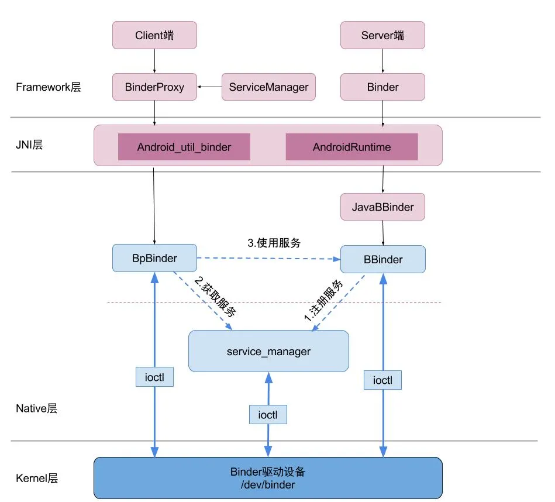
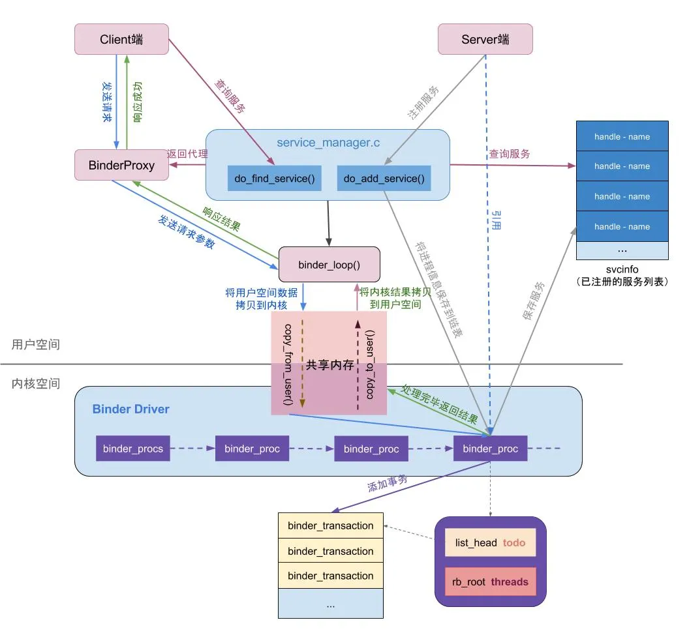
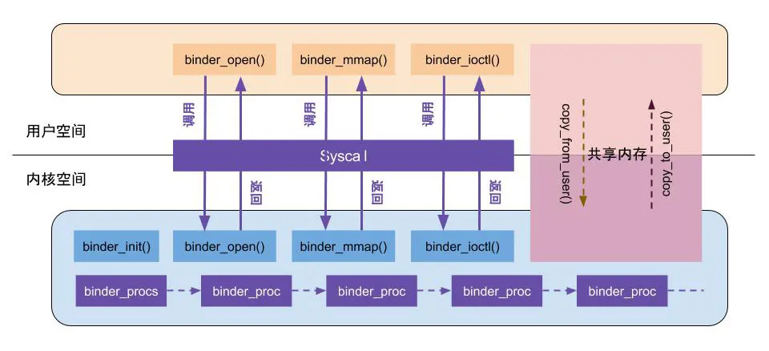
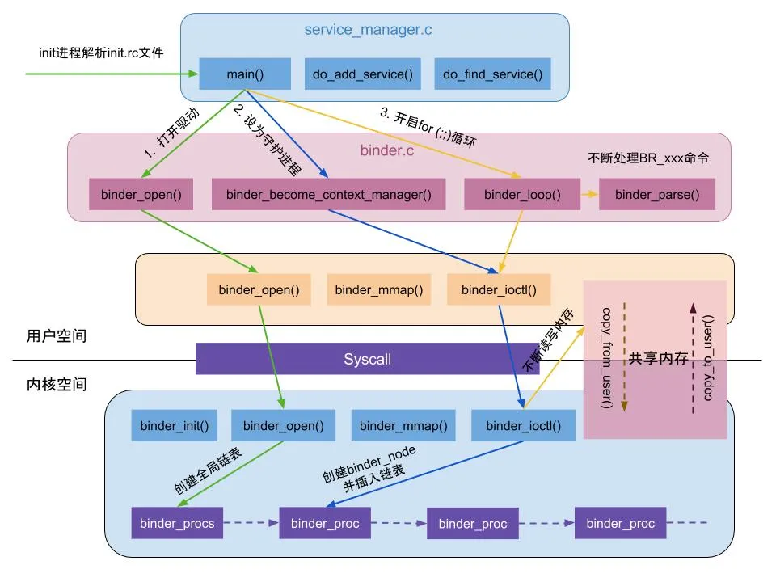
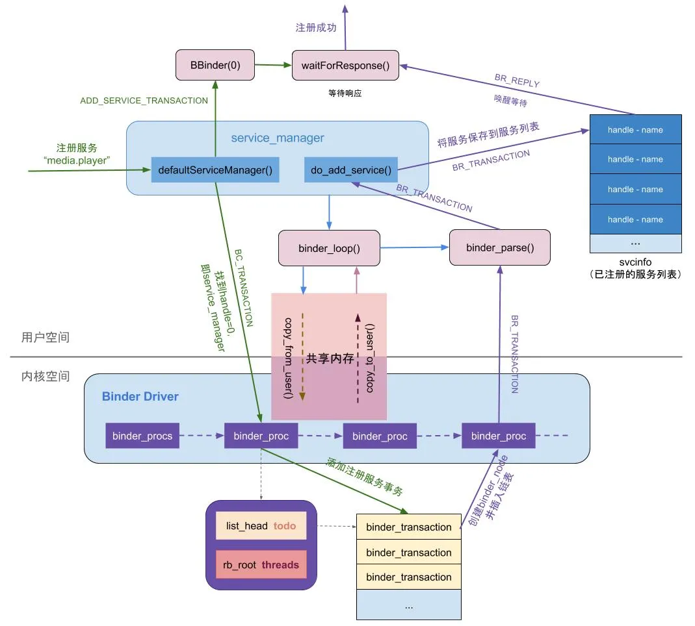
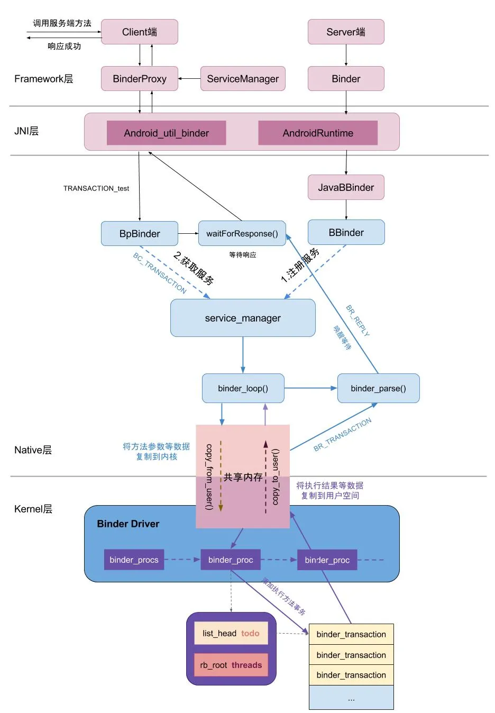

# 1 Linux 进程间通信

## 1.1 进程间通信的理解

1. 进程在用户空间相互独立，而内核空间所有进程共享。
2. 进程各自有不同的用户地址空间，任何一个进程的全局变量在另一个进程中都看不到。
3. **进程之间要交换数据必须通过内核，在内核中开辟一块缓冲区，进程A把数据从用户空间拷到内核缓冲区，进程B再从内核缓冲区把数据读走，内核提供的这种机制称为进程间通信。**
4. 不同进程间的通信本质：进程之间可以看到一份公共资源；而提供这份资源的形式或者提供者不同，造成了通信方式不同，进程间通信的本质就是内存的拷贝。

## 1.2 进程通信方式

1. 管道：拷贝两次
2. 共享内存：效率高，安全性差，无需拷贝
3. 文件：效率低，安全性高，拷贝两次
4. socket：C/S模型结构，拷贝两次

# 2 Binder

Binder 是 Android 系统进程间通信（IPC）的一种方式。译文为 “粘合剂” ，它的作用也和粘合剂一样，将系统中各个组件（如四大件）粘合到了一起，是各个组件之间的桥梁。

## 2.1 Binde 通信模型

模型步骤如下：
1. Server端向Service Manager注册服务。
2. Client端通过Service Manager查询服务。
3. 查找到之后，Client使用Server端提供的相关功能。

另外，需要注意的是，上述步骤实际都是通过io control向底层Binder驱动发送或请求数据。如下图所示：

## 2.2 Binder 整体结构

Binder 整体结构大致分4部分

1. Binder 驱动
2. Service Manager
3. Binder Client
4. Binder Service

- Binder 通信采用 C/S 架构。
- Binder 在 framework 层进行了封装，通过 JNI 技术调用 Native 层的 Binder 架构
- Binder 在 Native 层以 ioctl 的方式与 Binder 驱动通讯
- Binder IPC 包含 Client, Service, ServiceManager, binder 驱动. 其中 ServiceManager 用于管理系统总的各种服务

## 2.3 Binder 机制详解

1. 首先要注册服务端。Server 端通过 ServiceManager 注册服务。

   1. 首先向 Binder 驱动的全局链表 binder_procs 中插入服务端的信息
   2. 然后向 ServiceManager 的 svcinfo 列表中缓存一下注册的服务（svcinfo 列表保存了所有已注册服务的信息）。

2. 客户端通过 ServiceManager 获取对应服务。ServiceManager 从 svcinfo 列表中查询到对应服务并返回服务端的代理。（也可以理解为引用）

3. 客户端和服务端进行通信

   1. 通过 BinderProxy 将客户端请求参数发送给 ServiceManager
   2. 通过共享内存的方式使用内核方法 copy_from_user() 将参数拷贝到内核空间
   3. 客户端进入等待状态，Binder 驱动向服务端的 todo 列表中添加一条事务，执行完成之后把执行结果通过 copy_to_user() 将内核的结果拷贝到用户空间
   4. 唤醒等待的客户端，把结果响应返回

## 2.4 Binder 驱动

先了解一些基本概念。

**系统调用**

用户空间访问内核空间的唯一方式就是**系统调用**。

**内核态/用户态**
当一个进程（任务）执行系统调用而进入内核代码中执行时，就称进程处于内核运行态，简称**内核态**。此时处理器处于最高特权级（**0级**）的内核代码中运行。
当进程执行用户自己的代码时，称其处于用户运行态，简称**用户态**，此时处理器处于最低特权级（3级）的用户代码中运行

**驱动**
驱动程序一般指的是设备驱动程序（Device Driver），是一种可以使计算机和设备通信的特殊程序。相当于硬件的接口，操作系统只有通过这个接口，才能控制硬件设备的工作；

如上图：

- 户空间中的 binder_open()，binder_mmap()，binder_ioctl()等方法通过 system call 来调用内核空间 Binder 驱动中的方法。
- 内核空间与用户空间通过 copy_from_user()，copy_to_user() 这两个内核方法来完成用户空间与内核空间内存的数据传输。
- Binder 驱动中有一个全局链表 binder_procs 保存服务端的进程信息

## 2.5 ServiceManager

通过 ServiceManager 可以与 Binder 驱动进行通讯。

ServiceManager的作用很简单：提供注册服务和查询服务的功能。

下图为 ServiceManager 启动的过程。

- ServiceManager 分为 framework 层和 native 层，framework 层只是对 native 层进行了封装，方便调用。
- 系统开机时，init 进程解析 init.rc 文件调用 service_manager.c 中的 main() 方法启动 ServiceManager 服务。
- ServiceManager 启动步骤：

1. 打开驱动创建全局链表 binder_procs
2. 将自己当前进程信息保存到 binder_procs 链表
3. 开启 loop 不断处理共享内存中的数据

## 2.6 通过 ServiceManager 注册服务

1. 注册服务端：通过 ServiceManager 的 addService() 方法注册服务
2. ServiceManager 向 Binder 驱动发送 BC_TRANSACTION 命令（binder client）并携带 ADD_SERVICE_TRANSACTION命令。同时，注册服务的线程进入等待状态，waitForResponse()
3. Binder 驱动收到请求，向 ServiceManager 的 todo 队列里面添加一条事务：创建服务端进程 binder_node 信息并插入到 binder_procs 链表中
4. 事务处理完，发送 BR_TRANSACTION 命令，ServiceManager 收到命令后向 svcinfo 列表添加已经注册的服务。
5. 发送BR_REPLAY（binder replay）唤醒等待的线程，通知注册成功。

# 完整通信过程

1. 通过 ServiceManager 获取到服务端的 BinderProxy 代理对象，通过调用 BinderProxy 将参数、方法标识（例如：TRANSACTION_test）传给 ServiceManager，同时客户端线程进入等待状态。
2. ServiceManager 将用户空间的参数等请求数据复制到内核空间
3. 向服务端插入一条执行执行方法的事务
4. 事务执行完通知 ServiceManager 将执行结果从内核空间复制到用户空间，并唤醒等待的线程，响应结果，通讯结束。
