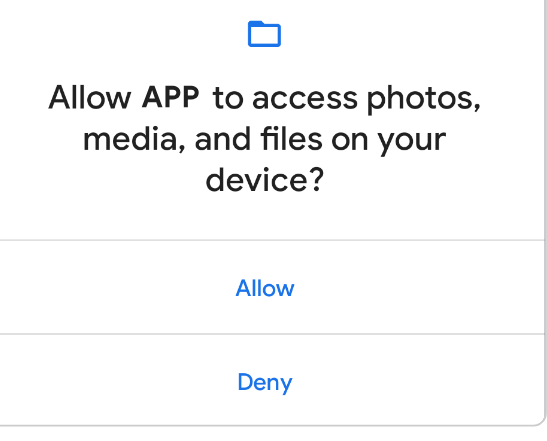

# 一、权限类型

## 1.1 安装时权限

安装时权限在用户安装应用时自动授予，如果您在应用中声明了安装时权限，应用商店会在用户查看应用详情页面时向其显示安装时权限通知。

安装时权限子类型，包括**一般权限**和**签名权限。**

**一般权限**

此类权限对用户隐私和其他应用的运行构成的风险很小。

系统会为一般权限分配 `normal` 级别

**签名权限**

只有当应用与定义权限的应用或 OS 使用相同的证书签名时，系统才会向应用授予签名权限。

实现特权服务（如自动填充或 VPN 服务）的应用也会使用签名权限。这些应用需要服务绑定签名权限，以便只有系统可以绑定到该应用的服务。

系统会为签名权限分配 `signature` 保护级别。

## 1.2 运行时权限

运行时权限也称为危险权限，此类权限授予应用对受限数据的额外访问权限，或允许应用执行对系统和其他应用具有更严重影响的受限操作。

因此，需要先在应用中请求运行时权限，然哼才能访问受限数据或执行受限操作。

当应用请求运行时权限时，系统会显示运行时权限提示，如下图所示。

 系统会为运行时权限分配 `dangerous` 保护级别。

## 1.3 特殊权限

特殊权限与特定的应用操作相对应。只有平台和原始设备制造商 (OEM) 可以定义特殊权限。此外，如果平台和 OEM 想要防止有人执行功能特别强大的操作（例如通过其他应用绘图），通常会定义特殊权限。

系统设置中的**特殊应用访问权限**页面包含一组用户可切换的操作。其中的许多操作都是以特殊权限的形式实现的。

系统会为特殊权限分配 `appop` 保护级别。

## 1.4 权限组

权限可以属于**权限组**。 **权限组由一组逻辑相关的权限组成。**例如，发送和接收短信的权限可能属于同一组，因为它们都涉及应用与短信的互动。

权限组的作用是在应用请求密切相关的多个权限时，帮助系统尽可能减少向用户显示的系统对话框数量。**当系统提示用户授予应用权限时，属于同一组的权限会在同一个界面中显示。** 但是，权限可能会在不另行通知的情况下更改组，因此不要假定特定权限与任何其他权限组合在一起。
 