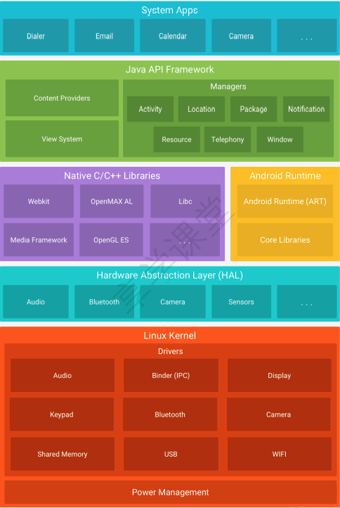
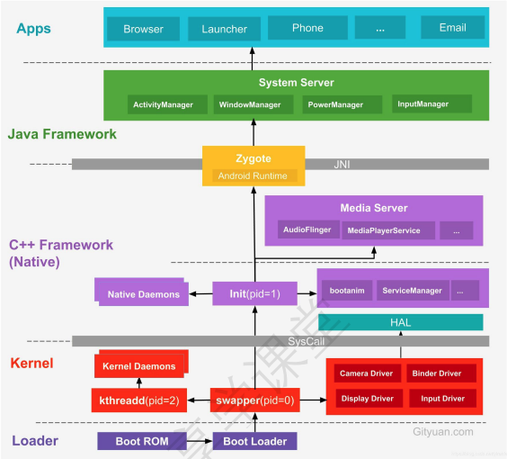
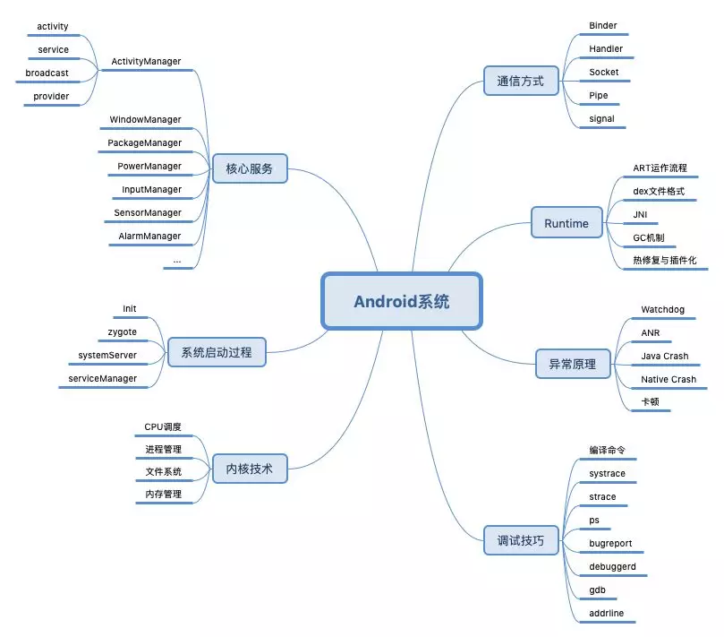

# 1 前言

- 底层以 Linux Kernel 作为基石
- 上层用户空间由 Native 系统库, 虚拟运行环境, 框架层组成
- 通过系统调用 (Syscall) 连通系统的内核空间与用户空间
- 用户空间通过 JNI 打通 Java 层和 Native 层
                  

从下往上依次是:

- Linux 内核

- Linux 内核的安全机制为 Android 提供保障。

- HAL 层

- 硬件厂商如果需要支持 Linux 系统，那就要遵守 GPL 协议公开硬件驱动的代码，所以需要一个“空壳”HAL。
- Android 根据不同的需要，加载不同的动态库。硬件厂商提供这些动态库，并且把相关硬件功能写入动态库，内核只开放一些基本的读写接口操作。
- HAL层遵循 Apache 协议，不需要公开源码

- 系统 Native 库和 Android 运行时环境

- Android 包含了一个核心库，提供了Java编程语言核心库的大多功能。虚拟机也在该层启动。

- Java 框架层
- 应用层

# 2 Android 架构

该文章是以进程的角度进行分层分析的

**系统启动架构图**

Android 系统启动过程是**从下往上**的一个过程

是由 Boot Loader 引导开机, 然后依次进入 Kernel -> Native -> Framework -> App

## 2.1 Linux 内核层

Android 平台的基础是 Linux 内核

- 启动 Kernel 的 swapper 进程 (pid=0)

- 该进程又称为 idle 进程

- 系统初始化过程 Kernel 从无到有开创的第一个进程

- 用于初始化进程管理、内存管理，加载Display,Camera Driver，Binder Driver等相关工作

  

- 启动 kthreadd 进程 (pid=2)

- Linux 系统内核进程
- 会创建内核工作线程 kworker, 软中断线程 ksoftirqd，thermal 等内核守护进程
- 是所有内核进程的鼻祖

## 2.2 硬件抽象层(HAL)

- HAL 层提供标准接口
- HAL 包含多个库模块, 每个模块都为特定类型的硬件组件实现一组接口

## 2.3 Android Runtime & 系统库

每个应用都在其自己的进程中运行，都有自己的虚拟机实例。

Native系统库主要包括: init 孵化来的用户控件的守护进程, HAL 层以及开机动画等

init 进程 (pid=1) 是所有用户进程的鼻祖

- init 进程会孵化出 ueventd、logd、healthd、installd、adbd、lmkd 等用户守护进程；
- init 进程还启动 servicemanager (binder服务管家)、 bootanim (开机动画) 等重要服务
- init 进程孵化出 Zygote 进程，Zygote 进程是 Android 系统的第一个 Java进程 (即虚拟机进程)， Zygote 是所有 Java 进程的父进程，Zygote 进程本身是由 init 进程孵化而来的。

## 2.4 Framework 层

**Zygote 进程**

是由 init 进程通过解析 init.rc 文件后 fork 生成

Zygote 进程作用主要包含:

- 加载 ZygoteInit 类，注册 Zygote Socket 服务端套接字
- 加载虚拟机
- 提前加载类 preloadClasses
- 提前加载资源 preloadResouces

**System Server 进程**

是由 Zygote 进程 fork 而来， System Server 是 Zygote 孵化的第一个进程

System Server 负责启动和管理整个 Java framework
包含

- ActivityManager
- WindowManager
- PackageManager
- PowerManager

**Media Server 进程**

init 进程 fork 而来

负责启动和管理整个 C++ framework

包含 AudioFlinger, Camera Service 等服务

## 2.5 App 层

- Zygote 进程孵化出的第一个 App 进程是 Launcher，这是用户看到的桌面 App
- Zygote 进程还会创建 Browser，Phone，Email 等 App 进程，每个 App 至少运行在一个进程上。
- 所有的 App 进程都是由 Zygote 进程 fork 生成的。

## 2.6 Syscall && JNI

Native 与 Kernel 之间有一层系统调用 (SysCall) 层，后续需要学习 Linux 系统调用 (Syscall) 原理;

Java 层与 Native(C/C++) 层之间的纽带JNI，后续需要学习 Android JNI 原理分析。

# 3 通信方式

对于IPC(Inter-Process Communication, 进程间通信)

- Linux 现有管道、消息队列、共享内存、套接字、信号量、信号这些 IPC 机制
- Android 额外还有 Binder IPC 机制，Android OS 中的 Zygote 进程的 IPC 采用的是 Socket 机制
- 在上层 system server、media server 以及上层 App 之间更多的是采用 Binder IPC 方式来完成跨进程间的通信。
- 对于 Android 上层架构中, 很多时候是多线程之间相互通信, 通常采用 Handler 消息机制

# 4 核心知识点概览

