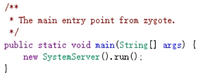
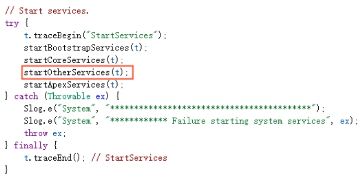
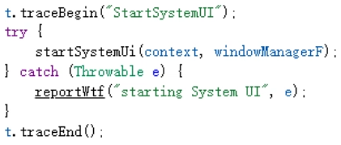
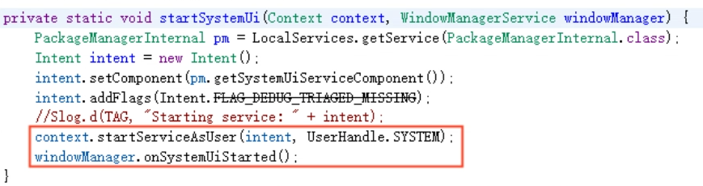
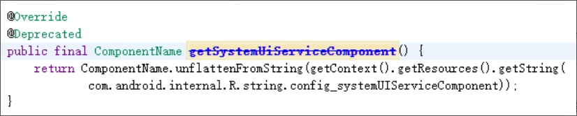
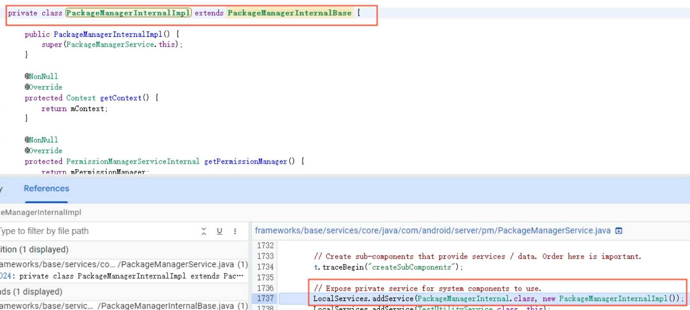

# 一、概述

SystemUI 是以应用的形式运行，编译 SystemUI 模块会生产 APK 文件。

编译源码路径：`frameworks/base/packages/SystemUI/`

安装路径：`/system/priv-app/SystemUI/`

**主要功能：**

- Status bars：顶部状态栏
- Navigation bars：底部导航栏
- Notification：通知栏
- Lockscreen：锁屏
- Quick Settings：快捷设置
- Recent Task Switcher：近期任务列表
- VolumeUI：音量控制UI

# 二、启动过程

基于Android 13.0

## 2.1 Android 系统启动

1. **按下电源键进行系统启动：**

触发引导芯片，加载预定义代码，启动引导程序 BootLoader

1. **启动 BootLoader 引导程序：**

它是一个 Android 系统启动前运行的一个小程序，用来拉起 OS 并运行

1. **启动 Linux 内核：**

设置缓存、被保护存储器、计划列表、加载驱动、完成系统设置

1. **启动 init 进程：**

初始化并启动属性服务，启动 Zygote 进程

1. **启动 Zygote 进程孵化器：**

创建 JVM，注册 JNI，创建服务端的 socket，启动 SystemServer 进程

1. **启动 SystemServer 进程：**

启动 Binder 线程池和 SystemServerManager，启动各种系统服务，如AMS、WMS等

## 2.2 启动 SystemUI

1. **SystemServer入口 main() 方法**

调用 SystemServer.java 类的 mian() 方法



1. **启动各项服务**

main() 方法生成 SystemServer 对象，然后调用 run() 方法启动各项服务



1. **调用 startOtherService()** 

SystemUI 在 startOtherService() 方法中启动，传入一个 WMS 对象



1. **调用 startSystemUi()**

SystemServer.java -> startSystemUi()



- 首先获取 PackageManagerInternal 的对象实例 pm
- 再调用 pm 的 getSystemUiServiceComponent() 方获取 SystemUiService 组件的路径
- 最后再调用 startServiceAsUser() 方法启动 SystemUiService 服务

1. **执行 getSystemUiServiceComponent()**

- PackageManagerInternal 是一个抽象类，PackageManagerInternalBase 继承该抽象类并重写了 getSystemUiServiceComponent() 方法



- PackageManagerService 的内部类 PackageManagerInternalImpl 类中，继承并实现了 PackageManagerInternalBase 类



可以看到 ComonentName 是从一个内部资源字符串`com.android.internal.R.string.config_systemUIServiceComponent`获取SystemUIService 组件完整类名的

- 通过搜索可以找到 config_systemUIServiceComponent 资源字符串的位置

```
frameworks/base/core/res/res/values/config.xml
```

1. 启动 SystemUIApplication

SystemUI 本质也是一个 APK，也有入口 Application，也有 AndroidManifest.xml 文件

```java
<manifest xmlns:android="http://schemas.android.com/apk/res/android"
        xmlns:androidprv="http://schemas.android.com/apk/prv/res/android"
        package="com.android.systemui"
        android:sharedUserId="android.uid.systemui"
        xmlns:tools="http://schemas.android.com/tools"
        coreApp="true">
     ...代码省略...
    <application
        android:name=".SystemUIApplication"
        android:persistent="true"
        android:allowClearUserData="false"
        android:backupAgent=".backup.BackupHelper"
        android:killAfterRestore="false"
        android:hardwareAccelerated="true"
        android:label="@string/app_label"
        android:icon="@drawable/icon"
        android:process="com.android.systemui"
        android:supportsRtl="true"
        android:theme="@style/Theme.SystemUI"
        android:defaultToDeviceProtectedStorage="true"
        android:directBootAware="true"
        tools:replace="android:appComponentFactory"
        android:appComponentFactory=".SystemUIAppComponentFactory">
		...代码省略...	
        <service android:name="SystemUIService"android:exported="true"/>   
        ...代码省略...     
    </application>
</manifest>
```

从 AndroidManifest.xml 文件中需要关注的是：

- SystemUI 的入口为 SystemUIApplication
- SystemUI是persistent (持久) 应用，当应用因为异常而崩溃的时候，系统会重新拉起这个应用
- 应用组件工厂属性 appComponentFactory 指向了 SystemUIAppComponentFactory。
- SystemUIService 服务的声明，且支持外部唤起。
   