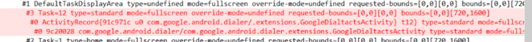

# 窗口添加流程 - Client端

窗口布局在 onCreate 方法中通过 setContentView(R.layout.xxx) 加载。

窗口mDrawState变化状态：

`NO_SURFACE -> DRAW_PENDING -> COMMIT_DRAW_PENDING -> HAS_DRAWN -> READY_TO_SHOW`

窗口在wm_on_resume_called之后可见。也即只有`READY_TO_SHOW`之后才会将图层设置为可见状态。

在添加窗口后，窗口层级会多如下部分。



层级结构：

```
Task
  ActivityRecord
    WindowState
```

