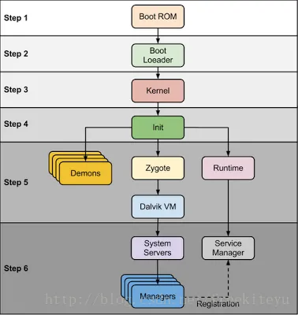
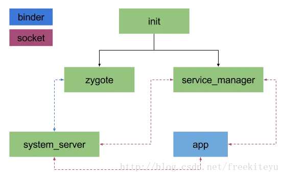
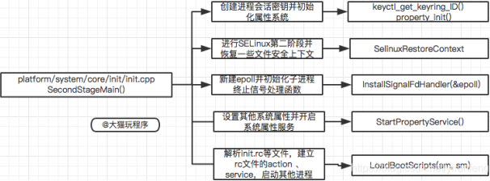
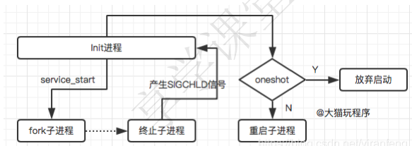
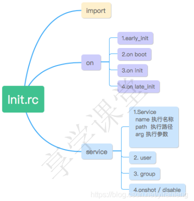
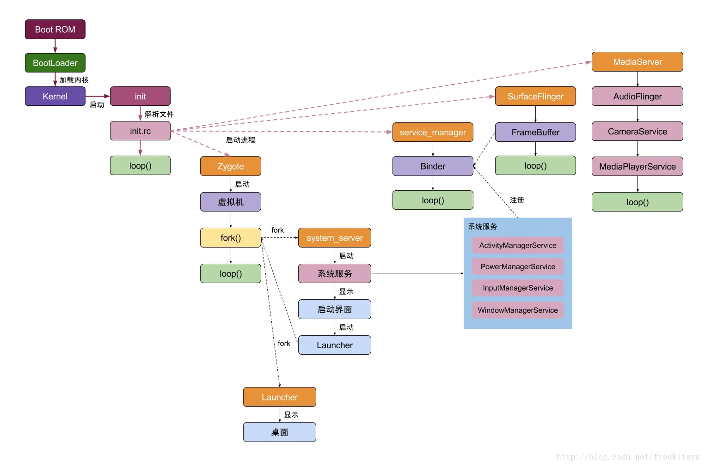

内容摘自：[一文看明白Android系统启动过程](https://blog.csdn.net/freekiteyu/article/details/79175010)

# 1 计算机启动方式

程序执行时首先将程序从**硬盘**读取到**内存**，然后加载到**CPU**

按下开机键之后，BIOS将操作系统加载到内存中

BIOS：Basic Input/Output System

1. BIOS首先进行硬件自检
2. 自检完成后，BIOS将控制权交给下一个启动程序，一般会按照**启动排序**顺序加载，一般就是**Boot Sequence**界面
3. 第一存储区被激活，计算机读取第一扇区，即最前面的**512**个字节（**主引导记录，Master boot record，MBR**），如果这512个自己最后两个字节是**0x55和0xAA**，表明设备可以启动
4. 计算机从MBR中读取前面的446字节的机器码，运行事先安装的**启动管理器(Boot Loader)**，由用户选择启动哪个操作系统
5. 操作系统的内核被加载入内存。

（1） 第1-446字节：调用操作系统的机器码。
（2） 第447-510字节：分区表（Partition table）。
（3） 第511-512字节：主引导记录签名（0x55和0xAA）。

# 2 Android 手机启动过程

Android系统主要分区

- /boot：存放引导程序，包括内核和内存操作程序
- /system：相当于电脑c盘，存放Android系统及系统应用
- /recovery：恢复分区，可以进入该分区进行系统恢复
- /data：用户数据区，包含了用户的数据 ：联系人、短信、设置、用户安装的程序
- /cache：安卓系统缓存区，保存系统最常访问的数据和应用程序
- /misc：包含一些杂项内容，如系统设置和系统功能启用禁用设置
- /sdcard：用户自己的存储区，可以存放照片，音乐，视频等文件



按下开机键之后，首先加载**Bootloader**

1. Bootloader 读取 ROM，找到操作系统，并将 Linux 内核加载到 RAM 中
2. Kernel 层，Linux内核初始化各种软硬件环境，加载驱动程序，挂载根文件系统

1. 首先启动 swapper 进程(pid=0)，用于初始化进程管理、内存管理、加载驱动
2. 再启动 kthread 进程(pid=2)，kthread 是所有 Linux 系统内核进程的鼻祖

1. Native 层，Linux 内核最后阶段，硬件设备驱动与 HAL 层交互，执行第一个用户空间的 init 进程，init 进程(pid=1)是所有进程的鼻祖
2. C++ Framework中，init 进程启动后，启动 adbd，logd 等守护进程，启动 service_manager，孵化 zygote 进程（由 init 进程解析 init.rc 文件后 fork 生成）
3. Java Framework中，zygote 加载虚拟机，启动 System Server（zygote 孵化的第一个进程）
4. zygote 启动 APP 进程，启动的第一个 APP 进程是 Launcher


## 2.1 init进程分析

init 进程是用户空间的第一个进程，pid=1

init 进程启动后主要进行：

1. 创建文件系统目录，并挂载相关的文件系统
2. 挂载分区，初始化日志输出
3. 启动 SELinux 安全策略
4. 启动属性服务，解析 init.rc 文件并启动相应属性服务进程



Android Q（10）之后，init 进程的入口从 init.cpp 调整到了 main.cpp，具体为调用 system/core/init/main.cpp 的 main() 方法

### 2.1.1 主方法

```cpp
// argc表示参数个数，argv是参数列表，也就是具体的参数
int main(int argc, char** argv) {
#if __has_feature(address_sanitizer)
    __asan_set_error_report_callback(AsanReportCallback);
#endif

    // init创建子进程ueventd
    // 当argv[0]的值为ueventd时，strcmp为0
    if (!strcmp(basename(argv[0]), "ueventd")) { 
        // ueventd创建设备节点文件
        return ueventd_main(argc, argv);
    }

    if (argc > 1) { // 当参数个数大于1时，执行分支
        
        // 参数为subcontext，初始化日志系统
        if (!strcmp(argv[1], "subcontext")) {
            android::base::InitLogging(argv, &android::base::KernelLogger);
            const BuiltinFunctionMap& function_map = GetBuiltinFunctionMap();

            return SubcontextMain(argc, argv, &function_map);
        }

        // 加载selinux规则，设置selinux日志，完成selinux相关工作
        if (!strcmp(argv[1], "selinux_setup")) {
            return SetupSelinux(argv);
        }

        // 启动第二阶段
        if (!strcmp(argv[1], "second_stage")) {
            return SecondStageMain(argc, argv);
        }
    }

    // 默认启动第一阶段
    return FirstStageMain(argc, argv);
}
```

### 2.1.2 子进程 ueventd

具体调用为：system/core/init/ueventd.cpp

Android 根文件系统中没有 /dev 目录，该目录是 init 进程启动后动态创建的。

ueventd 通过两种方式创建设备节点文件：

1. "冷插拔"

1. 以预先定义的设备信息为基础，当ueventd启动后，统一创建设备节点文件。
2. 这一类设备节点文件被称为**静态节点文件**。

1. "热插拔"

1. 当有设备插入 USB 端口时，ueventd 会接收到这一事件，为插入的设备动态创建设备节点。
2. 这一类设备节点文件被称为**动态节点文件**。

```cpp
int ueventd_main(int argc, char** argv) {
    // 设置文件默认值，设置默认权限为666（与chmod相反）
    umask(000);

    // 初始化内核日志，位于节点/dev/kmsg    
    android::base::InitLogging(argv, &android::base::KernelLogger);

    LOG(INFO) << "ueventd started!";

    //注册selinux相关用于打印log的回调函数
    SelinuxSetupKernelLogging();
    SelabelInitialize();

    std::vector<std::unique_ptr<UeventHandler>> uevent_handlers;

    / /获取属性，根据不同的SOC厂商获取不同的hardware rc文件
    auto hardware = android::base::GetProperty("ro.hardware", "");
    auto ueventd_configuration = ParseConfig({"/system/etc/ueventd.rc", 
                                              "/vendor/ueventd.rc",
                                              "/odm/ueventd.rc", 
                                              "/ueventd." + hardware + ".rc"});
    
    ......

    // 冷启动
    if (!android::base::GetBoolProperty(kColdBootDoneProp, false)) {
        ColdBoot cold_boot(uevent_listener, uevent_handlers,
                           ueventd_configuration.enable_parallel_restorecon);
        cold_boot.Run();
    }

    for (auto& uevent_handler : uevent_handlers) {
        uevent_handler->ColdbootDone();
    }

    // We use waitpid() in ColdBoot, so we can't ignore SIGCHLD until now.
    signal(SIGCHLD, SIG_IGN);
    // 在最后一次调用waitpid()和为上面的SIGCHLD设置SIG_IGN之间退出的子程序的获取和挂起。
    while (waitpid(-1, nullptr, WNOHANG) > 0) {
    }

    //监听来自驱动的uevent，进行“热插拔”处理
    uevent_listener.Poll([&uevent_handlers](const Uevent& uevent) {
        for (auto& uevent_handler : uevent_handlers) {
            // 热启动，创建设备
            uevent_handler->HandleUevent(uevent);
        }
        return ListenerAction::kContinue;
    });

    return 0;
}
```

### 2.1.3 第一阶段

init 进程第一阶段主要工作：挂载分区，创建设备节点和关键目录，初始化日志输出系统，启用 SELinux 安全策略。部分代码如下

```cpp
int FirstStageMain(int argc, char** argv) {
    // init crash时重启引导加载程序
    if (REBOOT_BOOTLOADER_ON_PANIC) {
        //主要将各种信号量的行为设置为SA_RESTART
        //一旦监听到这些信号即执行重启系统
        InstallRebootSignalHandlers();
    }

    ......

    // 清空权限.
    umask(0);

    CHECKCALL(clearenv());
    CHECKCALL(setenv("PATH", _PATH_DEFPATH, 1));
    // 在RAM内存上获取基本的文件系统,剩余的被rc文件所用
    CHECKCALL(mount("tmpfs", "/dev", "tmpfs", MS_NOSUID, "mode=0755"));
    CHECKCALL(mkdir("/dev/pts", 0755));
    CHECKCALL(mkdir("/dev/socket", 0755));
    CHECKCALL(mount("devpts", "/dev/pts", "devpts", 0, NULL));
#define MAKE_STR(x) __STRING(x)
    CHECKCALL(mount("proc", "/proc", "proc", 0, "hidepid=2,gid=" MAKE_STR(AID_READPROC)));
#undef MAKE_STR
    // Don't expose the raw commandline to unprivileged processes.
    CHECKCALL(chmod("/proc/cmdline", 0440));
    std::string cmdline;
    android::base::ReadFileToString("/proc/cmdline", &cmdline);
    gid_t groups[] = {AID_READPROC};
    CHECKCALL(setgroups(arraysize(groups), groups));
    CHECKCALL(mount("sysfs", "/sys", "sysfs", 0, NULL));
    CHECKCALL(mount("selinuxfs", "/sys/fs/selinux", "selinuxfs", 0, NULL));

    CHECKCALL(mknod("/dev/kmsg", S_IFCHR | 0600, makedev(1, 11)));

    if constexpr (WORLD_WRITABLE_KMSG) {
        CHECKCALL(mknod("/dev/kmsg_debug", S_IFCHR | 0622, makedev(1, 11)));
    }

    CHECKCALL(mknod("/dev/random", S_IFCHR | 0666, makedev(1, 8)));
    CHECKCALL(mknod("/dev/urandom", S_IFCHR | 0666, makedev(1, 9)));

    // 这对于日志包装器是必需的，它在ueventd运行之前被调用
    CHECKCALL(mknod("/dev/ptmx", S_IFCHR | 0666, makedev(5, 2)));
    CHECKCALL(mknod("/dev/null", S_IFCHR | 0666, makedev(1, 3)));

    // 第一阶段挂载tmpfs、mnt/vendor、mount/product分区
    CHECKCALL(mount("tmpfs", "/mnt", "tmpfs", MS_NOEXEC | MS_NOSUID | MS_NODEV,
                    "mode=0755,uid=0,gid=1000"));

    // 创建可供读写的vendor目录
    CHECKCALL(mkdir("/mnt/vendor", 0755));
    CHECKCALL(mkdir("/mnt/product", 0755));

    // 在/dev目录下挂载好tmpfs以及kmsg，这样就可以初始化kernel log系统
    InitKernelLogging(argv);

    ......

    // 初始化一些必要的分区，得到/system，/vendor，/odm三个目录的挂载信息
    if (!DoFirstStageMount()) {
        LOG(FATAL) << "Failed to mount required partitions early ...";
    }

    ......

    // 启动init进程，传入参数selinux_setup
    const char* path = "/system/bin/init";
    const char* args[] = {path, "selinux_setup", nullptr};
    auto fd = open("/dev/kmsg", O_WRONLY | O_CLOEXEC);
    dup2(fd, STDOUT_FILENO);
    dup2(fd, STDERR_FILENO);
    close(fd);
    execv(path, const_cast<char**>(args));

    // execv() only returns if an error happened, in which case we
    // panic and never fall through this conditional.
    PLOG(FATAL) << "execv(\"" << path << "\") failed";

    return 1;
}
```

### 2.1.4 加载SELinux规则

selinux有两种工作模式：

permissive，所有操作都被允许，setenforce 0

enforcing，所有操作都会检查权限，setenforce 1

实际操作的是 /sys/fs/selinux/enforce 文件

初始化 selinux，加载 SELinux 规则，配置 SELinux 相关 log 输出，启动第二阶段

```cpp
int SetupSelinux(char** argv) {
    SetStdioToDevNull(argv);
    // 初始化kernel日志
    InitKernelLogging(argv);

    // init crash时重启引导加载程序
    if (REBOOT_BOOTLOADER_ON_PANIC) {
        InstallRebootSignalHandlers();
    }

    boot_clock::time_point start_time = boot_clock::now();
    MountMissingSystemPartitions();

    // 注册回调，用来设置需要写入kmsg的selinux日志
    SelinuxSetupKernelLogging();
    //加载selinux规则
    SelinuxInitialize();

    ......

    // 传入参数second_stage
    const char* path = "/system/bin/init";
    const char* args[] = {path, "second_stage", nullptr};
    execv(path, const_cast<char**>(args));

    // 进入第二阶段
    PLOG(FATAL) << "execv(\"" << path << "\") failed";

    return 1;
}
```

### 2.1.5 第二阶段



主要函数功能在 system/core/init/init.cpp 中，部分代码如下

```cpp
int SecondStageMain(int argc, char** argv) {
    // 初始化属性系统
    PropertyInit();
    
    // 有进程都可以访问的会话密钥环
    keyctl_get_keyring_ID(KEY_SPEC_SESSION_KEYRING, 1);
    
    // 在第二阶段初始化期间挂载额外的文件系统
    MountExtraFilesystems();
    
    // 现在为第二阶段设置 SELinux
    SelinuxSetupKernelLogging();
    SelabelInitialize();
    SelinuxRestoreContext();
    
    // 新建epoll，初始化子进程终止信号处理函数
    Epoll epoll;
    InstallSignalFdHandler(&epoll);
    InstallInitNotifier(&epoll);
    
    // 设置其他系统属性，开启系统属性服务
    StartPropertyService(&property_fd);
    
    // 初始化上下文
    InitializeSubcontext();
    
    //解析init.rc文件
    ActionManager& am = ActionManager::GetInstance();
    ServiceList& sm = ServiceList::GetInstance();
    LoadBootScripts(am, sm);
}
```

### 2.1.6 信号处理 

init 是一个守护进程，为防止 init 的子进程成为僵尸进程，需要 init 获取子进程结束时的结束码，通过结束码将子进程从程序表中移除，防止子进程占用程序表空间。



信号处理主要工作：

1. 初始化信号signal句柄
2. 循环处理子进程
3. 注册epoll句柄
4. 处理子进程终止

### 2.1.7 属性服务

Android 将属性的设置统一交由init进程管理，其他进程不能直接修改属性，而只能通知init进程来修改，而在这过程中，init进程可以进行权限控制。


PropertyInit() 初始化属性系统，从指定文件中读取属性

- 注册 selinux 回调
- 调用 CreateSerializedPropertyInfo 加载系统属性的类别信息

StartPropertyService(&property_fd) 启动属性服务

- 创建 socket，返回文件描述符，设置最大并发数为8，其他进程可通过该 socket 通知 init 进程修改系统属性
- 新线程调用 PropertyServiceThread 方法中的  handle_property_set_fd，即注册 epoll 事件，当监听到 property_set_fd 改变时调用 handle_property_set_fd。

### 2.1.8 init.rc

Android系统的配置文件，在/system/core/rootdir/目录下

功能：

1. 定义了系统启动时需要执行的一系列action
2. 执行特定动作
3. 设置环境变量和属性
4. 执行特定的Service



**init进程**通过创建子进程启动init.rc脚本文件中配置的服务，这些Service属于native服务，运行在linux空间，通过socket向上层提供服务，以**守护进程**的方式运行在后台。

守护进程：

运行在后台，不受任何终端控制的进程。常常在系统引导时启动，仅在系统关闭时停止

通过**init.rc**脚本启动的服务：

- **service_manager**：启动 binder IPC，管理所有的 Android 系统服务。

ServiceManager 进程是Bind IPC通信过程中的守护进程，本身也是一个Binder服务。ServiceManager 主要用于**启动Binder**，提供服务的**查询**和**注册**。

- **mountd**：设备安装 Daemon（守护进程），负责设备安装及状态通知
- **debuggerd**：启动 debug system，处理调试进程的请求
- **rild**：启动 radio interface layer daemon 服务，处理电话相关的事件和请求
- **media_server**：启动 AudioFlinger，MediaPlayerService 和 CameraService，负责多媒体播放相关的功能，包括音视频解码

AudioFlinger 音频服务，CameraService 相机服务。

- **surface_flinger**：启动 SurfaceFlinger 负责显示输出

SurfaceFlinger 负责图像绘制，是应用UI的核心。SurfaceFlinger 进程主要启动FrameBuffer，初始化显示系统

- **zygote**：进程孵化器，启动 Android Java VMRuntime 和启动 systemserver，负责 Android 应用进程的孵化工作

## 2.2 Zygote进程

- 孵化了所有的 Android 应用进程，是 Android Framework 的基础。
- 该进程的启动标志着Framework框架初始化启动的开始

**主要功能：**

1. 将底层功能的JNI函数注册到虚拟机
2. 预加载Java类和资源
3. fork并启动system_server核心进程
4. 作为守护进程监听处理“**孵化新进程**”的请求

**Zygote进程启动后**：执行frameworks/base/cmds/app_process/App_main.cpp文件的main()方法

```plain
App_main.main() //设置进程名，并启动 AppRuntime。
AndroidRuntime::start() //创建 Java 虚拟机，注册 JNI 方法，调用 ZygoteInit.main() 方法。
ZygoteInit.main()   //为 Zygote 注册 socket，预加载类和资源，启动 system_server 进程。
```

## 2.3 system_server进程

system_server进程由Zygote进程fork（派生、分支，创建副本）而来

下面是system_server的启动过程

```cpp
//首先会调用 ZygoteInit.startSystemServer() 方法。
//fork子进程system_server，并进入该进程
ZygoteInit.startSystemServer()

//设置当前进程名为“system_server”，创建 PathClassLoader 类加载器。
ZygoteInit.handleSystemServerProcess()  

//重定向 log 输出，通用的初始化（设置默认异常捕捉方法，时区等）
//初始化 Zygote -> nativeZygoteInit()。
RuntimeInit.zygoteInit()    

//方法经过层层调用，会进入 app_main.cpp 中的 onZygoteInit() 方法。
nativeZygoteInit()  

// 启动新 Binder 线程。
app_main::onZygoteInit()

//方法经过层层调用，会抛出异常 ZygoteInit.MethodAndArgsCaller(m, argv)
//ZygoteInit.main() 会捕捉该异常。
applicationInit()

//开启 DDMS 功能，preload() 加载资源，预加载 OpenGL，调用 SystemServer.main() 方法。
ZygoteInit.main()   

//先初始化 SystemServer 对象，再调用对象的 run() 方法。
SystemServer.main() 

//准备主线程 looper，加载 android_servers.so 库，该库包含的源码在 frameworks/base/services/ 目录下。
SystemServer.run()
```


system_server启动后，将初始化系统上下文，创建SystemServerManager，然后启动各种服务：


```cpp
// 
/** 启动引导服务
* 该方法主要启动服务：
* ActivityManagerService
* PowerManagerService
* LightsService
* DisplayManagerService
* PackageManagerService
* UserManagerService
*/
startBootstrapServices(); 

// 

/** 启动核心服务
* 主要启动服务：
* BatteryService 统计电池电量，前置条件：LightService
* UsageStateService，统计应用使用情况
* WebViewUpdateService
*/
startCoreServices();

/** 启动其他服务
* 主要启动服务：InputManagerService，WindowManagerService，StatusBarManagerService
* 等待ServiceManager，SurfaceFlinger启动完成，显示启动界面
*/
startOtherServices();
```


所有服务启动完成后会注册到ServiceManager。

ActivityManagerService服务启动完成后

1. 进入ActivityManagerService.systemReady()
2. 启动SystemUI、WebViewFactory，Watchdog
3. 启动桌面Launcher App

## 2.4 ActivityManagerService启动


启动桌面Launcher App需要等待ActivityManagerService启动完成。启动过程如下：


```cpp
/**
* 创建名为"ActivityManager"的前台线程，并获取mHander
* 通过UiThread类，创建名为"android.ui"的线程
* 创建前台广播和后台广播接收器
* 创建目录 /data/system
* 创建服务 BatterStateService
*/
ActivityManagerService(Context) 
    
    //安装所有的系统 Provider。
    ActivityManagerService.startOtherServices() -> installSystemProviders()
    
    /**
    * 恢复最近任务栏的 task
    * 启动 WebView，SystemUI，开启 Watchdog，启动桌面 Launcher App
    * 发送系统广播
    */
ActivityManagerService.systemReady()
```


# 完整启动过程


