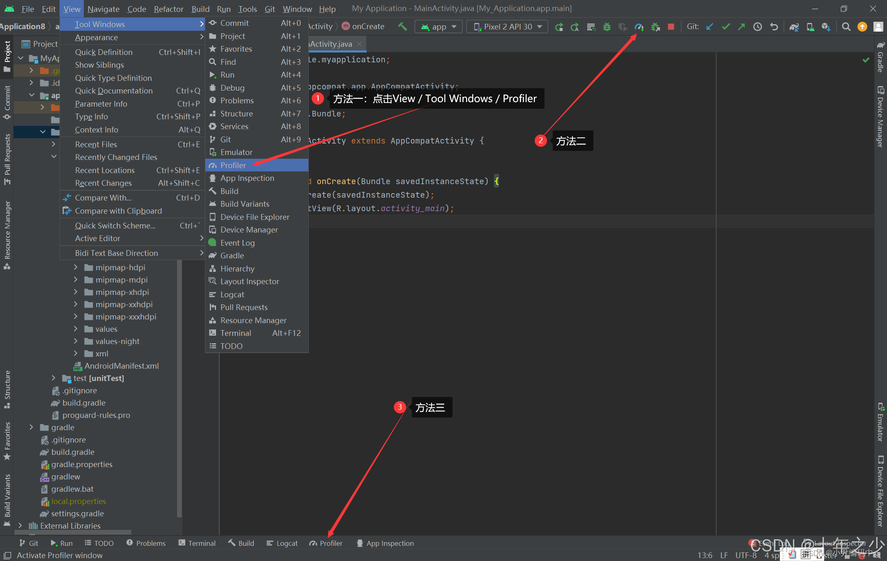
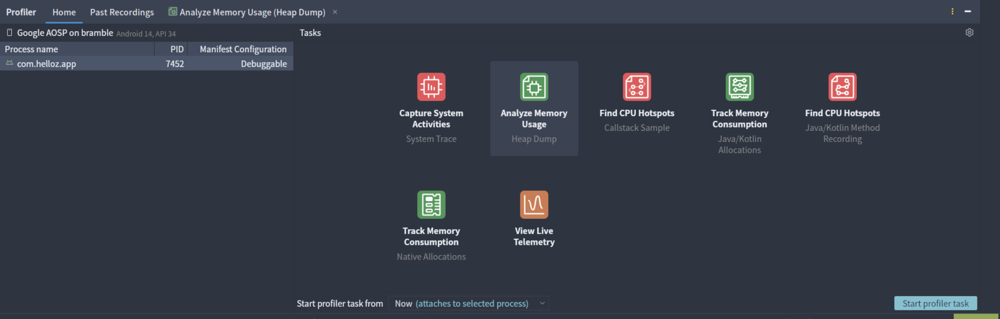
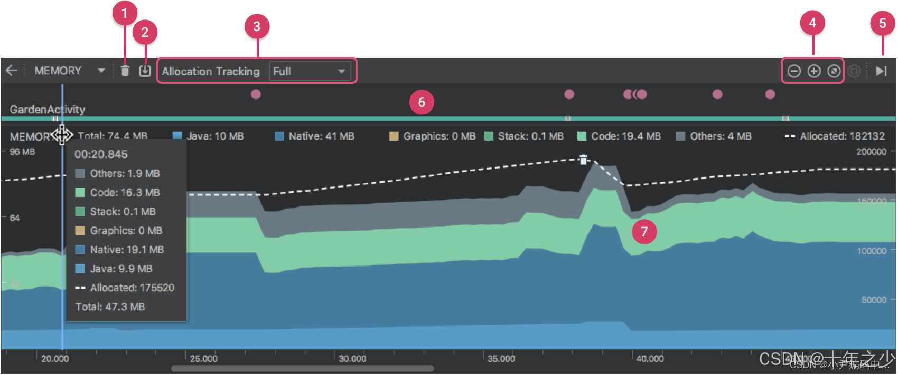
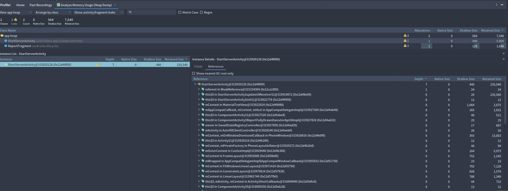

# 基本概念

**引用**
- 强引用：如果A强引用了B，当没有其他对象引用B**且A被垃圾回收**时，才会对B进行GC操作。
- 软引用：如果A软引用了B，当没有其他对象引用B**且内存不足**时，才会对B进行GC操作。
- 弱引用：如果A弱引用了B，**如果没有其他对象引用B**，则立即对B进行GC操作。

**内存泄露**
当一个对象已经不再使用（即需要被回收）时，由于有另外一个正在使用的对象持有它的引用从而导致它不能被回收，导致该对象停留在堆内存中，这就产生了内存泄漏。

简单的讲，就是该被释放的对象没有释放，一直被某些实例所持有却不再被使用导致GC不能回收。

Java中的内存泄露的对象有两个特点
- 这些对象是可达的，即在有向图中，存在通路可以与其相连
- 对象是无用的，即程序以后不会再使用这些对象


**Java内存分配策略**
Java运行时内存分配策略有三种：静态分配、栈式分配、堆式分配。三中存储策略使用的内存空间分别对应方法区、栈区、堆区

- 方法区
  - 存放静态数据、全局static数据和常量。
  - 这块内存在程序编译时就已经分配好，并且在程序整个运行期间都存在。
- 栈区
  - 当方法被执行时，方法体内的局部变量都在栈上创建。方法执行结束时，这些局部变量所持有的内存将会自动被释放。
  - 栈内存分配运算内置于处理器的指令集中，效率很高，但是分配的内存容量有限。
- 堆区
  - 又称为动态内存分配。主要存放对象的实例，通常就是指在程序运行时直接new出来的内存。
  - 这部分内存在不使用时会由Java垃圾回收器来负责回收。

# 内存泄露的影响
内存泄露是内存溢出（Out of Memory，OOM）的主要原因。

Android系统为每个应用分配的内存是有限的，当一个应用内存泄露过多时，就很有可能导致应用所需的内存超过系统分配的内存限额，从而造成OOM导致应用crash。

# Android中常见的内存泄露
## 集合类泄露
集合类如果仅仅有添加元素的方法，而没有相应的删除机制，会导致内存被占用从而造成泄露。

如果这个集合类是全局性的变量 (比如类中的静态属性，全局性的 map 等即有静态引用或 final 一直指向它)，那么没有相应的删除机制，很可能导致集合所占用的内存只增不减。

## 单例造成泄露

由于单例的静态特性使得其生命周期跟应用的生命周期一样长，所以如果使用不恰当的话，很容易造成内存泄漏。

在下面的示例代码中，AppManager类的getInstance(Context)方法传入了一个Context参数。

而上文已经提到，单例对象的静态特性导致其生命周期和应用生命周期一样长。此时如果传入的是一个Activity的Context，那么就会出现一种情况：由于该Activity的Context引用被单例对象所持有，导致当该Activity退出时，其内存不会被回收从而导致泄露。

```java
public class AppManager {
    private static AppManager instance;
    private Context context;
    private AppManager(Context context) {
        this.context = context;
    }
    public static AppManager getInstance(Context context) {
        if (instance == null) {
            instance = new AppManager(context);
        }
        return instance;
    }
}
```

正确修改方式有如下几种：
1. 在构造函数中，通过传入的context获取application的context
2. 不传入context
3. 使用弱引用的方式引用Activity的context

```java
private AppManager(Context context) {
    this.context = context.getApplicationContext();// 使用Application 的context
    this.context = new WeakReference<Context>(context); // 使用弱引用
}
```

## 匿名内部类、非静态内部类创建静态实例造成泄露
我们知道，匿名内部类、非静态内部类会默认持有外部类的引用，即我们常用this引用外部类的成员方法和属性，这里的this就是外部类的匿名引用。

而该外部类的实例为静态实例，这就导致了实例对象的生命周期和应用一样长，从而导致对应的外部类对象无法被释放。

```java
public class MainActivity extends AppCompatActivity {
    private static TestResource mResource = null;
    @Override
    protected void onCreate(Bundle savedInstanceState) {
        super.onCreate(savedInstanceState);
        setContentView(R.layout.activity_main);
        if(mManager == null){
            mManager = new TestResource();
        }
        //...
    }
    class TestResource {
        //...
    }
}
```

正确的修改方式为将非静态内部类改为静态内部类。
```java
static class TestResource {
  //...
}
```

如果要使用匿名内部类，并且要调用外部类的属性或方法，则可以通过弱引用外部类的方式实现。

```kotlin
public class MainActivity : AppCompatActivity {
    var mActivityRef: WeakReference<MainActivity> = WeakReference(this)

    private var demo : InnerClass by Lazy {
        override fun test() {
            var innerRef: MainActivity = mActivityRef.get()!!
            innerRef.getValue()
        }
    }
}
```
在上述代码中，外部类MainActivity声明了一个弱引用mActivityRef。在匿名内部类中，通过mActivityRef.get()获取该弱引用，然后再通过该弱引用调用外部类数据。这种方式可以尽可能避免内存泄露。

## Handler造成的内存泄露
如下代码是我们刚学习Handler时最常用的一种写法，实际上这个写法是有问题的。

在上面的案例中我们说了非静态匿名内部类会默认持有外部类引用，而在如下代码中，mHandler即非静态匿名内部类对象，默认会持有DemoActivity的引用，而Handler的消息队列是在Looper中不断轮询处理消息。当DemoActivity退出时，若消息队列中还有未处理或正在处理的消息，那么就会出现：MessageQueue中的Message持有mHandler实例的引用（这个可以从Handler类中的代码可以看到），而mHandler又持有Activity的引用，从而导致内存资源无法及时回收导致内存泄露。

```java
public class DemoActivity extends Activity {
    private Handler mHandler = new Handler() {
        @Override
        public void handleMessage(Message msg) {
            //...
        }
    }
}
```

结合上面的两个案例，如果想持有外部类Activity的引用，那么可以结合静态内部类+弱引用的方式。
```java
public class DemoActivity extends Activity {

    private static class MyHandler extends Handler {
        private WeakReference<Context> mContext;
        public MyHandler(Context context) {
            mContext = new WeakReference<Context>(context);
        }

        @Override
        public void handleMessage(Message msg) {
            //...
            DemoActivity activity = (DemoActivity) mContext.get();
        }
    }
}
```

# 内存泄露分析方法
## 获取堆转储文件（hprof文件）
**命令行获取：**
```bash
adb shell am dumpheap <PACKAGE_NAME> /data/local/tmp/myHprof.hprof
adb pull /data/local/tmp/myHprof.hprof ~/Desktop/
```

**AndroidStudio获取**
使用AndroidStudio自带的Profiler工具获取






## 内存性能分析



内存性能分析图说明：

1. 用于强制执行垃圾回收事件的按钮
2. 用于捕获堆转储的按钮
3. 用于指定性能分析器多久捕获一次内存分配的下拉菜单
4. 用于缩放时间轴的按钮
5. 用于跳转到实时内存数据的按钮
6. 事件时间轴，显示活动状态、用户输入事件和屏幕旋转事件
7. 内存使用量时间轴，它会显示以下内容 ：
    - 一个堆叠图表，显示每个内存类别当前使用多少内存，如左侧的 y 轴以及顶部的彩色键所示。
    -  一条虚线，表示分配的对象数，如右侧的 y 轴所示。
    - 每个垃圾回收事件的图标。


## hprof文件分析



- Shallow Size: 浅层大小，指的是一个对象自身占用的内存大小。只包括对象中直接存储的数据成员所占的空间，但不包括它引用的对象或集合中的其他对象所占用的内存。
- Retained Size: 保留大小，不仅包括对象自身的大小，还包括所有因为这个对象而不能被垃圾回收的其他对象的大小。换句话说，就是对象本身的Shallow Size + 对象能直接或间接访问到的子对象的Shallow Size。另外需要说明的一点是这些子对象到 Gc Root 节点是不可达的。

点击选择发生泄露的某个类，选择该类的某一个泄露对象，再点击References可展示出所有持有该对象的引用。选中 Show nearest GC root only，只展示最近的GC根节点。

在上图引用链中，形式为 `A in B` 表示前面的是对象实例，后面的是对应的类，意思是B类持有A对象引用。形式为 `this$0 in A#B` 表示当前内部类B中的持有外部类A的引用，`this$0`即表示外部类A的引用。

根据引用链的深度可以查看该对象的子对象

# 避免内存泄露的常用手段
- 及时释放对象：在不再需要对象时，及时将其引用置空，以便垃圾回收器能够及时回收对象。
- 避免使用静态对象：静态对象生命周期长，容易导致内存泄漏，尽量避免过度使用静态对象。
- 使用弱引用：对于可能导致内存泄漏的对象引用，使用弱引用来避免强引用导致的无法回收问题。
- 谨慎非静态内部类使用：匿名类和内部类隐式地持有外部类的引用，容易导致外部类无法被回收。
- 避免 Handler 导致的内存泄漏：使用静态内部类和对外部类的弱引用，在activity销毁是及时移除callback和message。
