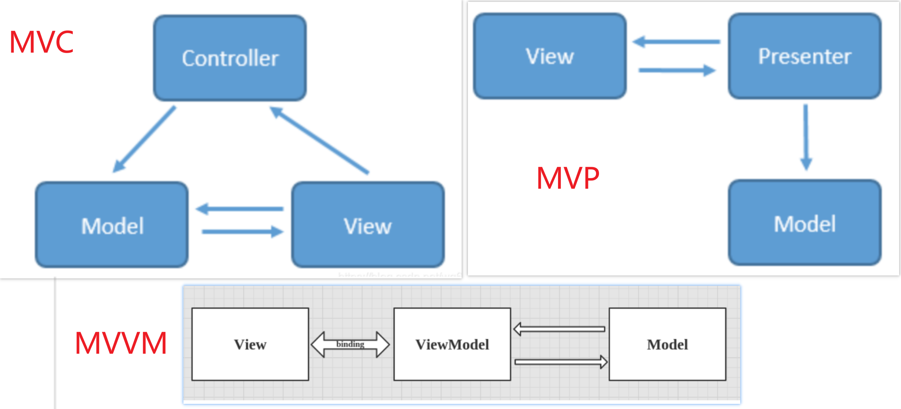


## MVC

MVC，Model View Controller，是软件架构中最常见的一种框架，简单来说就是通过controller的控制去操作model层的数据，并且返回给view层展示

当用户出发事件的时候，**view层会发送指令到controller层，接着controller去通知model层更新数据，model层更新完数据以后直接显示在view层上**，这就是MVC的工作原理。

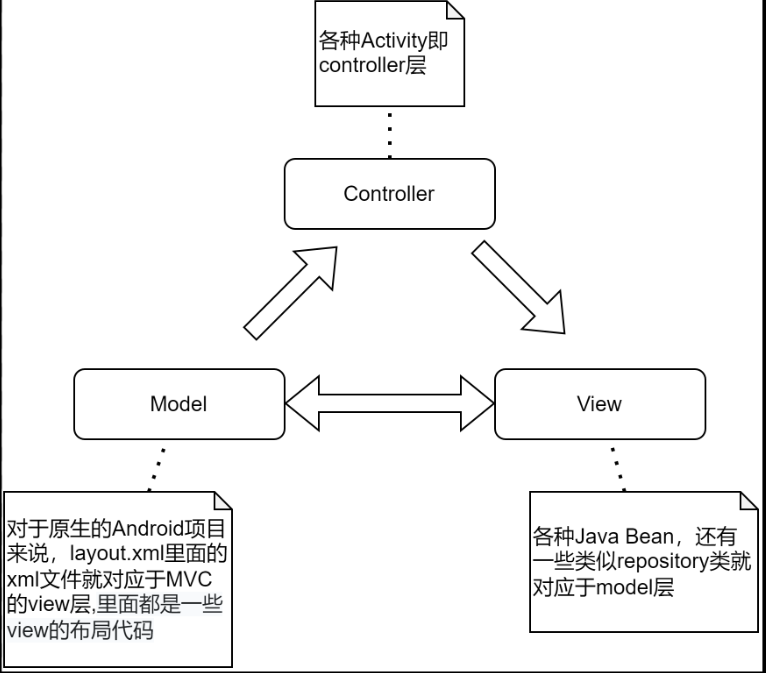

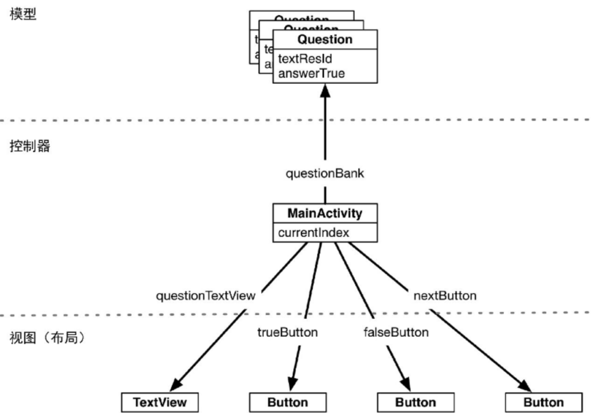

### MVC的缺点

View与Model之间还存在依赖关系，Controller很重很复杂。

由上面的MVC架构图可知，view层和model层是相互可知的，这意味着两层之间存在耦合，耦合对于一个大型程序来说是非常致命的，因为这表示开发，测试，维护都需要花大量的精力。

在Android中Activity即是View又是Controller，所以会很复杂。

xml作为view层，控制能力实在太弱了，**你想去动态的改变一个页面的背景，或者动态的隐藏/显示一个按钮，这些都没办法在xml中做，只能把代码写在activity中，造成了activity既是controller层，又是view层的这样一个窘境。**大家回想一下自己写的代码，如果是一个逻辑很复杂的页面，activity或者fragment是不是动辄上千行呢？这样不仅写起来麻烦，维护起来更是噩梦。


## MVP

MVP作为MVC的演化，解决了MVC不少的缺点，对于Android来说，MVP的model层相对于MVC是一样的，**而activity和fragment不再是controller层，而是纯粹的view层**，所有关于用户事件的转发全部交由presenter层处理。

从图中就可以看出，最明显的差别就是view层和model层不再相互可知，完全的解耦，取而代之的presenter层充当了桥梁的作用。

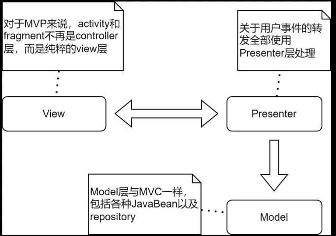

view层发出的事件传递到presenter层中，presenter层去操作model层，并且将数据返回给view层，整个过程中view层和model层完全没有联系。

对于view层和presenter层的通信，我们是可以通过接口实现的，具体的意思就是说我们的activity，fragment可以去实现实现定义好的接口，而在对应的presenter中通过接口调用方法。


##  MVVM

MVVM数据流向：
1. View层注册ViewModel层的观察者
2. View层点击事件（或其他获取数据请求）
3. View层调用ViewModel层获取数据的方法
4. ViewModel层调用Model层的Repository模块更新数据
5. ViewModel层获取到数据后更新LiveData
6. ViewModel层中LiveData通过postValue等方法通知View层并将数据回传
7. View层通过注册的观察者观察到数据变更，接收数据并通过DataBinding将数据更新到UI

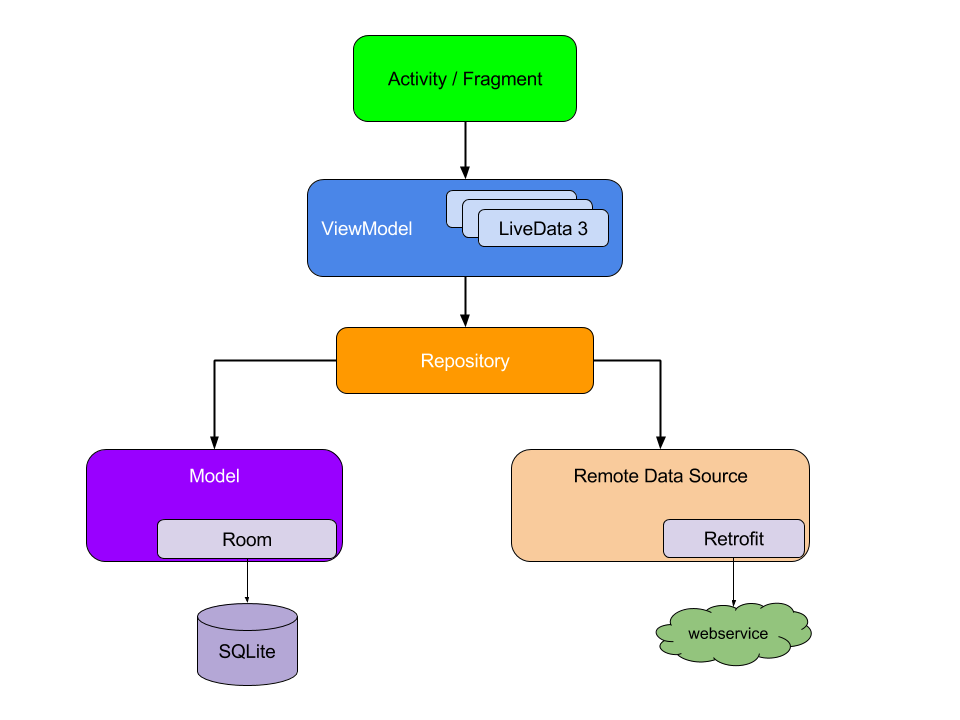

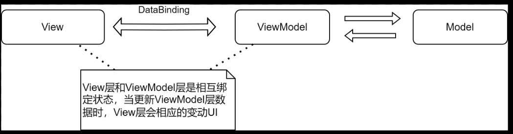

它和MVP的区别貌似不大，只不过是presenter层换成了viewmodel层，还有一点就是view层和viewmodel层是相互绑定的关系，这意味着当你更新viewmodel层的数据的时候，view层会相应的变动ui。相比于`MVP`，`MVVM`既不用声明多个接口及方法，同时`ViewModel`也不会像`Presenter`那样去持有`View`层的引用，而是生命周期感知的，`MVVM`方式更加解耦。


```java
binding = DataBindingUtil.setContentView(this, R.layout.mvvm_activity_main);

binding.setContributor(contributor);
```

首先，binding要通过DataBindingUtil.setContentView()方法将xml，也就是view层设定。接着，通过setXXX()方法将viewmodel层注入进去。由于这两个工作，view层(xml的各个组件)和viewmodel层(contributor)绑定在了一起。


**(Activity中持有ViewModel实例，通过ViewModel.LiveData.observer方法注册观察者，并监听数据变化。ViewModel请求Model的数据，一般通过一个中间层Repository获取Model层的数据，当获取到Model层数据时，LiveModel层调用LiveData.postValue()方法更新数据，这时Activity中监听者监听到数据即可通过DataBinding绑定的控件更新数据以及UI）**

### 实例说明

这是一个通过输入城市名查询城市天气的简单应用。

在MVVM划分中，Model层应当包含网络请求以及网络请求的数据Bean，View层应当包括一个EditText控件和两个TextView控件，ViewModel中通过LiveData实现数据与视图的双向绑定。

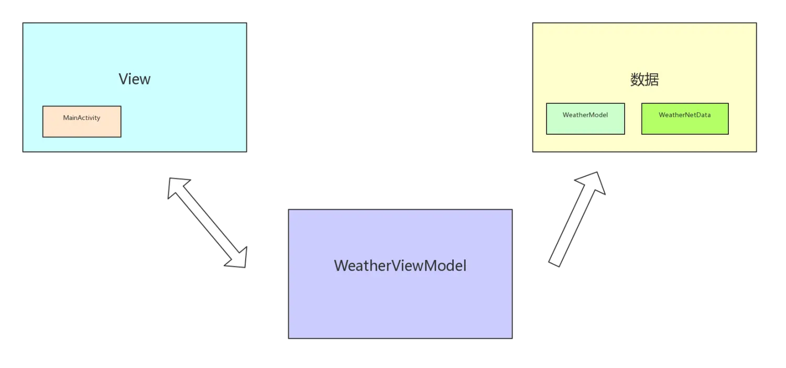


#### Model

Model层内部是一个网络请求，通过接口回调将请求结果返回给ViewModel，如下：

```kotlin
class WeatherModel : AbstractBaseModel() {

    /**  天气网络请求 **/
    fun request(listener:OnGetDataListener<WeatherNetData>,city:String){
        val response = api.getWeatherData(city)
        response.observeOn(AndroidSchedulers.mainThread())
                .subscribeOn(Schedulers.io())
                .subscribe(object :Observer<WeatherNetData>{
                    override fun onError(e: Throwable?) {
                        listener.fail(null,"")
                    }
                    override fun onNext(t: WeatherNetData?) {
                        listener.success(t)
                    }
                    override fun onCompleted() {
                    }
                })
    }
}
```


#### ViewModel

ViewModel层内部通过LiveData实现对View数据改变的通知

```kotlin
open class WeatherViewModel : ViewModel(){

    var weatherEvent = MutableLiveData<WeatherNetData>()

    /**  获取天气数据 **/
    open fun requestWeather(city:String){
        WeatherModel().request(object :OnGetDataListener<WeatherNetData>{
            override fun fail(response: WeatherNetData?, msg: String?) {
                //主线程
                weatherEvent.value = response
            }
            override fun success(response: WeatherNetData?) {
                weatherEvent.value = response
            }
        },city)
    }
}
```


#### View

View中收到更新状态后通过DataBinding实现对UI的更新

```kotlin
class MainActivity : FragmentActivity() {

    lateinit var binding: ActivityMainBinding
    lateinit var viewModel:WeatherViewModel

    override fun onCreate(savedInstanceState: Bundle?) {
        super.onCreate(savedInstanceState)
        //初始化DataBinding
        binding =DataBindingUtil.setContentView(this,R.layout.activity_main)
        binding.presenter = WeatherPresenter()
        init()
    }

    /**  添加viewModel绑定 **/
    private fun init(){
        viewModel = ViewModelProvider(
                this, ViewModelProvider.AndroidViewModelFactory(application)
        ).get(WeatherViewModel::class.java)
        //添加数据观察
        viewModel.weatherEvent.observe(this, Observer<WeatherNetData> { data -> binding.weatherData = data })
    }
}
```


### DataBinding的使用

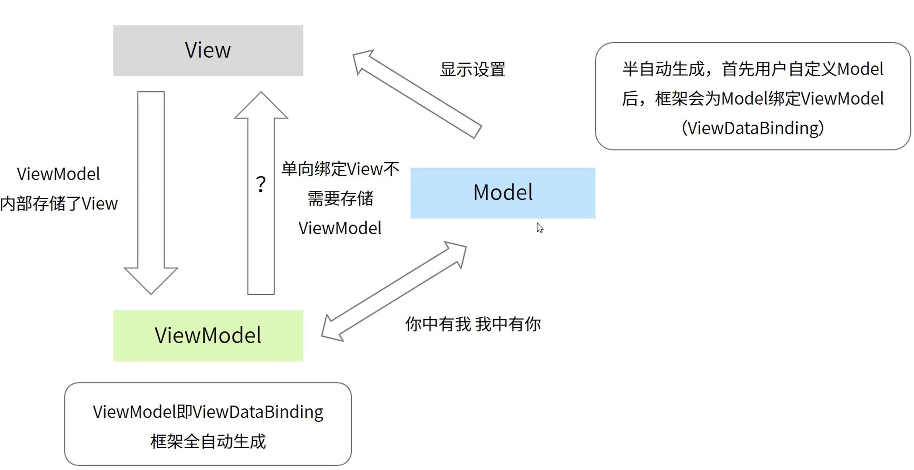


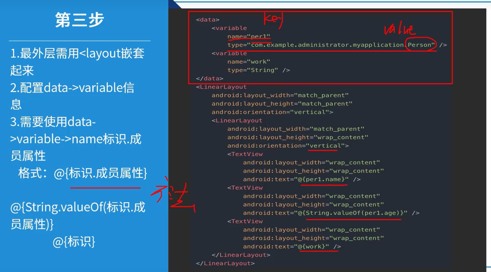

#### Model（被观察者）

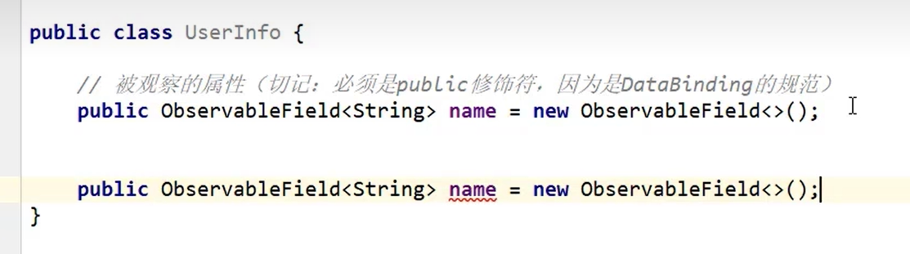

对应View中数据绑定（这只是对DataBinding的使用） 实际上应该用如上View中的写法，绑定ViewModel

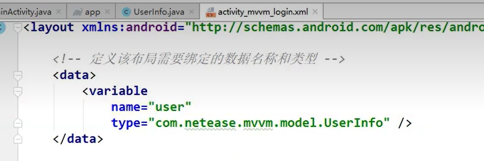

#### ViewModel

在ViewModel初始化时，通过DataBinding将ViewModel和Model进行绑定。

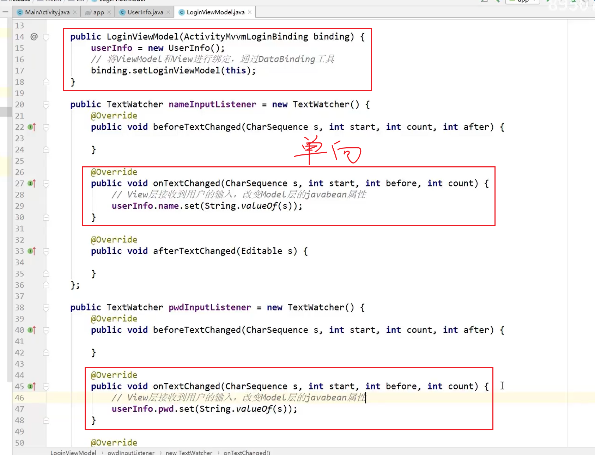

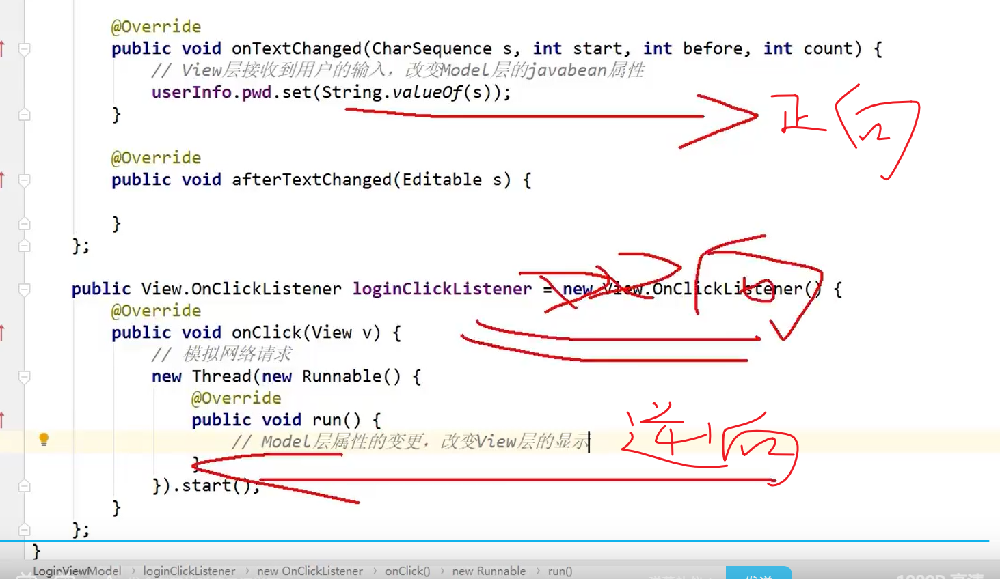

#### View

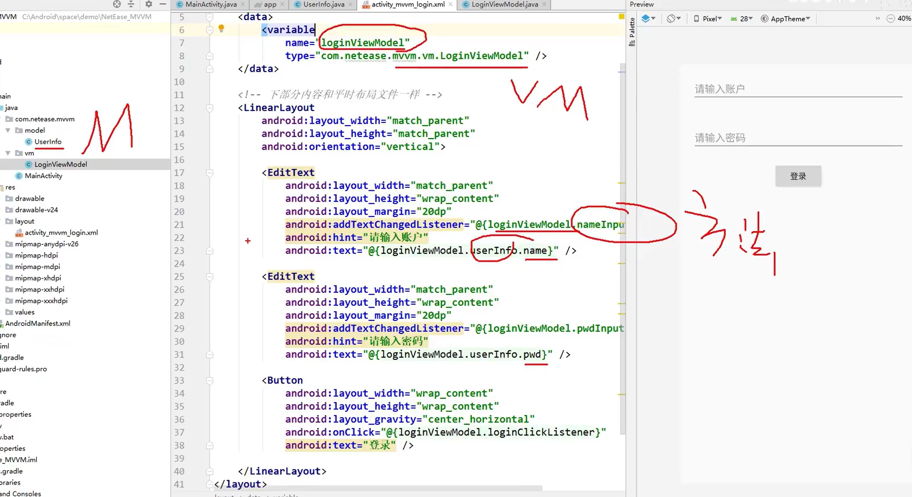

对应Activity甚至什么逻辑都不添加。把耦合度降低到了最低。
