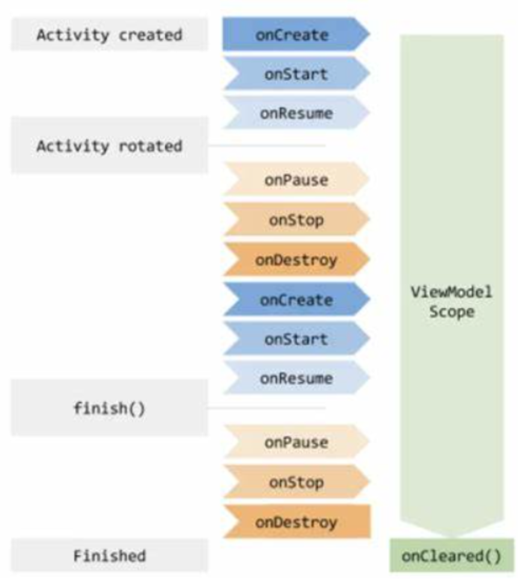

# 介绍
ViewModel的定义：ViewModel旨在以注重生命周期的方式存储和管理界面相关的数据。ViewModel本质上是视图（View）与数据（Model）之间的桥梁。

**ViewModel特点：**
- 生命周期比Activity长，数据可以在屏幕发生旋转、开关键盘等配置更改后继续留存。
- ViewModel中不能持有Activity引用，因此如果需要使用应用的Context（不可以使用Activity的Context，会导致内存泄露）则继承AndroidViewModel

# 实例

如下代码中，ShareViewModel继承ViewModel类，在clickItem()方法中，通过setValue()方法设置LiveData。
```kotlin
//ShareViewModel.kt
class ShareViewModel : ViewModel() {
    val itemLiveData: MutableLiveData<String> by lazy { MutableLiveData<String>() }

    //点击左侧Fragment中的Item发送数据
    fun clickItem(infoStr: String) {
        itemLiveData.value = infoStr
    }
}
```

如下代码中，在Fragment中首先通过ViewModelProvider.get()方法获取ShareViewModel对象，然后注册Observer并监听数据变化。
```kotlin
//右侧详情页Fragment
class DetailFragment : Fragment() {
    lateinit var mTvDetail: TextView

    //Fragment之间通过传入同一个Activity来共享ViewModel
    private val mShareModel by lazy {
        ViewModelProvider(activity!!).get(ShareViewModel::class.java)
    }

    override fun onCreateView(
        inflater: LayoutInflater,
        container: ViewGroup?,
        savedInstanceState: Bundle?
    ): View? {
        return LayoutInflater.from(context)
            .inflate(R.layout.layout_fragment_detail, container, false)
    }

    override fun onViewCreated(view: View, savedInstanceState: Bundle?) {
        mTvDetail = view.findViewById(R.id.tv_detail)
        //注册Observer并监听数据变化
        mShareModel.itemLiveData.observe(activity!!, { itemStr ->
            mTvDetail.text = itemStr
        })
    }
}
```

# ViewModel生命周期


我们通常在系统首次调用 activity 对象的 onCreate() 方法时请求 ViewModel。系统可能会在 activity 的整个生命周期内多次调用 onCreate()，如在旋转设备屏幕时。ViewModel 存在的时间范围是从首次请求 ViewModel 直到 activity 完成并销毁。

> ViewModelStore的存取都是间接在ActivityThread中进行并保存在ActivityClientRecord中。在Activity配置变化时，ViewModelStore可以在Activity销毁时得以保存并在重建时重新从lastNonConfigurationInstances中获取，又因为ViewModelStore提供了ViewModel，所以ViewModel也可以在Activity配置变化时得以保存，这也是为什么ViewModel的生命周期比Activity生命周期长的原因了。


# ViewModelProvider.Factory
从上面的示例代码中可以发现，我们并没有直接构造ViewModel，而是交给了ViewModelProvider。

我们发现通过ViewModelProvider构造的ViewModel没有参数。可是如果我们想构造一个带参数的ViewModel应该怎么处理？

androidx为我们提供了ViewModelProvider.Factory类，在该类中包含了一个create接口，就是提供给用户可以自定义参数的。

比如下面的示例代码中，LoginViewModelFactory实现了ViewModelProvider.Factory接口，并在构造函数中传入了两个参数。我们可以通过构造函数或我们喜欢的任何其他模式（Singleton、FactoryPattern 等）将 ViewModel 参数传递给 ViewModelProvider.Factory。

而我们实现的create方法负责创建我们的 VeiwModel 的实例。

```kotlin
class LoginViewModelFactory(
    private  val repository: RegisterRepository,
    private val application: Application
): ViewModelProvider.Factory{
    @Suppress("Unchecked_cast")
    override fun <T : ViewModel?> create(modelClass: Class<T>): T {
        if(modelClass.isAssignableFrom(LoginViewModel::class.java)) {
            return LoginViewModel(repository, application) as T
        }
        throw IllegalArgumentException("Unknown View Model Class")
    }
}
```

我们在Activity中是这么实例化 ViewModel 的：
```kotlin
val factory = LoginViewModelFactory(repository, application)
loginViewModel = ViewModelProvider(this, factory).get(LoginViewModel::class.java)
```

将参数或依赖项传递给 LoginViewModelFactory，以便它能够为我们创建 ViewModel。 ViewModelProviders.of(context, factory) 方法获取我们的 ViewModelProvider.Factory 的实例，然后通过get()方法获取LoginViewModel实例。
