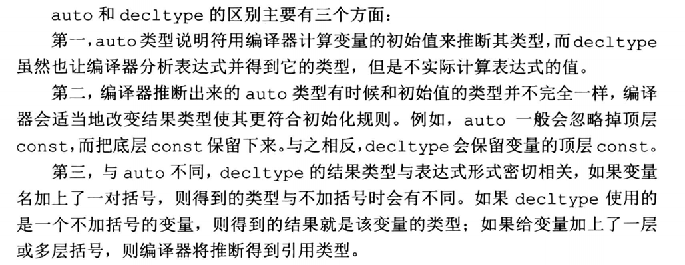

### 1 编写一个简单的C++程序

- main的返回值被用来指示状态，返回值0表示成功，非0的返回值的 含义由系统定义，通常用来指出错误类型。
- cin，标准输入；cout，标准输出；cerr，标准错误；clog，日志打印
- endl：结束当前行，并将与设备关联的缓冲区中的内容刷到设备中
- 缓冲刷新：保证到目前为止程序所产生的所有输出都真正写入输出流中，而不是仅停留在内存中等待写入流。

### 2 变量

string是一种库类型，表示一个可变长的字符序列

创建字符串的几种方式

1. string s：生成空字符串s
2. string s(str)：生成字符串为str的复制品s
3. string s(str, begin, len)：将字符串str中从下标begin开始、长度为len的部分作为字符串s的初值 
4. string s(cstr, char_len)：以C_string类型cstr的前char_len个字符串作为字符串s的初值
5. string s(num ,c)：生成num个c字符的字符串赋值给s
6. string s(str, stridx)：将字符串str中从下标stridx开始到字符串结束的位置作为字符串初值

```cpp
string str1;               //生成空字符串
string str2("123456789");  //生成"1234456789"的复制品
string str3("12345", 0, 3);//结果为"123"
string str4("012345", 5);  //结果为"01234"
string str5(5, '1');       //结果为"11111"
string str6(str2, 2);      //结果为"3456789"
```

#### 2.1 类型转换

程序通常会自动进行类型转换

```cpp
bool b = 42; //b为true
bool c = -42; //c为true
bool d = 0; //d为false
int i = b; //i为1
int j = d; //j为0
i =  3.14; //i为3
double pi = i; //pi为3.0
```

无符号、有符号两者类型的转换是通过补码进行转换的

```cpp
unsigned char c = -1; //假设char占8bit，c的值为255
```

计算机中，负数是以补码的形式存在的，-1的补码是`1111 1111`（负数的补码是在其原码的基础上，符号位不变，其余各位取反，最后+1。(也即在反码的基础上+1)），其中第一位为符号位，转换为无符号数即为255。也即，上述例子中，c的值最终是255

### 3 初始化

虽然初始化和赋值都用=来进行表示，但是在C++中，两者是完全不同的操作。

初始化的含义是创建变量时赋予其一个初始值，赋值的含义是把对象的当前值擦除，而以一个新值来替代

**列表初始化**

`int i = {0};`当用于内置类型的变量时，这种初始化形式有一个重要特点：如果使用列表初始化，当初始值存在丢失信息的风险时，编译器会报错，比如下面的例子：

```cpp
long double ld = 3.1415926;
int a{ld};
```

long double 转换为int会损失精度，这种方式存在丢失信息的风险，因此转换未执行

### 4 引用

引用并非对象，只是给一个已经存在的对象所起的另外一个名字，引用类型通过使用&符号引用另外一种类型，**一旦定义了引用，就无法令其再绑定到另外的对象**

1. 引用类型必须初始化
2. 引用本身并非对象，因此无法使用字面量赋值
3. 引用类型要和与之绑定的对象严格匹配

```cpp
int val = 1000;
int &refVal = val;
cout << "val: " << val << "  refVal: " << refVal << "  &refVal: " << &refVal << "  &val: " << &val << endl;
// output: val: 1000  refVal: 1000  &refVal: 0xa2d49ff67c  &val: 0xa2d49ff67c

int &refVal;	//报错，必须初始化
int &refVal = "abc"; //报错，无法赋值
```
上述代码可以看书，refVal实际就是val的别名，也可以理解为refVal和val指向的是同一个对象。


### 5 指针

指针与引用不同，指针本身是一个对象，允许对指针进行赋值和拷贝。

#### 5.1 定义

```cpp
//p1, p2都是指向int类型对象的指针
int *p1, *p2;
//dp是double类型对象，*dp2是指向double类型对象的指针
double dp, *dp2;
```

#### 5.2 获取对象的地址

通过**取地址符**`&`获取某个对象的地址

```cpp
int val = 1000;

//pi中存放的是val的地址，也可以说p1是指向变量val的指针
int* pi = &val;
cout << pi << "  " << *pi;
// output: pi: 0xa2d49ff67c  *pi: 1000

```
从上面的代码中可以看到，pi中存放的是val对象的地址。以pi对象中存放的数据 `0x48cd7ff7e4` 为地址，查找该地址对应对象中存放的数据。

**注意：**

1. 不能定义指向引用的指针，因为引用本身不是对象，没有实际地址。
2. 指针的类型要与它所指向的对象严格匹配，但有两种例外情况
3. 允许指向常量的指针指向一个非常量对象
4. 可以将基类指针绑定到派生类对象上

```cpp
double dval = 42.0;
const double* pDouble;
pDouble = &dval;
```

####  5.3 利用指针访问对象

通过**解引用符** `*` 访问对象

```cpp
int val = 1000;
int* p = &val;		//初始化指针p，存放的值为ival对象的地址。
cout << *p << endl;	//这里的*p表示：以p对象中存放的数据为地址，查找该地址对应的对象，然后获取该对象的值，输出1000。
```

当给解引用的结果赋值，实际上就是给指针指向的对象赋值

```cpp
*p = 0;	//由*得到p指向的对象，即可通过p为变量ival赋值
cout << *p << endl;	//结果为0
cout << "ival " << ival << endl; //结果为0
```

**符号的多重含义：**

`&` `*` 既能作为表达式里的运算符，也能作为声明的一部分

```cpp
int i = 42;
int &r = i;	  //&紧随类型出现，是声明的一部分，r是一个引用
int* p;       //*紧随类型出现，是声明的一部分，p是一个指针
p = &i;       //&在表达式中，是取地址符
*p = i;       //*在表达式中，是解引用符
int &r2 = *p; //&是声明的一部分，*是解引用符
```

#### 5.4 空指针

空指针不指向任何对象。当使用指针之前，可以先检查它是否为空指针。

```cpp
int *p = nullptr;	//等价于 int *p = 0;
```

#### 5.5 其他指针操作

**条件表达式**：非0为true，0为false

```cpp
int *p = 0;
if (p) {...} //条件值为false
int iInt = 42;
int *p2 = &iInt;
for (p2) {...} //条件值为true
```

**void\* 类型指针：** void类型指针对该地址中是什么类型的对象并不了解，也即void类型指针可以指向任意类型的对象。

```cpp
doubld obj = 3.14, *p = &obj;
void *pv = &obj;  //obj可以是任意类型的对象
pv = p;  //pv可以存放任意类型的指针
```

### 6 指针和引用的区别

相同点:指针"指向"内存中的某个对象,而引用"绑定到"内存中的某个对象,**他们都实现了对其他对象的间接访问.**

不同点:

1. **指针本身就是一个对象**，允许对指针**赋值**和**拷贝**，而且在指针的生命周期内它可以**指向几个不同的对象**。指针无需在定义时赋初值,和其他内置类型一样，在块作用域内定义的指针如果没有被初始化，也将拥有一个不确定的值
2. **引用不是一个对象**,**无法令引用重新绑定到另外一个对象**。引用必须在定义时赋初值，并且一旦赋值就无法再绑定到其他的对象，每次访问这个引用都是最初绑定的那个对象。

### 7 理解复合类型

#### 7.1 指向指针的指针

指针是内存中的对象，因此允许把指针的地址再存放在另一个指针中。通过*的个数，可以区分指针的级别。

```cpp
int val = 1000;
int *pi = &val;
int** pii = &pi; //pi是一个指向p指针的指针
cout << "&pi: " << &pi << "  pi: " << pi << endl;
cout << "pii: " << pii << "  *pii: " << *pii << "  **pii: " << **pii << endl;
// output:
// &pi: 0xa2d49ff670  pi: 0xa2d49ff67c
// pii: 0xa2d49ff670  *pii: 0xa2d49ff67c  **pii: 1000
```
从上述代码中可以看到，pii存放的是pi的地址，*pii中存放的是pi中存放的地址。

#### 7.2 指向指针的引用

指针是一个对象，因此存在指向指针的引用。

```cpp
int i = 42;
int *p = &i;
int *&r = p;  //r时一个对指针p的引用
r = &i;  //r是指针p的引用，因此给r赋值就是让指针p指向i，即赋值 &i
*r = 0;  //解引用r即解引用p得到i，给i赋值0
```

### 8 const限定符

类似于java中的final，定义一个值不能改变的属性，也即常量。const类型变量必须进行初始化。

```cpp
const int a = 42; //编译时初始化
const int b = get_size(); //运行时初始化
const int c; //会报错，未进行初始化操作
```

#### 8.1 const 作用域

如果程序包含多个文件，则每个用了const对象的文件都必须能访问到它的初始值才行，也就必须在每一个用到变量的文件中都有对它的定义，同时避免对同一变量的重复定义，默认情况下，const 对象仅在文件内有效。

特殊的，当需要const在文件之间共享，则使用extern关键字实现。不管是声明还是定义都要添加。


```c
// file_1.cc 定义并初始化了一个常量，该常量能被其他文件访问
extern const int bufSize = fcn();
// file_1.h 头文件
extern const int bufSize;
```

上面的代码中，file_1.h头文件声明的作用是指明bufSize并非本文件独有，它的定义将在别处出现。

#### 8.2 const引用

可以把引用绑定到const对象上，但是对常量的引用不能被用作修改它所绑定的对象。另外，允许将const引用绑定到一个普通对象上，如下示例中均是允许的。

```c
const int ci = 42;
const int &r1 = ci; // 定义常量引用，引用对象为ci
//r1 = 1024; 错误，r1是对常量的引用，不可以修改
//int &r2 = ci; 错误，非常量引用不能指向一个常量对象

int i = 42;
const int &rr1 = i; //常量引用rr1绑定i
const int &rr2 = 42; //常量引用rr2绑定到常量上
const int &rr3 = rr1 * 2; //rr3也是一个常量引用
```

由上述可知，常量引用可能引用的并不是一个const对象，因此一般的，常量引用仅对引用可参与的操作做出限定，所以允许通过其他途径改变它的值。

```c
int i = 42;
int &r1 = i;
const int &r2 = i;
r1 = 0; //r1非常量引用，可以改
//r2 = 0; 错误，r2是一个常量引用
```

#### 8.3 指针和const

**与引用一样**

1. 指针可以指向常量或非常量
2. 指向常量的指针不能改变所指对象的值
3. 要想存放常量对象的地址，只能使用指向常量的指针

```c
const double pi = 3.14; //定义常量pi
//double *ptr = &pi; //错误，常量必须使用常量指针，ptr是个非常量指针
const double *cptr = &pi; //定义常量指针cptr指向pi
//*cptr = 42; //错误，cptr是个常量指针，不能赋值
```

**与引用不同的是** const指针本身是一个对象，因此像其他对象类型一样，允许将指针本身定为常量。**常量指针必须初始化，初始化完成后，它的值就不能再改变了**

```c
int num = 0;
int *const curr = &num;
const double const pi = 3.14;
const double *const pip = &pi;
```

常量指针pip指向的是常量，则pip本身存储的地址和pip所指向的对象均不可改变。

常量指针curr指向的是非常量，则可以通过curr去改变num的值。

```c
//*pip = 2.22; //报错，pip指向的是一个常量
*curr = 0; //正确，把curr所指向的对象的值赋值为0
```

**【重要！！！】从上述例子可以看出，** `*`  **放在const关键字之前用以说明指针本身是一个常量，这样书写的含义是：不变的是指针本身，而非指向的那个值**
要想弄明白这些声明的含义，**最有效的办法是从右向左阅读**。离curr最近的符号是const，意味着curr本身是一个常量对象，下一个符号是*，意思是它是一个常量指针。

通过加括号的方式，更容易理解 `(int (*(const curr))) = num;` 但实际不能这么写。

通过如下实例进一步理解从右向左的思想。

```c
const int *p; //定义了一个指向整型常量的普通指针,该指针没有指向任何实际的对象
const int *const p2 = &i2; //定义了一个指向整型常量的常量指针，指向了对象i2
const &r = 0; //定义了一个常量引用r，r绑定到字面量0
```

#### 8.4 底层const/顶层const

- 顶层const：表示指针本身是个常量，更一般的，顶层const可以表示任意对象是常量。
- 底层const：表示指针指向的对象是一个常量。用于声明引用的const都是底层const
- `const int *const p3 = p2;`，右const是顶层const，左const是底层const

通过下面案例理解：

```c
int num = 0;  //定义一个int变量num
int *const p1 = &i;  //顶层const，p1是一个常量指针
const int num2 = 42;  //顶层const，num2是一个常量
const int *p2 = &num2;  //底层const，p2是一个普通指针，指向的是一个常量
const int *const p3 = p2;  //右const是顶层const，左const是底层const
const int &r = num;  //用于声明引用的const都是底层const
```

对于顶层const，拷贝行为不受影响，比如 `num = num2;` `p2 = p3;` p2 p3均指向一个常量对象，p2是一个普通指针，p3赋值给p2是正确的。

而对于底层const，拷贝行为收到很多限制，**拷入和拷出都必须具有相同的底层const**。

```c
p2 = p3;              //正确，p2 p3都是底层const
p2 = &num;            //正确，int*可以转换成const int*，也即变量num可以copy其地址给p2，然后转变为一个常量
int &r = num2;        //错误，普通引用r无法绑定到常量num2上
const int &r2 = num;  //正确，普通引用可以将其绑定到num上，然后将其转变为一个常量
```

**补充：**对于`int *p = p3;`，p3既是顶层const，也是底层const，拷贝p3时可以不关注它是一个顶层const，但必须清楚它指向的对象是一个常量。因此不能用p3初始化p。

**总结：**

- const int const *p = 常量/非常量对象地址
- const int *p = 常量/非常量对象地址
- int const *p = 非常量对象地址（**不可以是常量**）
- int *p = 非常量对象地址

简单的说，非常量指针可以指向常量对象，常量指针指向的对象类型由声明的基本数据类型确定。

### 9 constexpr 和常量表达式

#### 9.1 常量表达式

不会改变，并且在编译过程中就能得到计算结果的表达式。

字面值、用常量表达式初始化的const对象都是常量表达式。如下示例中，需要注意后两例容易出错的例子。

```cpp
const int max_files = 20;	//是常量表达式
const int limit = max_files + 1;	//是常量表达式
int staff_size = 27 //不是常量表达式，因为它的数据类型是一个普通的int型
const int sz = get_size();	//不是常量表达式，因为它的具体值只有运行时才能获取到
```

#### 9.2 constexpr变量

C++11规定，将变量声明为`constexpr`类型以便编译器验证变量的值是否为一个常量表达式。

constexpr变量一定**是一个常量**，并且必须**用常量表达式初始化。**

```cpp
constexpr int mf = 20;	//20是个常量表达式
// 或者也可以： const int mf = 20;
constexpr int limit = mf + 1;	//mf+1是个常量表达式
constexpr int sz = get_size();	//只有当get_size()是一个constexpr函数时，才是一条正确的声明
```

如上示例中，需要注意第三行，get_size()必须用constexpr声明才可。比如

```cpp
constexpr int get_size() { return 42; }
```

### 10 处理类型

#### 10.1 类型别名

通过使用类型别名，可以将复杂的类型名字变得简单明了。有两种方式定义类型别名：第一种是typedef关键字；第二种是使用别名声明。

**第一种 typedef**

```cpp
typedef double wages;	//定义double类型的别名为wages。即wages是double的同义词。
typedef wages base, *p;	//base也是double的类型别名，p是double*的类型别名
```

**第二种 别名声明**

```cpp
using SI = Sales_item;	//声明SI是Sales_item的类型别名
```

类型的别名和类型名完全等价，类型名能出现的地方，类型别名就可以。 

#### 10.2 指针、常量和类型别名

当这三者在一起使用时，容易产生理解上的错误。与之前的定义一样，const是对给定类型的修饰。下列示例代码的含义为：cstr是一个指向char类型对象的常量指针。ps是一个指向char类型常量指针的指针。

```cpp
typedef char *pstring;	//定义char*的别名pstring
const pstring cstr = 0; //cstr是一个常量指针，类型是char类型。
const pstring *ps;	//ps是一个指向char常量指针的指针
```

人们往往会错误的尝试把类型替换以便于理解：

```cpp
const char *cstr = 0;	//是对 const pstring cstr 的错误理解
```

声明语句用到pstring时，其基本数据类型是常量指针，可是用char*重写了声明语句之后，基本数据类型变为了const char，*成了声明符的一部分。

#### 10.3 auto类型说明符

auto类型说明符类似与kotlin的var和val，通过编译器推断变量的类型，而不需要开发者在声明变量的时候清楚的知道表达式的类型。

```cpp
auto item = val1 + val2;	//由val1和val2相加的结果推断出item的类型
```

通过auto可以同时声明多个变量，但是变量类型都要保持一致，如下为错误情况

```cpp
auto a = 0, b = 3.14;	//a为int型，b为double型，不一致，因此是错误的
```

当auto声明的变量遇到引用时，其真正参与初始化的其实是引用对象的值。

```cpp
int i = 0, &r = i;
auto a = r;	//a是int型，r是i的引用，实际上参与的是i，因此a类型和i保持一致
```

auto一般会忽略顶层const，保留底层const

```cpp
const int ci = i, &cr = ci;
auto b = ci;	//b是一个整型，ci的顶层const被忽略了
auto c = cr;	//c是一个整型，cr是ci的别名，类型和b一样
auto d = &i;	//d是一个int型指针
auto e = &ci;	//e是一个指向常量的指针
```

如果需要让推断出的auto类型是一个顶层const，则需要明确指出

```cpp
const auto f = ci	//ci的顶层const忽略，推演为int型，f是const int
auto &g = ci;	//g是一个整型常量引用
//auto &h = 42;	//h不是常量引用，不可以绑定字面值
const auto &j = 42;	//j声明为常量引用，可以绑定字面值
```

#### 10.4 decltype 类型指示符

该类型指示符主要作用是：选择并返回操作数的数据类型，也即从表达式的类型推断出要定义的变量的类型，但不使用该表达式的只初始化变量。

```cpp
decltype(f()) sum = x;	//sum的类型是函数f()的返回类型
```

编译器并不实际调用函数f()，而是当发生调用时，f的返回值类型作为sum的类型。

**如果decltype使用的表达式是一个变量，则decltype返回该变量的类型。**

```cpp
const int ci = 0, &cj = ci;
decltype(ci) x = 0;		//x是const int型变量
decltype(cj) y = x;		//y的类型是 const int&，y绑定的变量是x
decltype(cj) z;			//错误：z是一个引用，必须初始化
```

**如果decltype使用的表达式不是变量，则decltype返回表达式结果对应的类型。**

```cpp
int i = 42, &r = i;
decltype(r) a;		//r是一个引用，所以a也是一个引用
decltype(r+0) b;	//加法的结果是int，因此b是int型
```

**如果表达式内容是接引用操作，则decltype将得到引用类型。**

```cpp
int i = 42, *p;
decltype(*p) c = i;		//c为引用类型，即int&型
```

**赋值是会产生引用的一类表达式，引用的类型是左值的类型。**

```cpp
int a = 3, b = 4;
decltype(a) c = a;
decltype(a = b) d = a;	//a是int，表达式a=b的类型是int&
//需要注意的是：表达式 a = b 实际不进行计算，因此a=3 b=4 c=3 d=3
```

**特殊的，**`**decltype((i)) d = i;**`**（双层括号）的结果永远是引用。**

#### 10.5 auto 和 decltype 的区别

1️⃣计不计算表达式

2️⃣编译器推断的类型一致不一致

3️⃣与表达式形式关系密切程度



### 11 自定义数据类型

#### 10.1 定义Sales_data类型

以struct关键字定义类型，紧跟类名和类体

```cpp
struct Sales_data {
	std::string bookNo;
	unsigned units_sold = 0;
	double revenue = 0.0;
};  //记得写分号
```

声明该类型对象

```cpp
Sales_data accum, *salesptr;
```

#### 10.2 操作Sales_data类对象

```cpp
#include <iostream>
#include <string>
#include "Sales_data.h"
int main() {
    Sales_data data1, data2;
    double price = 0;
    std::cin >> data1.bookNo >> data1.units_sold >> price;
    data1.revenue = data1.units_sold * price;
}
```

#### 10.3 头文件

- 类一般不定义在函数体内。
- 函数体外部定义类时，在各个指定的源文件中可能只有一处该类的定义。
- 要在不同文件中使用同一个类，类的定义就必须保持一致。为确保各个文件中类定义一致，类通常被定义在头文件中，类所在的头文件名字应与类名一样。

**预处理器**

预处理器用于确保头文件多次包含仍能安全工作。预处理器变量有两种状态：已定义和未定义

- **#define** 把一个名字设定为预处理器变量
- **#ifdef** 检查某个指定的预处理变量是否已定义，当且仅当变量已定义时为真
- **#ifndef** 检查某个指定的预处理变量是否已定义，当且仅当变量未定义时为真
- 一旦检查结果为真，则执行后续操作直至遇到**#endif**指令为止

这样可以有效的防止重复包含的发生：

```cpp
#ifndef SALES_DATA_H
#define SALES_DATA_H
#include <string>
struct Sales_data {
	std::string bookNo;
	unsigned units_sold = 0;
	double revenue = 0.0;
};
#endif
```

第一次判断未定义为真，则执行到 #endif 为止。第二次包含这个头文件时，判断未定义为假，则不会再执行 #ifndef 到 #endif 之间的代码

#### 10.4 补充

**在.h文件中**

- 主要是进行类的定义，包括**数据成员**和**函数成员**的声明（成员函数的定义也可以在这个文件中进行）
- 一般类的数据成员被声明为私有的，函数成员被声明为公有的。


**在.cpp文件中**

- 进行变量的赋值和函数的实例化。
- 涉及到类的调用、类中形参的输入、输出结果等


**头文件**

写**类的声明**（包括类里面的成员和方法的声明）、**函数原型**、**#define常数**等，但一般来说不写出具体的实现。

开头和结尾处必须按照如下样式加上预编译语句，用以防止重复编译

```cpp
#ifndef CIRCLE_H
#define CIRCLE_H
 
//你的代码写在这里
 
#endif
```

CIRCLE_H这个名字实际上是无所谓，可以按照自己的要求进行改写，一般与文件名保持一致，全部大写，以下划线区分为H文件

ifdef与ifndef的区别：

- ifdef：如果标识符被定义，则执行程序段1，否则执行其他程序段
- ifndef：与ifdef相反，如果标识符未被定义，则执行程序段1，否则执行其他程序段

**源文件（.cpp）：**

源文件主要写实现头文件中已经声明的那些函数的具体代码。

需要注意的是，**开头必须#include一下实现的头文件，以及要用到的头文件**。


**最值**

直接定义

```cpp
const unsigned int MAX_UINT = 0xffffffff;
const int  MAX_INT = 0x7fffffff;
const int  MIN_INT  = 0x80000000;
```

使用系统库函数

```cpp
std::numeric_limits<unsigned int>::max()
std::numeric_limits<int>::max()
std::numeric_limits<int>::min()
```
