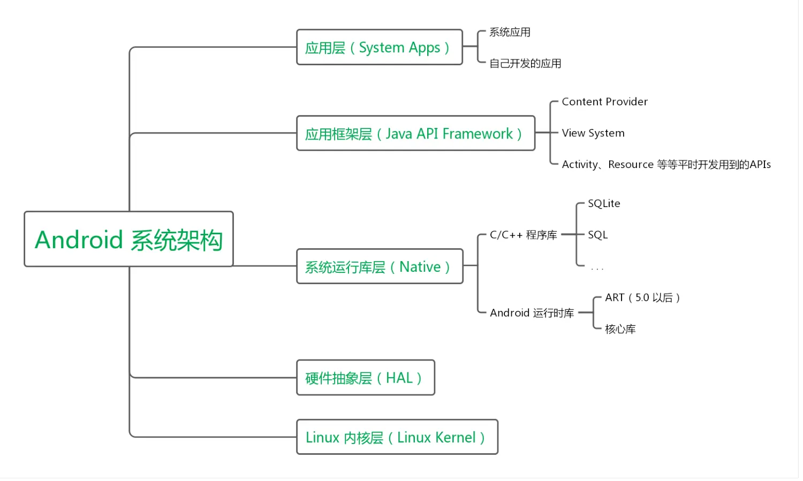
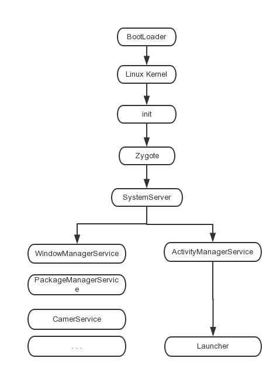

## Android 部分（二）高级知识点

### 1. Android 系统架构

- 应用层
- 应用框架层
- 系统运行库层
- 硬件抽象层
- Linux 内核层	

	

### 2. Android 各个版本特性

1. Android 5

   引入 Material Design、ART、优化通知栏、弃用 HTTP 类、增强 WebView、TLS / SSL 默认配置变更。

2. Android 6

   运行时权限、低电耗模式、应用待机模式、指纹身份验证。

3. Android 7

   SurfaceView、更多的表情支持、多窗口支持、通知增强功能。

4. Android 8

   后台执行限制、后台位置限制、画中画模式、可下载字体、自动调整 TextView 的大小、自适应图标、新增权限。

5. Android 9

   对使用非 SDK 接口的限制、电池管理、强制执行 FLAG_ACTIVITY_NEW_TASK 要求、利用 WI-FI 进行室内定位、全面屏支持、适用于可绘制图像和位图的 ImageDecoder、引入 AnimatedImageDrawable 类，用于绘制和显示 GIF 和 WebP 图像。

参考：[Android 各版本特性](https://www.jianshu.com/p/e8db7954a895)

### 3. Android 系统启动流程

1. init 进程启动过程
   1. 创建和挂载启动所需的文件目录
   2. 初始化和启动属性服务
   3. 解析 init.rc 配置文件并启动 Zygote 进程
2. Zygote 进程启动过程
   1. 创建 AppRuntime 并调用 start 方法，启动 Zygote 进程
   2. 创建 Java 虚拟机并为 Java 虚拟机注册 JNI 方法
   3. 通过 JNI 调用 ZygoteInit 的 main 方法进入 Zygote 的 Java 框架层
   4. 通过 registerZygoteSocket 方法创建服务端 Socket，并通过 runSelectLoop 方法等待 AMS 的请求来创建新的应用程序进程
   5. 启动 SystemServer 进程
3. SystemServer 处理过程
   1. 启动 Binder 线程池，这样就可以与其他进程进行通信
   2. 启动 SystemServiceManager，其用于对系统的服务进程创建、启动和生命周期管理
   3. 启动各种启动服务
4. Launcher 启动过程

### 4. 应用程序进程启动过程

启动过程可以分为两步：

1. AMS 发送启动应用程序进程请求

   AMS 如果想要启动应用程序进程，就需要向 Zygote 进程发送创建应用程序进程的请求，AMS 会通过调用 startProcessLocked 方法向 Zygote 进程发送请求。

2. Zygote 接收请求并创建应用程序进程

### 5. Activity 状态的保存与恢复

其实就是 onSaveInstanceState 和 onRestoreInstanceState 方法的使用。不过需要注意的是 onRestoreInstanceState 方法时，应当先调用 super 方法，这样由系统负责保存的部分才能够恢复，比如文本输入类型控件的输入文本以及光标位置。

整个保存 View 状态的流程如下：

1. 调用 Activity 的 onSaveInstanceState 方法
2. 该方法又调用 mWindow.saveHierarchyState，把返回的结果保存到 WINDOW_HIERARCHY_TAG 这个 key 对应的 value 中
3. mWindow 的实现类 PhoneWindow 当中，调用根布局的 saveHierarchyState 方法，这里面会从根布局按树形结构遍历，调用每个 ViewGroup / View 的 onSaveInstanceState。

于是，我们得出结论，保存的前提有两个：

1. View 的子类必须实现了 onSaveInstanceState
2. 它必须要有一个 ID，这个 ID 作为 Bundle 的 key，这也为我们实现自定义 View 时，需要保存状态提供了思路。

onSaveInstanceState 调用时机：

在 onPause() 方法之后，和 onStop() 方法没有既定的时序关系。

onRestoreInstanceState 调用时机：

在 onStart() 方法之后，onResume() 之前。

### 6. Android 动画框架实现原理

### 7. requestLayout、onLayout、onDraw、drawChild 区别与联系

### 8. requestLayout、invalidate、postInvalidate 的区别

1. requestLayout 会回掉 onMeasure、onLayout、onDraw（ViewGroup.setWillNotDraw(fasle)情况下）方法
2. invalidate 只会回掉 onDraw 方法
3. postInvalidate 只会回掉 onDraw 方法（可以在非 UI 线程中调用）

### 9. Activity、Window、View 的区别以及联系

### 10. Volley 的理解

### 11. 如何优化自定义 View

### 12. 低版本如何实现高版本 API

### 13. 描述一次网络请求的过程

### 14. HttpUrlConnection 与 OkHttp 的关系

### 15. Bitmap 的理解

### 16. Looper 架构

### 17. ActivityThread 的工作原理

### 18. AMS 的工作原理

### 19. WMS 的工作原理

### 20. 自定义 View 如何考虑机型适配

### 21. 自定义 View 的事件

### 22. LaunchMode 应用场景

### 23. SpareArray 原理

### 24. ContentProvider 是如何实现数据共享的

### 25. Service 与 Activity 的通信方式

### 26. IntentService 原理与作用

### 27. ApplicationContext 与 ActivityContext 的区别

### 28. SP 是进程同步的嘛？如何做到进程同步？

### 29. 谈谈多线程在 Android 中的应用

### 30. 进程和 Application 的生命周期
