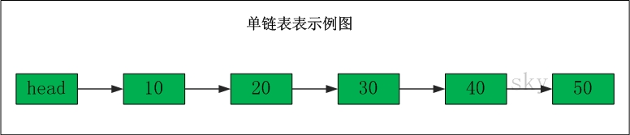
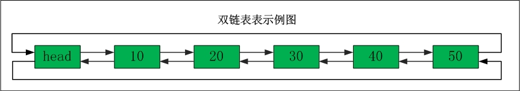

## Java 部分（三）数据结构

### 1.  <span id="java_structure_1">常用数据结构简介</span>


### 2. <span id="java_structure_2">并发集合了解哪些？</span>


### 3. <span id="java_structure_3">HashMap</span>

**简介**

	HashMap 是一散列表，它存储的内容是键值对的映射。它根据键的hashCode值存储数据，大多数情况下可以直接定位到它的值，因而具有很快的访问速度，但遍历顺序确是不确定的。

HashMap最多只允许一条记录的键为null，允许多条记录的值为null。

HashMap使用hash算法进行数据的存储和查询，内部使用一个Entry表示键值对key-value。用Entry的数组保存所有键值对，Entry通过链表的方式链接后续的节点（1.8后会根据链表长度决定是否转换成红黑树），Entry通过计算key的hash值来决定映射到具体的哪个数组（也叫Bucket）中。

HashMap非线程安全，即任一时刻可以有多个线程同时写HashMap，可能会导致数据的不一致，如果需要满足线程安全，可以用Collections的synchronizedMap方法使得HashMap具有线程安全的能力，或者使用ConcurrentHaspMap。

**存储结构**
HashMap是数组+链表+红黑树实现的。

```java
public class HashMap<K,V> extends AbstractMap<K,V> implements Map<K,V>, Cloneable, Serializable {
    private static final long serialVersionUID = 362498820763181265L;
    /**
     * HashMap 的默认初始容量为 16，必须为 2 的 n 次方 (一定是合数)
     */
    static final int DEFAULT_INITIAL_CAPACITY = 1 << 4;

    /**
     * HashMap 的最大容量为 2 的 30 次幂
     */
    static final int MAXIMUM_CAPACITY = 1 << 30;        

    /**
     *  HashMap 的默认负载因子
     */
    static final float DEFAULT_LOAD_FACTOR = 0.75f;

    /**
     * 链表转成红黑树的阈值。即在哈希表扩容时，当链表的长度(桶中元素个数)超过这个值的时候，进行链表到红黑树的转变
     */
    static final int TREEIFY_THRESHOLD = 8;

    /**
     * 红黑树转为链表的阈值。即在哈希表扩容时，如果发现链表长度(桶中元素个数)小于 6，则会由红黑树重新退化为链表
     */
    static final int UNTREEIFY_THRESHOLD = 6;

    /**
     * HashMap 的最小树形化容量。这个值的意义是：位桶（bin）处的数据要采用红黑树结构进行存储时，整个Table的最小容量（存储方式由链表转成红黑树的容量的最小阈值）
     * 当哈希表中的容量大于这个值时，表中的桶才能进行树形化，否则桶内元素太多时会扩容，而不是树形化
     * 为了避免进行扩容、树形化选择的冲突，这个值不能小于 4 * TREEIFY_THRESHOLD
     */
    static final int MIN_TREEIFY_CAPACITY = 64;

    /**
     * Node 是 HashMap 的一个内部类，实现了 Map.Entry 接口，本质是就是一个映射 (键值对)
     * Basic hash bin node, used for most entries.
     */
    static class Node<K,V> implements Map.Entry<K,V> {
        final int hash; // 用来定位数组索引位置
        final K key;
        V value;
        Node<K,V> next; // 链表的下一个node

        Node(int hash, K key, V value, Node<K,V> next) { ... }

        public final K getKey()        { ... }
        public final V getValue()      { ... }
        public final String toString() { ... }
        public final int hashCode() { ... }
        public final V setValue(V newValue) { ... }
        public final boolean equals(Object o) { ... }
    }

    /**
     * 哈希桶数组，分配的时候，table的长度总是2的幂
     */
    transient Node<K,V>[] table;

    /**
     * Holds cached entrySet(). Note that AbstractMap fields are used
     * for keySet() and values().
     */
    transient Set<Map.Entry<K,V>> entrySet;

    /**
     * HashMap 中实际存储的 key-value 键值对数量
     */
    transient int size;

    /**
     * 用来记录 HashMap 内部结构发生变化的次数，主要用于迭代的快速失败机制
     */
    transient int modCount;

    /**
     * HashMap 的门限阀值/扩容阈值，所能容纳的 key-value 键值对极限，当size>=threshold时，就会扩容
     * 计算方法：容量capacity * 负载因子load factor    
     */
    int threshold;

    /**
     * HashMap 的负载因子
     */
    final float loadFactor;
}

作者：野狗子嗷嗷嗷
链接：https://www.jianshu.com/p/b40fd341711e
來源：简书
简书著作权归作者所有，任何形式的转载都请联系作者获得授权并注明出处。
```

Node[] table的初始化长度是16，负载因子默认是0.75，threshold是HashMap所能容纳的最大键值对。threshold=length*loadFactor，也就是说当HashMap存储的元素数量大于threshold时，HashMap就会进行扩容的操作。

size这个字段其实很好理解，就是HashMap中实际存在的键值对数量。而modCount字段主要用来记录HashMap内部结构发生变化的次数，主要用于迭代的快速失败。

在HashMap中，哈希桶数组table的长度length大小必须为2的n次方，这是一种非常规的设计，常规的设计是把桶的大小设计为素数，相对来说，素数导致冲突的概率要小。HashTable初始化桶大小为11，这就是桶大小设计为素数的应用（HashTable扩容后不能保证还是素数）。HashMap采用这种非常规的设计，主要是为了在取模和扩容时做优化，同时为了减少冲突，HashMap定位哈希桶索引位置时，也加入了高位参与运算的过程。

**功能实现**

解决Hash冲突的hash()方法：

HashMap的hash计算时先计算hashCode()，然后进行二次hash。

```java
// 计算二次Hash
int hash = hash(key.hashCode());

// 通过Hash找数组索引
int i = hash & (tab.length-1);

static final int hash(Object key) {
    int h;
    return (key == null) ? 0 : (h = key.hashCode()) ^ (h >>> 16);
}
```

它总是通过h&(table.length-1)来得到该对象的保存位置，而HashMap底层数组的长度总是2的n次方，这样保证了计算得到的索引值总是位于table数组的索引之内。

**put方法**

1. 对key的hashCode做hash，然后计算index
2. 如果没碰撞，就直接放到bucket里，如果碰撞了，以链表的形式存在buckets后
3. 如果碰撞导致链表过长（大于等于TREEIFY_THRESHOLD=8），就把链表转换为红黑树
4. 如果节点已经存在，就替换，保证key的唯一性
5. 如果bucket满了（超过loadFactor*currentCapacity），就要resize

具体步骤：

1. 如果table没有使用过的情况，（tab=table）==null||(n=length)==0，则以默认大小进行一次resize
2. 计算key的hash值，然后获取底层table数组的第（n-1）&hash的位置的数组索引tab[i]处的数据，即hash对n取模的位置，依赖的是n为2的次方的这一条件
3. 先检查该bucket第一个元素是否是和插入的key相等（如果是同一个对象则肯定equals）
4. 如果不相等并且是TreeNode的情况，调用TreeNode的put方法
5. 否则循环遍历链表，如果找到相等的key跳出循环否则达到最后一个节点时将新的节点添加到链表最后，当前面找到了相同的key的情况下替换这个节点的value为新的value
6. 如果新增了key-value对，则增加size并且判断是否超过了threshold，如果超过了则需要进行resize扩容

```java
public V put(K key, V value) {
    // 对key的hashCode()做hash
    return putVal(hash(key), key, value, false, true);
}

/**
 * Implements Map.put and related methods
 *
 * @param hash hash for key
 * @param key the key
 * @param value the value to put
 * @param onlyIfAbsent if true, don't change existing value
 * @param evict if false, the table is in creation mode.
 * @return previous value, or null if none
 */
final V putVal(int hash, K key, V value, boolean onlyIfAbsent,
                boolean evict) {
    Node<K,V>[] tab; Node<K,V> p; int n, i;
    // table为空或者length=0时，以默认大小扩容，n为table的长度    
    if ((tab = table) == null || (n = tab.length) == 0)
        n = (tab = resize()).length;
    // 计算index，并对null做处理，table[i]==null
    if ((p = tab[i = (n - 1) & hash]) == null)
        // (n-1)&hash 与Java7中indexFor方法的实现相同，若i位置上的值为空，则新建一个Node，table[i]指向该Node。
        // 直接插入
        tab[i] = newNode(hash, key, value, null);
    else {
        // 若i位置上的值不为空，判断当前位置上的Node p 是否与要插入的key的hash和key相同
        Node<K,V> e; K k;
        // 若节点key存在，直接覆盖value
        if (p.hash == hash &&
            ((k = p.key) == key || (key != null && key.equals(k))))
            e = p;
        // 判断table[i]该链是否是红黑树，如果是红黑树，则直接在树中插入键值对
        else if (p instanceof TreeNode)
            // 不同，且当前位置上的的node p已经是TreeNode的实例，则再该树上插入新的node
            e = ((TreeNode<K,V>)p).putTreeVal(this, tab, hash, key, value);
        // table[i]该链是普通链表，进行链表的插入操作
        else {
            // 在i位置上的链表中找到p.next为null的位置，binCount计算出当前链表的长度，如果继续将冲突的节点插入到该链表中，会使链表的长度大于tree化的阈值，则将链表转换成tree。
            for (int binCount = 0; ; ++binCount) {
                // 如果遍历到了最后一个节点，说明没有匹配的key，则创建一个新的节点并添加到最后
                if ((e = p.next) == null) {
                    p.next = newNode(hash, key, value, null);
                    // 链表长度大于8转换为红黑树进行处理
                    if (binCount >= TREEIFY_THRESHOLD - 1) // -1 for 1st
                        treeifyBin(tab, hash);
                    break;
                }
                // 遍历过程中若发现 key 已经存在直接覆盖 value 并跳出循环即可
                if (e.hash == hash &&
                    ((k = e.key) == key || (key != null && key.equals(k))))
                    break;
                p = e;
            }
        }
        // 已经存在该key的情况时，将对应的节点的value设置为新的value
        if (e != null) { // existing mapping for key
            V oldValue = e.value;
            if (!onlyIfAbsent || oldValue == null)
                e.value = value;
            afterNodeAccess(e);
            return oldValue;
        }
    }
    ++modCount;
    // 插入成功后，判断实际存在的键值对数量 size 是否超多了最大容量 threshold，如果超过，进行扩容
    if (++size > threshold)
        resize();
    afterNodeInsertion(evict);
    return null;
}

```

**get方法**
get(key)方法时获取key的hash值，计算hash&(n-1)得到在链表数组中的位置first=tab[hash&(n-1)]，先判断first的key是否是参数key相等，不等就遍历后面的链表找到相同的key值返回对应的value值即可。

```java
public V get(Object key) {
    Node<K,V> e;
    return (e = getNode(hash(key), key)) == null ? null : e.value;
}

// 根据哈希表元素个数与哈希值求模（使用的公式是 (n - 1) &hash）得到 key 所在的桶的头结点，如果头节点恰好是红黑树节点，就调用红黑树节点的 getTreeNode() 方法，否则就遍历链表节点
final Node<K,V> getNode(int hash, Object key) {
    Node<K,V>[] tab; Node<K,V> first, e; int n; K k;
    if ((tab = table) != null && (n = tab.length) > 0 &&
        (first = tab[(n - 1) & hash]) != null) {
        if (first.hash == hash && // always check first node
            ((k = first.key) == key || (key != null && key.equals(k))))
            return first;
        if ((e = first.next) != null) {
            if (first instanceof TreeNode)
                return ((TreeNode<K,V>)first).getTreeNode(hash, key);
            do {
                if (e.hash == hash &&
                    ((k = e.key) == key || (key != null && key.equals(k))))
                    return e;
            } while ((e = e.next) != null);
        }
    }
    return null;
}

```

**resize方法**
扩容就是重新计算容量，向HashMap对象里不停的添加元素，而HashMap对象内部的数组无法装载更多的元素时，对象就需要扩大数组的长度，以便能装入更多的元素。当然Java里的数组是无法自动扩容的，方法是使用一个新的数组代替已有的容量小的数组。

具体步骤：

1. 首先计算resize()后的新的capacity和threshold，如果原有的capacity大于零，则将capacity增加一倍，否则设置成默认的capacity
2. 创建新的数组，大小是新的capacity
3. 将旧的数组元素放置到新数组中

```java
final Node<K,V>[] resize() {
    // 将字段引用copy到局部变量表，这样在之后的使用时可以减少getField指令的调用
    Node<K,V>[] oldTab = table;
    // oldCap为原数组的大小或当空时为0
    int oldCap = (oldTab == null) ? 0 : oldTab.length;
    int oldThr = threshold;
    int newCap, newThr = 0;
    if (oldCap > 0) {
        if (oldCap >= MAXIMUM_CAPACITY) {
            // 如果超过最大容量1>>30，无法再扩充table，只能改变阈值
            threshold = Integer.MAX_VALUE;
            return oldTab;
        }
        // 新的数组的大小是旧数组的两倍
        else if ((newCap = oldCap << 1) < MAXIMUM_CAPACITY &&
                    oldCap >= DEFAULT_INITIAL_CAPACITY)
            // 当旧的的数组大小大于等于默认大小时，threshold也扩大一倍
            newThr = oldThr << 1;
    }
    else if (oldThr > 0) // initial capacity was placed in threshold
        newCap = oldThr;
    else {               // zero initial threshold signifies using defaults
        // 初始化操作
        newCap = DEFAULT_INITIAL_CAPACITY;
        newThr = (int)(DEFAULT_LOAD_FACTOR * DEFAULT_INITIAL_CAPACITY);
    }
    if (newThr == 0) {
        float ft = (float)newCap * loadFactor;
        newThr = (newCap < MAXIMUM_CAPACITY && ft < (float)MAXIMUM_CAPACITY ?
                    (int)ft : Integer.MAX_VALUE);
    }
    threshold = newThr;
    @SuppressWarnings({"rawtypes","unchecked"})
    // 创建容量为newCap的newTab，并将oldTab中的Node迁移过来，这里需要考虑链表和tree两种情况。
    Node<K,V>[] newTab = (Node<K,V>[])new Node[newCap];
    table = newTab;
    // 将原数组中的数组复制到新数组中
    if (oldTab != null) {
        for (int j = 0; j < oldCap; ++j) {
            Node<K,V> e;
            if ((e = oldTab[j]) != null) {
                oldTab[j] = null;
                if (e.next == null)
                    // 如果e是该bucket唯一的一个元素，则直接赋值到新数组中
                    newTab[e.hash & (newCap - 1)] = e;
                else if (e instanceof TreeNode)
                    // split方法会将树分割为lower 和upper tree两个树，如果子树的节点数小于了UNTREEIFY_THRESHOLD阈值，则将树untreeify，将节点都存放在newTab中。
                    // TreeNode的情况则使用TreeNode中的split方法将这个树分成两个小树
                    ((TreeNode<K,V>)e).split(this, newTab, j, oldCap);
                else { // preserve order 保持顺序
                    // 否则则创建两个链表用来存放要放的数据，hash值&oldCap为0的(即oldCap的1的位置的和hash值的同样的位置都是1，同样是基于capacity是2的次方这一前提)为low链表，反之为high链表, 通过这种方式将旧的数据分到两个链表中再放到各自对应余数的位置
                    Node<K,V> loHead = null, loTail = null;
                    Node<K,V> hiHead = null, hiTail = null;
                    Node<K,V> next;
                    do {
                        next = e.next;
                        // 按照e.hash值区分放在loTail后还是hiTail后
                        if ((e.hash & oldCap) == 0) {
                            // 运算结果为0的元素，用lo记录并连接成新的链表
                            if (loTail == null)
                                loHead = e;
                            else
                                loTail.next = e;
                            loTail = e;
                        }
                        else {
                            // 运算结果不为0的数据，用li记录
                            if (hiTail == null)
                                hiHead = e;
                            else
                                hiTail.next = e;
                            hiTail = e;
                        }
                    } while ((e = next) != null);
                    // 处理完之后放到新数组中
                    if (loTail != null) {
                        loTail.next = null;
                        // lo仍然放在“原处”，这个“原处”是根据新的hash值算出来的
                        newTab[j] = loHead;
                    }
                    if (hiTail != null) {
                        hiTail.next = null;
                        // li放在j+oldCap位置
                        newTab[j + oldCap] = hiHead;
                    }
                }
            }
        }
    }
    return newTab;
}

```

**size方法**
HashMap的大小很简单，不是实时计算的，而是每次新增加Entry的时候，size就递增。删除的时候就递减，空间换时间的做法，因为它不是线程安全的，完全可以这么做，效率高。

**面试问题**

**1. 构造函数中initialCapacity与loadFactor两个参数**
	HashMap(int initialCapacity,float loadFactor)：构造一个指定容量和负载因子的空HashMap。

这两个参数是影响HashMap性能的重要参数，其中容量表示哈希表中桶的数量，初始容量是创建哈希表时的容量，负载因子是哈希表在其容量增加之前可以达到多满的一种尺度，它衡量的是一个散列表的空间的使用程度，负载因子越大表示散列表的填充程度越高，反之越小。

**2. size为什么必须是2的整数次幂**
	这是为了服务key映射到index的hash算法的，公式 index=hashcode(key)&(length-1)。HashMap中数组的size必须是2的幂，是为了将key的hash值均匀的分布在数组的索引上。HashMap中使用indexFor方法来计算key所在的数组的索引，实现逻辑为key的hash值与数组长度值减一进行与运算，代码如下：

```java
	static int indexFor(int h, int length) {
        return h & (length - 1);
    }
```

**3. HashMap的key为什么一般用字符串比较多，能用其他对象，或者自定义的对象嘛？**
	能用其他对象，必须是不可变的，但是自实现的类必须重写equals()和hashCode()方法，否则会调用默认的Object类的对应方法。

**4. HashMap的key和value都能为null嘛？如果key为null，那么它是怎么样查找值的？**
	如果key为null，则直接从哈希表的第一个位置table[0]对应的链表上查找，由putForNullKey()实现，记住，key为null的键值对永远都放在以table[0]为头节点的链表中。

**5. 使用HashMap时一般使用什么类型的元素作为Key？**
	一般是String、Integer，这些类是不可变的，并且这些类已经规范的复写了hashCode以及equals方法，作为不可变类天生是线程安全的，而且可以很好的优化比如可以缓存hash值，避免重复计算等等。

**6. HashTable和HashMap的区别有哪些？**
	都实现了Map接口，主要区别在于：线程安全性，同步以及性能。

- HashMap是非线程安全的，效率肯定高于线程安全的HashTable
- HashMap允许null作为一个entry的key或者value，而HashTable不允许
- HashMap把HashTable的contains方法去掉了，改成了containsVaule和containsKey
- HashTable和HashMap扩容的方法不一样，HashTable中的hash数组默认大小是11，扩容方式是old x 2+1，而HashMap中hash数组的默认大小是16，而且一定是2的指数，扩容时old x 2


## 数据结构

* 线性表
* 栈和队列
* 树
* 图
* 散列查找
* 排序
* 海量数据处理

#### 线性表

##### 概述

线性表是一种线性结构，它是具有相同类型的n(n>=0)个数据元素组成的有限序列。本章先介绍线性表的几个基本组成部分：数组、单向链表、双向链表。

**数组**

数组有上界和下界，数组的元素在上下界内是连续的。

存储10,20,30,40,50的数组的示意图如下：


数组的特点是：

数据是连续的；随机访问速度快。数组中稍微复杂一点的是多维数组和动态数组。对于C语言而言，多维数组本质上也是通过一维数组实现的。至于动态数组，是指数组的容量能动态增长的数组；对于Java而言，Collection集合中提供了ArrayList和Vector。

**单向链表**

单链表是链表的一种，它由节点组成，每个节点都包含下一个节点的指针。



表头为空，表头的后继节点是“节点10”（数据是10的节点），“节点10”的后继节点是“节点20”（数据为20的节点）......

单链表删除节点：


单链表添加节点：


单链表的特点是：

节点的链接方向是单向的；相对于数组来说，单链表的随机访问速度较慢，但是单链表删除 / 添加数据的效率很高。

**双向链表**

双向链表是链表的一种，和单链表一样，双链表也是由节点组成，它的每个数据节点中都有两个指针，分别指向直接后继和直接前驱。所以，从双向链表中的任意一个节点开始，都可以很方便的访问它的前驱结点和后继结点，一般我们都构造双向循环链表。



双链表删除节点：


双链表添加节点：


**总结**

链表（LinkedList）是一种常见的基础数据结构，是一种线性表，但是并不会按线性的顺序存储数据，而是在每一个节点里存下一个节点的指针，简单来说链表并不像数组那样将数组存储在一个连续的内存地址空间里，它们可以不是连续的因为他们每个节点保存着下一个节点的引用地址，所以较数组来说是一个优势。

* 链表增删元素的时间复杂度为O(1)，查找一个元素的时间复杂度为O(n)
* 单链表不用像数组那样预先分配存储空间的大小，避免了空间浪费
* 单链表不能进行回溯操作

**单链表的基本操作**

获取单链表的长度：

由于单链表的存储地址是不连续的，链表并不具有直接获取链表长度的功能，对于一个链表的长度我们只能依次去遍历链表的节点，直到找到某个节点的下一个节点为空的时候得到链表的总长度。注意这里的出发点并不是一个空链表然后依次添加节点后，然后去读取已经记录的节点个数，而是已知一个链表的头节点然后去获取这个链表的长度。

```java
public int getLength(Node head){
    
    if(head == null){
        return 0;
    }
    
    int len = 0;
    while(head != null){
        len++;
        head = head.next;
    }  
    return len;  
}
```

查询指定索引的节点值或指定值的节点值的索引：

由于链表是一种非连续性的存储结构，节点的内存地址不是连续的，也就是说链表不能像数组那样可以通过索引值获取索引元素的位置。所以链表的查询的时间复杂度要是O(n)级别的，这点和数组查询指定值的元素位置是相同的，因为你要查找的东西在内存中的存储地址都是不一定的。

```java
/** 获取指定角标的节点值 */
    public int getValueOfIndex(Node head, int index) throws Exception {

        if (index < 0 || index >= getLength(head)) {
            throw new Exception("角标越界！");
        }

        if (head == null) {
            throw new Exception("当前链表为空！");
        }

        Node dummyHead = head;

        while (dummyHead.next != null && index > 0) {
            dummyHead = dummyHead.next;
            index--;
        }

        return dummyHead.value;
    }

    
    /** 获取节点值等于 value 的第一个元素角标 */
    public int getNodeIndex(Node head, int value) {
    
            int index = -1;
            Node dummyHead = head;
    
            while (dummyHead != null) {
                index++;
                if (dummyHead.value == value) {
                    return index;
                }
                dummyHead = dummyHead.next;
            }
    
            return -1;
    }
```

**链表添加一个元素**

链表的插入操作分为头插法、尾插法和随机节点插入法。当然数据结构讲的时候也是针对一个已经构造好的（保存了链表头部节点和尾部节点引用）
