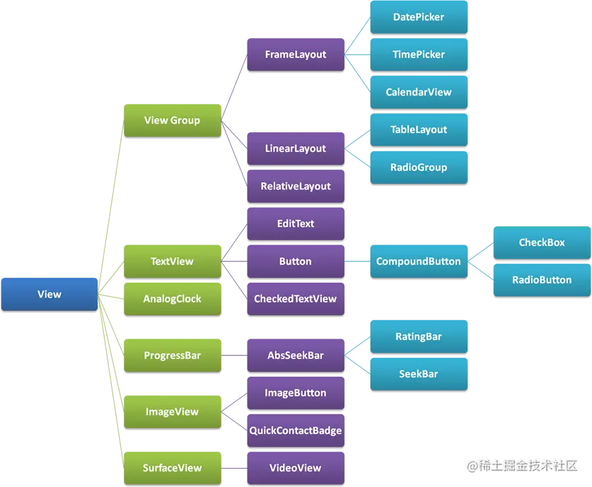
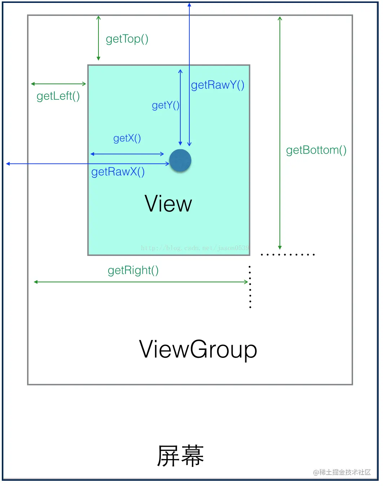
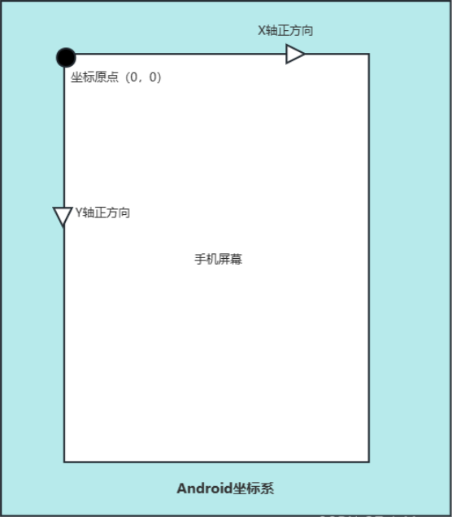

# View体系

<font style="color:rgb(53, 53, 53);">如下图的 </font>`View部分继承关系`



# 1 坐标系
## 1.1 相对坐标系
<font style="color:rgb(77, 77, 77);">View坐标系是描述View在其父ViewGroup（而非手机屏幕）中的位置，主要有四个属性：top，left，right和bottom。top是左上角纵坐标，left是左上角横坐标，right是右下角横坐标，bottom是右下角纵坐标。</font>



上图之中的蓝色和绿色是有着不同作用含义，我们平时使用也是在不同的地方调用

**绿色**：在 View 中获得 View 到其父控件之间的距离

+ <font style="color:rgba(0, 0, 0, 0.75);">getTop():获取View自身顶边到其父布局顶边的距离；</font>
+ <font style="color:rgba(0, 0, 0, 0.75);">getLeft():获取View自身左边到其父布局左边的距离；</font>
+ <font style="color:rgba(0, 0, 0, 0.75);">getBottom():获取View自身底边到其父布局底边的距离；</font>
+ <font style="color:rgba(0, 0, 0, 0.75);">getRight():获取View自身右边到其父布局右边的距离；</font>

**蓝色**：来自于点击事件 **MotionEvent **内部的方法，可以在重写 View 事件分发体系的的三大方法的时候，利用传入的事件调用上图的蓝色方法，获取点击的位置坐标

+ <font style="color:rgb(77, 77, 77);">getX和getY方法可以获取触摸点距离所在View的左边界和上边界的距离，即相对坐标系的值</font>
+ <font style="color:rgb(77, 77, 77);">getRawX和getRawY方法可以获取触摸点的绝对坐标系值</font>

## <font style="color:rgb(77, 77, 77);">1.2 绝对坐标系</font>
<font style="color:rgb(77, 77, 77);">在Android系统中，将屏幕左上角的顶点作为坐标系的原点，原点向右是X轴正方向，向下是Y轴正方向</font>



+ <font style="color:rgb(77, 77, 77);">在触控事件中，使用getRawX方法和getRawY方法获得的都是绝对坐标系值</font>

# 2 触摸事件
## 2.1 MotionEvent
| **事件** | **含义** |
| :---: | :---: |
| <font style="color:rgb(79, 79, 79);">ACTION_DOWN</font> | <font style="color:rgb(79, 79, 79);">表示手指按下屏幕时触发的事件。它是触摸事件序列的第一个事件。</font> |
| <font style="color:rgb(79, 79, 79);background-color:rgb(247, 247, 247);">ACTION_MOVE</font> | <font style="color:rgb(79, 79, 79);">表示手指在屏幕上滑动时触发的事件。在手指滑动期间，会多次触发该事件。</font> |
| <font style="color:rgb(79, 79, 79);">ACTION_UP</font> | <font style="color:rgb(79, 79, 79);">表示手指从屏幕上抬起时触发的事件。它是触摸事件序列的最后一个事件。</font> |
| <font style="color:rgb(79, 79, 79);background-color:rgb(247, 247, 247);">ACTION_CANCEL</font> | <font style="color:rgb(79, 79, 79);background-color:rgb(247, 247, 247);">表示触摸事件序列被取消时触发的事件。在某些情况下，例如手指按下后突然有来电或系统通知，会导致触摸事件被取消。</font> |
| <font style="color:rgb(79, 79, 79);">ACTION_POINTER_DOWN</font> | <font style="color:rgb(79, 79, 79);">当有多个手指同时按下屏幕时，除第一个手指外的其他手指按下时触发的事件。</font> |
| <font style="color:rgb(79, 79, 79);background-color:rgb(247, 247, 247);">ACTION_POINTER_UP</font> | <font style="color:rgb(79, 79, 79);background-color:rgb(247, 247, 247);">当有多个手指同时按下屏幕时，除最后一个手指外的其他手指抬起时触发的事件。</font> |
| <font style="color:rgb(79, 79, 79);">ACTION_HOVER_MOVE</font> | <font style="color:rgb(79, 79, 79);">当没有手指触摸屏幕，但有物体（如手指悬停、笔等）接近屏幕时触发的事件。</font> |
| <font style="color:rgb(79, 79, 79);background-color:rgb(247, 247, 247);">ACTION_BUTTON_PRESS</font> | <font style="color:rgb(79, 79, 79);background-color:rgb(247, 247, 247);">代表鼠标按键按下的事件。它是指在连接到Android设备的鼠标设备上，当按下鼠标按钮时触发的事件。</font> |


一次手指触摸屏幕的行为，会触发一系列点击事件，比如DOWN->MOVE->UP

**TouchSlop**

<font style="color:rgb(77, 77, 77);">TouchSlop是系统所能够识别出的被认为是滑动的最小距离，也可以说是能触发MOVE事件的一个距离单元。当手指在屏幕上滑动时，如果距离小于TouchSlop，那么系统将不会触发MOVE事件。TouchSlop是一个常量，一般与设备有关，我们可以通过getScaledTouSlop方法获取，返回值为int值：</font>

```java
int mindp = ViewConfiguration.get(getApplicationContext()).getScaledTouchSlop();
```

## 2.2 速度检测
<font style="color:rgb(77, 77, 77);">速度跟踪就是用于追踪手指在滑动过程中的速度，包括水平和竖直方向上的速度。</font>VelocityTracker类用来进行速度跟踪。

如下实例中，使用VelocityTracker类实现速度跟踪，并在日志中打印

```java
public class VelocityTrackerView extends View {
    private static final String TAG = "VelocityTrackerView";
    VelocityTracker velocityTracker;
    //这里省略自动生成的四个构造方法
    public VelocityTrackerView(Context context) {...}
    @Override
    public boolean onTouchEvent(MotionEvent event) {
        switch (event.getAction()){
            case MotionEvent.ACTION_DOWN:
                velocityTracker = VelocityTracker.obtain();//获取速度追踪对象
                break;
            case MotionEvent.ACTION_MOVE:
                velocityTracker.addMovement(event);//添加移动事件
                velocityTracker.computeCurrentVelocity(1000);//计算1000ms内的平均速度
                int xVelocity = (int) velocityTracker.getXVelocity(); //获取XY的速度值
                int yVelocity = (int) velocityTracker.getYVelocity();
                Log.d(TAG, "xVelocity is : "+ xVelocity);
                Log.d(TAG, "yVelocity is : "+ yVelocity);
                break;
            case MotionEvent.ACTION_UP:
                velocityTracker.clear();//清空速度追踪器
                velocityTracker.recycle();//回收速度追踪器
                break;
            default:
                break;
        }
        return true;
    }
}
```

## 2.3 手势检测
<font style="color:rgb(77, 77, 77);">手势检测，是用于辅助检测用户的单机，滑动，长按，双击等行为。这里需要用到GestureDetector</font>

<font style="color:rgb(77, 77, 77);">如下实例中，通过创建一个GestureDetector对象并且实现OnGestureListener接口来监听手势</font>

```java
public class GestureView extends View implements GestureDetector.OnGestureListener {
    private static final String TAG = "GestureDetectorView";
    GestureDetector gestureDetector = null;
    //省略自动生成的四个构造方法
    public GestureDetectorView(Context context) {...}
    
    @Override
    public boolean onTouchEvent(MotionEvent event) {
        if(gestureDetector == null){
            gestureDetector = new GestureDetector(getContext(),this);
            gestureDetector.setIsLongpressEnabled(false);//解决长按屏幕后无法拖动的现象
        }
        boolean isConsume = gestureDetector.onTouchEvent(event);//接管onTouchEvent方法
        return isConsume;
    }

    @Override
    public boolean onDown(@NonNull MotionEvent e) {
        Log.d(TAG, "onDown: ");
        return true;
    }

    @Override
    public void onShowPress(@NonNull MotionEvent e) {
        Log.d(TAG, "onShowPress: ");
    }

    @Override
    public boolean onSingleTapUp(@NonNull MotionEvent e) {
        Log.d(TAG, "onSingleTapUp: ");
        return true;
    }

    @Override
    public boolean onScroll(@NonNull MotionEvent e1, @NonNull MotionEvent e2, float distanceX, float distanceY) {
        Log.d(TAG, "onScroll: ");
        return true;
    }

    @Override
    public void onLongPress(@NonNull MotionEvent e) {
        Log.d(TAG, "onLongPress: ");
    }

    @Override
    public boolean onFling(@NonNull MotionEvent e1, @NonNull MotionEvent e2, float velocityX, float velocityY) {
        Log.d(TAG, "onFling: ");
        return true;
    }
}
```

上述代码中，回调方法的相关解释如下表所示：

| **方法名** | **含义** | **所属接口** |
| :---: | :---: | --- |
| <font style="color:rgb(79, 79, 79);">onDown</font> | 手指触摸屏幕的一瞬间 | <font style="color:rgb(79, 79, 79);">OnGestureListener</font> |
| <font style="color:rgb(79, 79, 79);background-color:rgb(247, 247, 247);">onShowPress</font> | <font style="color:rgb(79, 79, 79);background-color:rgb(247, 247, 247);">手指触摸屏幕，尚未松开或者拖动，由一个ACTION_DOWN触发。需要和onDown区别，它强调的是没有松开或者拖动的状态</font> | |
| <font style="color:rgb(79, 79, 79);">onSingleTapUp</font> | <font style="color:rgb(79, 79, 79);">手指触摸后松开，伴随这一个ACTION_UP而触发，单击行为</font> | |
| <font style="color:rgb(79, 79, 79);background-color:rgb(247, 247, 247);">onScroll</font> | <font style="color:rgb(79, 79, 79);background-color:rgb(247, 247, 247);">手指按下屏幕并拖动，由一个ACTION_DOWN，多个ACTION_MOVE触发，拖动行为</font> | |
| <font style="color:rgb(79, 79, 79);">onLongPress</font> | <font style="color:rgb(79, 79, 79);">手指长按屏幕</font> | |
| <font style="color:rgb(79, 79, 79);background-color:rgb(247, 247, 247);">onFling</font> | <font style="color:rgb(79, 79, 79);background-color:rgb(247, 247, 247);">按下触摸屏，快速滑动后松开，由一个ACTION_DOWN，多个ACTION_MOVE和一个ACTION_UP触发，是快速滑动行为</font> | |
| <font style="color:rgb(79, 79, 79);">onDoubleTap</font> | <font style="color:rgb(79, 79, 79);">双击，两次连续的单击组成，和onSingleTapConfirmed不共存</font> | <font style="color:rgb(79, 79, 79);">onDoubleTapListener</font> |
| <font style="color:rgb(79, 79, 79);background-color:rgb(247, 247, 247);">onSingleTapConfirm</font> | <font style="color:rgb(79, 79, 79);background-color:rgb(247, 247, 247);">严格的单击行为，如果触发了onSingleTapConfirm，那么后面不可能再紧跟着另一个单机行为。Android会确保单击之后短时间内没有再次单击，才会触发该函数</font> | |
| <font style="color:rgb(79, 79, 79);">onDoubleTapEvent</font> | <font style="color:rgb(79, 79, 79);">双击行为，在双击的期间，ACTION_DOWN、ACTION_MOVE、ACTION_UP都会触发此回调</font> | |


> <font style="color:rgb(0, 0, 0);">onSingleTapUp() - 在按下并抬起时发生，只要符合这个条件就触发该函数，没有任何附加条件。</font>
>
> <font style="color:rgb(0, 0, 0);">onSingleTapConfirmed() 同上者，但有附加条件，就是Android会确保单击之后短时间内没有再次单击，才会触发该函数。</font>
>
> <font style="color:rgb(0, 0, 0);">举个列子，如果监听双击事件：onSingleTapUp()会被触发两次。但是onSingleTapConfirmed()一次都不会被触发。</font>
>


> 更新: 2023-12-10 18:39:44  
> 原文: <https://www.yuque.com/zhangxiaofani4cu/xih3ez/eo9kaf>