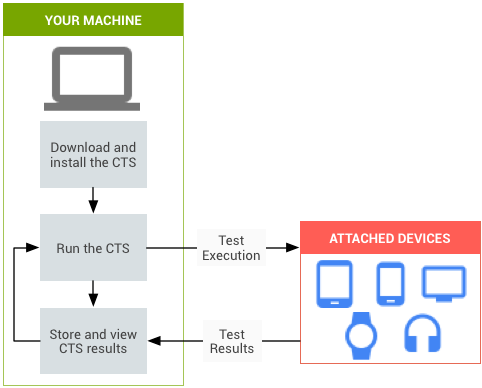
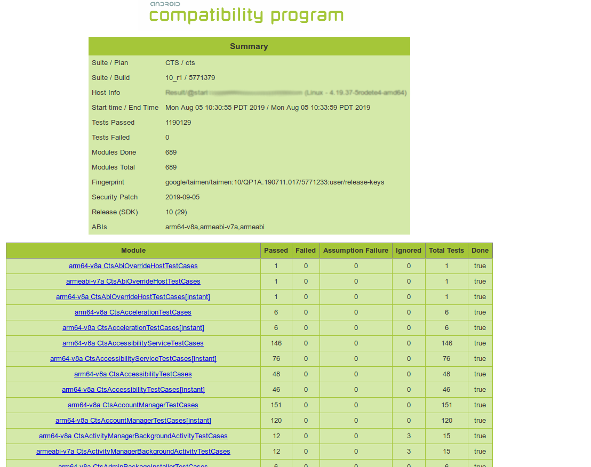

# CTS

<font style="color:rgb(32, 33, 36);">兼容性测试套件 (CTS) 是一个免费的商业级测试套件，可以</font>[下载](https://source.android.com/compatibility/cts/downloads)<font style="color:rgb(32, 33, 36);">二进制文件版本，也可以在 </font>[Android 开源项目 (AOSP)](https://android.googlesource.com/platform/cts/)<font style="color:rgb(32, 33, 36);"> 中下载源代码版本。CTS 代表兼容性“机制”。</font>

<font style="color:rgb(32, 33, 36);"></font>

# <font style="color:rgb(32, 33, 36);">1 工作流程</font>


# 2 环境搭建
## 2.1 物理环境
**低功耗蓝牙信标**

> 至少三个低功耗蓝牙信标， 以便进行低功耗蓝牙扫描测试。
>

**相机**

> 使用正常的照明条件和一个测试图案
>

**GPS/GNSS**

> <font style="color:rgb(32, 33, 36);">以合适的信号电平向 DUT 提供 GPS/GNSS 信号，以便其接收到相应信号并计算 GPS 位置。</font>
>

**<font style="color:rgb(32, 33, 36);">Wi-Fi 和 IPv6</font>**

> <font style="color:rgb(32, 33, 36);">CTS 测试需要一个支持 IPv6 的 Wi-Fi 网络，可以连接到互联网，并且可以将 DUT 视为独立客户端。</font>
>

**Wi-Fi RTT**

> <font style="color:rgb(32, 33, 36);">Android 包含 </font>[Wi-Fi RTT API](https://developer.android.com/reference/android/net/wifi/rtt/package-summary)<font style="color:rgb(32, 33, 36);">，用于提供 </font>[Wi-Fi 往返时间 (RTT)](https://source.android.com/devices/tech/connect/wifi-rtt)<font style="color:rgb(32, 33, 36);"> 功能。此 API 允许设备测量自身与接入点之间的距离（误差在 1 到 2 米内），从而显著提高室内位置信息的准确性。</font>
>

<font style="color:rgb(32, 33, 36);"></font>

## <font style="color:rgb(32, 33, 36);">2.2 电脑设置</font>
**adb 和 AAPT**

> <font style="color:rgb(32, 33, 36);">运行 CTS 之前，请确保已安装最新版本的 </font>[Android 调试桥 (adb)](http://developer.android.com/tools/help/adb.html)<font style="color:rgb(32, 33, 36);"> 和 </font>[Android 资源打包工具 (AAPT)](http://developer.android.com/guide/topics/manifest/uses-feature-element.html#testing)<font style="color:rgb(32, 33, 36);">，并已将这两个工具的位置信息添加到计算机的系统路径中。</font>
>

**<font style="color:rgb(32, 33, 36);">JDK </font>**

> <font style="color:rgb(32, 33, 36);">对于Android 11，推荐使用 OpenJDK 11</font>
>

**<font style="color:rgb(32, 33, 36);">CTS 文件</font>**

> <font style="color:rgb(32, 33, 36);">从</font>[兼容性测试套件下载](https://source.android.com/compatibility/cts/downloads)<font style="color:rgb(32, 33, 36);">页面下载与您设备的 Android 版本以及您设备支持的所有应用二进制接口 (ABI) 相匹配的 CTS 软件包，并将其打开。</font>
>

<font style="color:rgb(32, 33, 36);"></font>

## <font style="color:rgb(32, 33, 36);">2.3 Android 设备设置</font>
1. <font style="color:rgb(32, 33, 36);">将设备恢复出厂设置：依次点击</font>**<font style="color:rgb(32, 33, 36);">设置 > 备份和重置 > 恢复出厂设置</font>**<font style="color:rgb(32, 33, 36);">。</font>
2. <font style="color:rgb(32, 33, 36);">将设备的语言设置为英语（</font>**<font style="color:rgb(32, 33, 36);">美国</font>**<font style="color:rgb(32, 33, 36);">）：依次点击</font>**<font style="color:rgb(32, 33, 36);">设置 > 语言和输入法 > 语言</font>**<font style="color:rgb(32, 33, 36);">。</font>
3. <font style="color:rgb(32, 33, 36);">如果设备支持自定义默认字体，请将默认</font><font style="color:rgb(32, 33, 36);"> </font>sans-serif<font style="color:rgb(32, 33, 36);"> </font><font style="color:rgb(32, 33, 36);">字体系列设置为</font><font style="color:rgb(32, 33, 36);"> </font>Roboto<font style="color:rgb(32, 33, 36);">（AOSP build 中使用的默认</font><font style="color:rgb(32, 33, 36);"> </font>sans-serif<font style="color:rgb(32, 33, 36);"> </font><font style="color:rgb(32, 33, 36);">字体系列）。</font>
4. <font style="color:rgb(32, 33, 36);">如果设备有 GPS 或 Wi-Fi/移动网络功能，请开启位置信息设置：依次点击</font>**<font style="color:rgb(32, 33, 36);">设置 > 位置 > 开启</font>**<font style="color:rgb(32, 33, 36);">。</font>
5. <font style="color:rgb(32, 33, 36);">连接到满足以下要求的 Wi-Fi 网络：支持 IPv6、可以将 DUT 视为独立客户端，并可连接到互联网。连接网络的操作方式为：依次点击</font>**<font style="color:rgb(32, 33, 36);">设置 > Wi-Fi</font>**<font style="color:rgb(32, 33, 36);">。</font>
6. <font style="color:rgb(32, 33, 36);">确保设备未设置锁屏图案或密码：依次点击</font>**<font style="color:rgb(32, 33, 36);">设置 > 安全 > 屏幕锁定 > 无</font>**<font style="color:rgb(32, 33, 36);">。</font>
7. <font style="color:rgb(32, 33, 36);">在设备上启用 </font>**<font style="color:rgb(32, 33, 36);">USB 调试</font>**<font style="color:rgb(32, 33, 36);">：依次点击</font>**<font style="color:rgb(32, 33, 36);">设置 > 开发者选项 > USB 调试</font>**<font style="color:rgb(32, 33, 36);">。</font>
8. <font style="color:rgb(32, 33, 36);">将时间设置为 12 小时制：依次点击</font>**<font style="color:rgb(32, 33, 36);">设置 > 日期和时间 > 使用 24 小时制 > 关闭</font>**<font style="color:rgb(32, 33, 36);">。</font>
9. <font style="color:rgb(32, 33, 36);">将设备设置为不锁定屏幕：依次点击</font>**<font style="color:rgb(32, 33, 36);">设置 > 开发者选项 > 不锁定屏幕 > 开启</font>**<font style="color:rgb(32, 33, 36);">。</font>
10. <font style="color:rgb(32, 33, 36);">仅在</font><font style="color:rgb(32, 33, 36);"> </font>**<font style="color:rgb(32, 33, 36);">Android 5.x 和 4.4.x</font>****<font style="color:rgb(32, 33, 36);"> </font>**<font style="color:rgb(32, 33, 36);">上，可以将设备设置为允许模拟位置：依次点击</font>**<font style="color:rgb(32, 33, 36);">设置 > 开发者选项 > 允许模拟位置 > 开启</font>**<font style="color:rgb(32, 33, 36);">。</font>
11. <font style="color:rgb(32, 33, 36);">在</font><font style="color:rgb(32, 33, 36);"> </font>**<font style="color:rgb(32, 33, 36);">Android 4.2 或更高版本中</font>**<font style="color:rgb(32, 33, 36);">，关闭通过 USB 验证应用：依次点击</font><font style="color:rgb(32, 33, 36);"> </font>**<font style="color:rgb(32, 33, 36);">设置 > 开发者选项 > 通过 USB 验证应用 > 关闭</font>**<font style="color:rgb(32, 33, 36);">。</font>
12. <font style="color:rgb(32, 33, 36);">启动浏览器并关闭任何启动/设置屏幕。</font>
13. <font style="color:rgb(32, 33, 36);">使用 USB 数据线连接将要用于测试设备的台式机。</font>

<font style="color:rgb(32, 33, 36);"></font>

## <font style="color:rgb(32, 33, 36);">2.4 文件安装</font>
```java
//CTS 2.1 R2 - 4.2 R4 的版本
abd install -r android-cts/repository/testcases/CtsDelegatingAccessibilityService.apk
//在设备上启用委托：依次点击设置 > 无障碍 > 无障碍 > 委托无障碍服务。
```

**将 CTS 媒体文件复制到设备**

1. <font style="color:rgb(32, 33, 36);">导航 (</font>cd<font style="color:rgb(32, 33, 36);">) 到下载并解压缩媒体文件的目标路径。</font>
2. <font style="color:rgb(32, 33, 36);">更改文件权限：</font>chmod u+x copy_media.sh
3. <font style="color:rgb(32, 33, 36);">复制必要的文件：</font>
    1. `./copy_media.sh all`


# 3 本地运行 CTS 媒体测试
## 3.1 下载
+ [CTS 媒体 1.5](https://dl.google.com/dl/android/cts/android-cts-media-1.5.zip)


## 3.2 设置 CTS 媒体测试
```bash
adb push CtsMediaTestCases /sdcard/
```

## 3.3 运行 CTS 媒体测试
单个模块运行（<font style="color:rgb(32, 33, 36);">SD 卡上的 CtsMediaTestCases）</font>

```bash
run cts -m CtsMediaTestCases --module-arg CtsMediaTestCases:config-url:https://storage.googleapis.com/cts_media/DynamicConfig_local.json --module-arg CtsMediaTestCases:local-media-path:/tmp/android-cts-media-1.5 --shard-count 6
```

完整运行（<font style="color:rgb(32, 33, 36);">SD 卡上的 CtsMediaTestCases）</font>

```bash
run cts --module-arg CtsMediaTestCases:config-url:https://storage.googleapis.com/cts_media/DynamicConfig_local.json --module-arg CtsMediaTestCases:local-media-path:/tmp/android-cts-media-1.5 --shard-count 6
```


# 4 解读结果
> 记录一下：
>
> 根据测试结果图显示信息，找到对应测试项的测试方法，一般在项目根目录的 cts/目录下搜索对应测试项。
>
> 根据堆栈信息、报错信息对应的代码中的报错打印，找到具体测试位置。
>
> 根据方法代码查找对应系统中的代码或者是aosp代码。
>

测试结果位于

```bash
CTS_ROOT/android-cts/results/start_time.zip
```

测试摘要示例




## 4.1 CTS 分析
常规步骤：

+ <font style="color:rgba(0, 0, 0, 0.75);">通跑某一模块；</font>
+ <font style="color:rgba(0, 0, 0, 0.75);">查看测试结果；</font>
+ <font style="color:rgba(0, 0, 0, 0.75);">对Fail项进行单跑；</font>
+ <font style="color:rgba(0, 0, 0, 0.75);">辅助信息抓取；</font>

### <font style="color:rgb(79, 79, 79);">通跑某一模块</font>
<font style="color:rgb(77, 77, 77);">以网络模块为例，通过如下测试项为例，在</font><font style="color:rgb(199, 37, 78);background-color:rgb(249, 242, 244);">cts-tradefed</font><font style="color:rgb(77, 77, 77);">交互界面输入</font><font style="color:rgb(199, 37, 78);background-color:rgb(249, 242, 244);">list m</font><font style="color:rgb(77, 77, 77);">可查看与之对应的待测模块(modules)：</font>

```bash
cts-tf > list m
...
CtsNetTestCases
...
```

<font style="color:rgb(77, 77, 77);">从中可以看到，</font><font style="color:rgb(199, 37, 78);background-color:rgb(249, 242, 244);">CtsNetTestCases</font><font style="color:rgb(77, 77, 77);">明显是网络相关的测试模块，因此执行：</font>

```java
cts-tf > run cts -m CtsNetTestCases
```

### <font style="color:rgb(79, 79, 79);">查看测试结果</font>
测试结果存放目录：${cts_root}/results/


文件夹命名格式：yyyy.MM.dd_HH.mm.ss（例如2021.12.28_15.18.09）


如果是最近一次测试结果，可直接在这里找到：${cts_root}/results/latest


查看Fail项可直接使用浏览器打开目录下的test_result_failures.html文件即可；

### <font style="color:rgb(79, 79, 79);">对Fail项进行单跑</font>
<font style="color:rgb(77, 77, 77);">还是以CtsNetTestCases的测试结果为例，比如在</font><font style="color:rgb(199, 37, 78);background-color:rgb(249, 242, 244);">test_result_failures.html</font><font style="color:rgb(77, 77, 77);">中显示，如下这项测试Fail：</font>

```bash
cts-tf > run cts -m CtsNetTestCases -t android.net.cts.ConnectivityManagerTest#testConnectivityChanged_manifestRequestOnlyPreN_shouldReceiveIntent
```

### <font style="color:rgb(79, 79, 79);">辅助信息抓取</font>
以上面提到的android.net.cts.ConnectivityManagerTest#testConnectivityChanged_manifestRequestOnlyPreN_shouldReceiveIntent测试项为例，通过测试项名称，可以快速定位到源码中对应的代码：

```java
类名：  android.net.cts.ConnectivityManagerTest
方法名：testConnectivityChanged_manifestRequestOnlyPreN_shouldReceiveIntent
```

<font style="color:rgb(77, 77, 77);">注意：</font>_<font style="color:rgb(77, 77, 77);">源码中的代码并不一定与当前CTS版本完全一致，只能作为参考，若需要获取完全对应的，可下载AOSP源码，并checkout到对应的分支（tag）后，使用同样方法查看代码；</font>_

<font style="color:rgb(77, 77, 77);">通过查找，可知ConnectivityManagerTest类在这里：</font>  
 

```java
cts/tests/tests/net/src/android/net/cts/ConnectivityManagerTest.java
```

<font style="color:rgb(77, 77, 77);">结合</font><font style="color:rgb(199, 37, 78);background-color:rgb(249, 242, 244);">cts-tradefed</font><font style="color:rgb(77, 77, 77);">交互界面的异常栈信息：</font>

```java
12-29 10:03:34 I/ConsoleReporter: [1/1 arm64-v8a CtsNetTestCases 1234567] android.net.cts.ConnectivityManagerTest#testConnectivityChanged_manifestRequestOnlyPreN_shouldReceiveIntent fail: junit.framework.AssertionFailedError
    at junit.framework.Assert.fail(Assert.java:48)
    at junit.framework.Assert.assertTrue(Assert.java:20)
    at junit.framework.Assert.assertTrue(Assert.java:27)
    at android.net.cts.ConnectivityManagerTest.testHttpRequest(ConnectivityManagerTest.java:724)
    at android.net.cts.ConnectivityManagerTest.disconnectFromWifi(ConnectivityManagerTest.java:744)
    at android.net.cts.ConnectivityManagerTest.toggleWifi(ConnectivityManagerTest.java:663)
    at android.net.cts.ConnectivityManagerTest.testConnectivityChanged_manifestRequestOnlyPreN_shouldReceiveIntent(ConnectivityManagerTest.java:636)
    at java.lang.reflect.Method.invoke(Native Method)
    at junit.framework.TestCase.runTest(TestCase.java:168)
    at junit.framework.TestCase.runBare(TestCase.java:134)
    at junit.framework.TestResult$1.protect(TestResult.java:115)
    at androidx.test.internal.runner.junit3.AndroidTestResult.runProtected(AndroidTestResult.java:73)
    at junit.framework.TestResult.run(TestResult.java:118)
    at androidx.test.internal.runner.junit3.AndroidTestResult.run(AndroidTestResult.java:51)
    at junit.framework.TestCase.run(TestCase.java:124)
    at androidx.test.internal.runner.junit3.NonLeakyTestSuite$NonLeakyTest.run(NonLeakyTestSuite.java:62)
    at androidx.test.internal.runner.junit3.AndroidTestSuite$2.run(AndroidTestSuite.java:101)
    at java.util.concurrent.Executors$RunnableAdapter.call(Executors.java:458)
    at java.util.concurrent.FutureTask.run(FutureTask.java:266)
    at java.util.concurrent.ThreadPoolExecutor.runWorker(ThreadPoolExecutor.java:1167)
    at java.util.concurrent.ThreadPoolExecutor$Worker.run(ThreadPoolExecutor.java:641)
    at java.lang.Thread.run(Thread.java:764)
```

<font style="color:rgb(77, 77, 77);">可知问题发生在</font><font style="color:rgb(199, 37, 78);background-color:rgb(249, 242, 244);">android.net.cts.ConnectivityManagerTest.testHttpRequest</font><font style="color:rgb(77, 77, 77);">（同理，行数参考意义不大，重点关注方法调用即可）</font>  
<font style="color:rgb(77, 77, 77);">从而快速定位到Fail的原因：</font>

```java
    private void testHttpRequest(Socket s) throws IOException {
        OutputStream out = s.getOutputStream();
        InputStream in = s.getInputStream();

        final byte[] requestBytes = HTTP_REQUEST.getBytes("UTF-8");
        byte[] responseBytes = new byte[4096];
        out.write(requestBytes);
        in.read(responseBytes);
        assertTrue(new String(responseBytes, "UTF-8").startsWith("HTTP/1.0 204 No Content\r\n"));
    }
```

可见此处是在打开Socket并尝试进行通信，异常处为方法最后一行，即：判断返回的字符串是否与预期一致。


分析到了这里，我们可以确定与网络环境有较大因素，但是如果要确认assertTrue为何不满足，即返回值到底是什么的话，那么我们就需要添加一些日志了；


由于上面提到的原因，CTS测试跑的时候，这段代码是通过已经打好包的APK形式提供的，我们并没有办法对其进行修改；但是反过来想，我们是不是可以用自己编译好的APK，替换掉CTS中的APK呢？


那么这就是一个方法：

从AOSP下载对应版本的代码（如果行数与当前基线差异不大，也可以先用当前基线尝试）；

添加必要信息，例如：

```java
    private void testHttpRequest(Socket s) throws IOException {
        OutputStream out = s.getOutputStream();
        InputStream in = s.getInputStream();

        final byte[] requestBytes = HTTP_REQUEST.getBytes("UTF-8");
        byte[] responseBytes = new byte[4096];
        //添加日志输出完整请求URL
        Log.i(TAG, "HTTP_REQUEST = " + HTTP_REQUEST);
        out.write(requestBytes);
        in.read(responseBytes);
        //添加日志输出返回结果
        String formattedResponse = new String(responseBytes, "UTF-8");
        Log.i(TAG, "responseBytes = " + formattedResponse);
        assertTrue(formattedResponse.startsWith("HTTP/1.0 204 No Content\r\n"));
    }
```

<font style="color:rgba(0, 0, 0, 0.75);">然后再进行一次单跑，同时抓取logcat日志：</font>

```java
12-29 11:13:40.348 I/ConnectivityManagerTest(26037): Network type: 1 state: CONNECTED
12-29 11:13:40.390 I/ConnectivityManagerTest(26037): HTTP_REQUEST = GET /generate_204 HTTP/1.0
12-29 11:13:40.390 I/ConnectivityManagerTest(26037): Host: connectivitycheck.gstatic.com
12-29 11:13:40.390 I/ConnectivityManagerTest(26037): Connection: keep-alive
12-29 11:13:40.390 I/ConnectivityManagerTest(26037): 
12-29 11:13:40.431 I/ConnectivityManagerTest(26037): responseBytes = HTTP/1.0 403 Forbidden
12-29 11:13:40.431 I/ConnectivityManagerTest(26037): Server: bfe
12-29 11:13:40.431 I/ConnectivityManagerTest(26037): Date: Wed, 29 Dec 2021 03:13:40 GMT
12-29 11:13:40.431 I/ConnectivityManagerTest(26037): Content-Length: 0
12-29 11:13:40.431 I/ConnectivityManagerTest(26037): Content-Type: text/plain; charset=utf-8
12-29 11:13:40.431 I/ConnectivityManagerTest(26037): 
12-29 11:13:40.431 I/ConnectivityManagerTest(26037): ...
12-29 11:13:40.433 I/TestRunner(26037): failed: testConnectivityChanged_manifestRequestOnlyPreN_shouldReceiveIntent(android.net.cts.ConnectivityManagerTest)
12-29 11:13:40.433 I/TestRunner(26037): 	at android.net.cts.ConnectivityManagerTest.testHttpRequest(ConnectivityManagerTest.java:725)
12-29 11:13:40.433 I/TestRunner(26037): 	at android.net.cts.ConnectivityManagerTest.disconnectFromWifi(ConnectivityManagerTest.java:745)
12-29 11:13:40.433 I/TestRunner(26037): 	at android.net.cts.ConnectivityManagerTest.toggleWifi(ConnectivityManagerTest.java:661)
12-29 11:13:40.433 I/TestRunner(26037): 	at android.net.cts.ConnectivityManagerTest.testConnectivityChanged_manifestRequestOnlyPreN_shouldReceiveIntent(ConnectivityManagerTest.java:634)
```

<font style="color:rgb(77, 77, 77);">可见此处请求返回码期望为204，返回头期望为</font><font style="color:rgb(199, 37, 78);background-color:rgb(249, 242, 244);">"HTTP/1.0 204 No Content"</font><font style="color:rgb(77, 77, 77);">，但实际返回</font><font style="color:rgb(199, 37, 78);background-color:rgb(249, 242, 244);">"HTTP/1.0 403 Forbidden"</font>


> 更新: 2024-09-08 23:18:08  
> 原文: <https://www.yuque.com/zhangxiaofani4cu/xih3ez/eqoyg2>