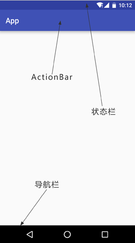
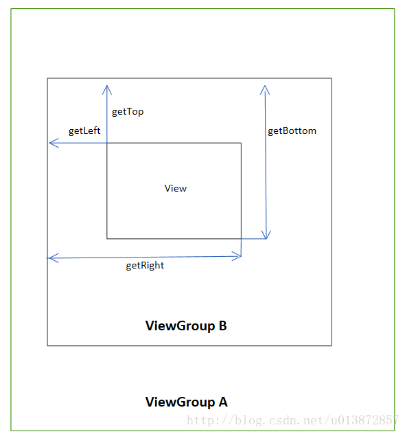
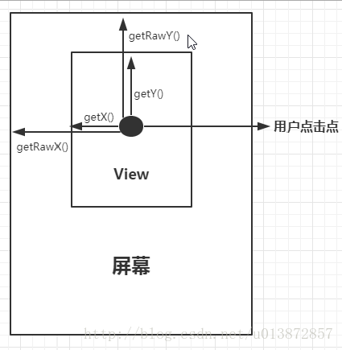

# requestWindowFeature()


**功能：**


启用窗体的扩展特性。


参数是 Window 类中定义的常量：


1. **DEFAULT_FEATURES**：系统默认状态，一般不需要指定
2. **FEATURE_CONTEXT_MENU**：启用 ContextMenu，默认该项已启用，一般无需指定
3. **FEATURE_CUSTOM_TITLE**：自定义标题。当需要自定义标题时必须指定。如：标题是一个按钮时
4. **FEATURE_INDETERMINATE_PROGRESS**：不确定的进度
5. **FEATURE_LEFT_ICON**：标题栏左侧的图标
6. **FEATURE_NO_TITLE**：没有标题
7. **FEATURE_OPTIONS_PANEL**：启用“选项面板”功能，默认已启用。
8. **FEATURE_PROGRESS**：进度指示器功能
9. **FEATURE_RIGHT_ICON**：标题栏右侧的图标


# getWindow()


**功能：**


检索活动的当前窗口。


**getWindow().getDecorView()**


- 获取顶级视图，包含整个屏幕，包括标题栏
- 标题栏左上角，也就是整个屏幕最左上角的位置为坐标原点。


这里先调用 getWindow().getDecorView() 方法获取到了当前界面的 DecorView，然后调用它的 setSystemUiVisibility() 方法来设置系统 UI 元素的可见性。


参考链接：https://blog.csdn.net/guolin_blog/article/details/51763825




```java
getWindow().getDecorView().setSystemUiVisibility(
        View.SYSTEM_UI_FLAG_HIDE_NAVIGATION     //隐藏导航栏
                | View.SYSTEM_UI_FLAG_FULLSCREEN    //全屏，会将状态栏隐藏，但是状态栏图标也隐藏了
                | View.SYSTEM_UI_FLAG_IMMERSIVE_STICKY
                | View.SYSTEM_UI_FLAG_LAYOUT_HIDE_NAVIGATION
                | View.SYSTEM_UI_FLAG_LAYOUT_FULLSCREEN
                | View.SYSTEM_UI_FLAG_LAYOUT_STABLE //将隐藏的状态栏图标显示出来);
```


# ordinal()


此方法返回枚举常量的序数。

也就是用来获取某个枚举对象的位置索引的值


# 弱引用


有一个Activity的弱引用，而弱引用会很容易被gc回收，这样就能解决Activity结束后，gc却无法回收的情况。


使用静态内部类，通过WeakReference实现对Activity的弱引用。


```java
public class AutoActivity extends Activity {

	MyHandler handler = new MyHandler(this);
	@Override
	protected void onCreate(Bundle savedInstanceState) {
	    super.onCreate(savedInstanceState);
	    setContentView(R.layout.activity_auto);
	}

	static class MyHandler extends Handler{
	    WeakReference<AutoActivity> mactivity;
	    
	    public MyHandler(AutoActivity activity){
	        mactivity = new WeakReference<AutoActivity>(activity);
	    }
	    
	    @Override
	    public void handleMessage(Message msg) {
	        super.handleMessage(msg);           
	        switch (msg.what) {
	        case 100:               
	            //在这里面处理msg
	            //通过mactivity.get()获取Activity的引用(即上下文context)
	            break;              
	        default:
	            break;
	        }
	    }
	}
}
```


# ListView


安卓布局中的一个控件

使用ListView并更新其中的item内容需要使用相关的Adapter来实现，Adapter充当了一个转换功能的类


实现了绑定数据到UI界面的功能

负责创建每个项目的子View和提供对下层数据的访问


常用属性:

　　　　listSelector       listView每项在选中、按下等不同状态时的Drawable

　　　　divider         ListView每项间的间隔Drawable

　　　　dividerHeight     ListView每项间间隔的间隔高度


常用方法：

　　　　setAdapter()         设置数据适配器

　　　　setOnItemClickListener()     设置每项点击事件监听

　　　　addHeaderView()       添加头视图

　　　　addFooterView()       添加脚视图

　　　　setEmptyView()         设置数据项为0时的空数据视图


适配器是一个连接数据和AdapterView的桥梁，通过它能有效地实现数据与AdapterView的分离设置，使AdapterView与数据的绑定更加简便，修改更加方便。


将数据源的数据适配到ListView中的常用适配器有：ArrayAdapter、SimpleAdapter 和 SimpleCursorAdapter。


1. ArrayAdapter最为简单，只能展示一行字；
2. SimpleAdapter有最好的扩充性，可以自定义各种各样的布局，除了文本外，还可以放ImageView（图片）、Button（按钮）、CheckBox（复选框）等等；
3. SimpleCursorAdapter可以认为是SimpleAdapter对数据库的简单结合，可以方便地把数据库的内容以列表的形式展示出来。


但是实际工作中，常用自定义适配器。即继承于BaseAdapter的自定义适配器类。


# OnScrollListener


```java
class MyScrollListener implements OnScrollListener {  
  
        @Override  
        public void onScroll(AbsListView view, int firstVisibleItem,  
                int visibleItemCount, int totalItemCount) {            
    		//TODO
        }  
            
                                                                                                                                        
        @Override  
        public void onScrollStateChanged(AbsListView view, int scrollState) { 
            Log.d("load", "onScrollStateChanged");  
            //TODO
        }  
    }
```


onScroll():


1. firstVisibleItem 表示在当前屏幕显示的第一个ListItem在整个listiew里面的位置

   (下标从0开始)

2. visibleItemCount 表示在现实屏幕中可以见到的ListItem总数

3. totalItemCount 表示ListView的ListItem总数

4. listView.getLastVisiblePosition() 表示在现实屏幕最后一个ListItem在整个ListView的位置(最后ListItem要完全显示出来才算)（下标从0开始）


# getChildAt(index)


在很多时候ListView列表数据不需要全部刷新，只需刷新有数据变化的那一条，这时可以用getChildAt(index)获取某个指定position的view，并对该view进行刷新。


ListView.getFirstVisiblePosition() <= index <= ListView.getLastVisiblePosition()

如果使用了getChildAt(index).findViewById(…)设置值的话，滚动列表时值就会改变了。


因此需要使用getFirstVisiblePosition()获得第一个可见的位置，再用当前的position-它,再用getChildAt取值！即getChildAt(position - ListView.getFirstVisiblePosition()).findViewById(…)去设置值


# View坐标系


View 提供了如下 5 种方法获取 View 的坐标：


1. View.getTop()、View.getLeft()、View.getBottom()、View.getRight();
2. View.getX()、View.getY();
3. View.getTranslationX()、View.getTranslationY();
4. View.getLocationOnScreen(int[] position);
5. View.getLocationInWindow(int[] position);


下面根据编号介绍：


1. 这四个方法用户获取View相对于父容器的坐标




1. getX()与getY()方法获取的是View左上角相对于父容器的坐标，当View没有发生平移操作时，getX()=getLeft()、getY=getTop()。
2. translationX与 translationY是View左上角相对于父容器的偏移量：translationX = getX() - getLeft(),当View未发生平移操作时，translationX 与translationY都为0。
3. 获取View相对于整个屏幕的坐标。
4. 获取View相对于Window的坐标（忽略状态栏及ActionBar）。


**用户点击坐标**


当重写View的onTouchEvent(MotionEvent event)方法时android会把触摸事件封装成MotionEvent成提供给开发者，MotionEvent提供了两组用于获取用户点击点坐标的方法：


```java
1. getX()、getY(); //这个和View里的getX()、getY()不一样
2. getRawX、getRawY();
```


getX()和getY()获取到的是相对于当前View左上角的坐标；getRawX和getRawY()获取的是相对于屏幕左上角的坐标。



# SpannableString


SpannableString，是CharSequence的一种。

原本的CharSequence只是一串字符序列，没有任何样式。

而SpannableString可以在字符序列基础上对指定的字符进行润饰。


在开发中，TextView可以通过setText(CharSequence)传入SpannableString作为参数，来达到显示不同样式文字的效果。


**在开发中如何使用？**


一般通过以下方式进行设置


```java
spannableString.setSpan(Object what, int start, int end, int flags);
```


- what：对SpannableString进行润色的各种Span；
- start：需要润色文字段开始的下标；
- end：需要润色文字段结束的下标；
- flags：决定开始和结束下标是否包含的标志位，有四个参数可选

- SPAN_INCLUSIVE_EXCLUSIVE：包括开始下标，但不包括结束下标 [a, b)
- SPAN_EXCLUSIVE_INCLUSIVE：不包括开始下标，但包括结束下标 (a, b]
- SPAN_INCLUSIVE_INCLUSIVE：既包括开始下标，又包括结束下标 [a, b]
- SPAN_EXCLUSIVE_EXCLUSIVE：不包括开始下标，也不包括结束下标 (a, b)


# Bundle


作用：携带数据，类似于Map，存放 key-value 键值对形式的值。


Bundle 提供了各种常用类型的 get/put 方法，比如：getString()/putString()。它是传递数据的“容器”


Bundle 内部使用 HashMap 类型的变量来存放 put 方法放入的值。


两个 Activity 之间的通讯可以通过 Bundle 类来实现


```java
//新建一个Bundle类
Bundle mBundle = new Bundle();   
 
//bundle类中加入数据（key -value的形式，另一个activity里面取数据的时候，就要用到key，找出对应的value）
 
mBundle.putString("Data", "data from TestBundle");  
 
//新建一个intent对象，并将该bundle加入这个intent对象
Intent intent = new Intent();    
intent.setClass(TestBundle.this, Target.class);    
intent.putExtras(mBundle);
```


如果学过四大组件之一的 Activity。那么应该记得 putExtras 用来在 Activity 之间传递数据，传递的方式就是键值对的方式。Bundle 正好可以用在这里。


# Context


在自学笔记中有写Context相关的知识点

这里做一些补充


**Context是什么**


译文：语境、环境、背景；开发中常称之为“上下文”


在程序中，可以理解为当前对象在程序中所处的一个环境，一个与系统交互的过程


比如微信聊天，此时的“环境”是指聊天的界面以及相关的数据请求与传输，Context在加载资源、启动Activity、获取系统服务、创建View等操作都要参与。


一个应用程序可以认为是一个工作环境，用户在这个环境中会切换到不同的场景


**形象的理解Context**


在这里我给出一个可能不是很恰当的比喻，希望有助于大家的理解：一个Android应用程序，可以理解为一部电影或者一部电视剧，Activity，Service，Broadcast Receiver，Content Provider这四大组件就好比是这部戏里的四个主角：胡歌，霍建华，诗诗，Baby。他们是由剧组（系统）一开始就定好了的，整部戏就是由这四位主演领衔担纲的，所以这四位主角并不是大街上随随便便拉个人（new 一个对象）都能演的。有了演员当然也得有摄像机拍摄啊，他们必须通过镜头（Context）才能将戏传递给观众，这也就正对应说四大组件（四位主角）必须工作在Context环境下（摄像机镜头）。那Button，TextView，LinearLayout这些控件呢，就好比是这部戏里的配角或者说群众演员，他们显然没有这么重用，随便一个路人甲路人乙都能演（可以new一个对象），但是他们也必须要面对镜头（工作在Context环境下），所以Button mButton=new Button（Context）是可以的。虽然不很恰当，但还是很容易理解的，希望有帮助。


源码中的注释是这么来解释Context的：Context提供了关于应用环境全局信息的接口。它是一个抽象类，它的执行被Android系统所提供。它允许获取以应用为特征的资源和类型，是一个统领一些资源（应用程序环境变量等）的上下文。就是说，它描述一个应用程序环境的信息（即上下文）；是一个抽象类，Android提供了该抽象类的具体实现类；通过它我们可以获取应用程序的资源和类（包括应用级别操作，如启动Activity，发广播，接受Intent等）。


# Lambda 表达式


lambda表达式是匿名方法，它提供了轻量级的语法，从而解决了匿名内部类带来的“高度问题”。


下面是一些lambda表达式：


```java
(int x, int y) -> x + y
() -> 42
(String s) -> { System.out.println(s); }
```


第一个lambda表达式接收x和y这两个整形参数并返回它们的和；

第二个lambda表达式不接收参数，返回整数'42'；

第三个lambda表达式接收一个字符串并把它打印到控制台，不返回值。


lambda表达式的语法由参数列表、箭头符号->和函数体组成。


函数体既可以是一个表达式，也可以是一个语句块：


- 表达式：表达式会被执行然后返回执行结果。
- 语句块：语句块中的语句会被依次执行，就像方法中的语句一样

- return语句会把控制权交给匿名方法的调用者
- break和continue只能在循环中使用
- 如果函数体有返回值，那么函数体内部的每一条路径都必须返回值


# onNewIntent(Intent intent)


当我们在activity的启动模式中设置为栈内唯一时，也就是android:launchMode=”singleTask”或android:launchMode=”signleTop”时，会用到这个方法。


**比如：**


- 从A Activity跳转至B Activity再跳转至C Activity
- 在C中做了一定的操作之后返回A界面
- 如果A Activity启动模式设置为singleTask，C跳转至A时，就会判断栈内是否有该Activity实例

- 有，执行A的onNewIntent()方法
- 没有，执行A的onCreate()方法


# 内核空间和用户空间


内核空间是**内核**（操作系统的核心）执行并提供服务的地方。Linux操作系统和驱动程序运行在内核空间。

内核是操作系统启动期间加载到内存的第一部分

内核是构成计算机操作系统核心的程序，它完全控制系统中发生的一切。

 

通常包括：

 

- 调度器：决定各种流程如何共享内核的处理时间（时间片）
- 进程管理器(supervisor)：监听、启动、停止、重启一个或多个进程
- 中断处理程序：处理来自各种硬件设备（如磁盘驱动器和键盘）的所有请求
- 内存管理器：为内核服务的所有用户分配系统的地址空间


用户空间是用户处理运行中的系统内存的地方。应用程序运行在用户空间。


# SharedPreferences

SharedPreference 使用 **键值对** 的方式存储数据


## 1 将数据存储到 SharedPreferences 中


### (1) Context 类中的 getSharedPreferences() 方法

```bash
两个参数
1. 指定 SharedPreferences 文件名，存放在 /data/data/<package_name>/shared_prefs/ 目录下。
2. 指定操作模式，只有一种模式可选，MODE_PRIVATE，和直接传入0效果相同。表示只有当前应用程序可以对该文件进行读写。
```


### (2) Activity 类中的 getSharedPreferences() 方法

```plain
只接收一个 **操作模式** 参数。该方法自动将当前活动的类名作为 SharedPreferences 文件名
```


### (3) PreferenceManager 类中的 getDefaultSharedPreferences() 方法

```plain
静态方法，只接收一个 Context 参数。

使用当前应用程序的包名作为前缀来命名 SharedPreferences 文件
```


## 2 向 SharedPreferences 文件中存储数据

1. 调用 SharedPreferences 对象的 edit() 方法，获取一个 `Shared Preferences.Editor` 对象。
2. 向 `Shared Preferences.Editor` 对象中添加数据，例如 putString() putBoolean() 等
3. 调用 apply() 方法将添加的数据提交


# SQLiteOpenHelper 类

- 该类为抽象类。
- 提供两个抽象方法 onCreate() 和 onUpgrade()。
- 提供两个实例方法 getReadableDatabase() getWritableDatabase()。这两种方法都可以创建或者打开一个现有的数据库。

 

当数据库不可写入的时候（比如磁盘空间已满）

- getReadableDatabase() 方法返回的对象将以 **只读** 的方式打开数据库
- getWritableDatabase() 方法会出现 **异常**


构造方法有两个，选参数少的，有4个参数

1. Context
2. 数据库名，创建数据库时，这里指定名称
3. 允许在查询数据时返回一个自定义的 Cursor（光标），一般传入null
4. 当前数据库的版本号


# build.gradle

1.  Android Studio 项目根目录下有一个 build.gradle
   保存了和当前项目有关的 Gradle 配置信息，相当于该项目的 Makefile 文件，一般项目依赖都会写在这个文件里面。 
2.  项目的 “app” 目录下也有一个 build.gradle
   保存当前项目的所有配置信息 


1. apply plugin：声明是安卓应用程序还是库模块
2. android 闭包：配置项目构建的各种属性 

1.  compileSdkVersion：指定项目编译的 SDK 版本 
2.  buildToolsVersion：指定项目构建工具的版本 
3.  defaultConfig 闭包：默认配置，
   包括应用程序包名，最小 sdk 版本，目标 sdk 版本，版本号，版本名 
4.  buildTypes 闭包：指定生成安装文件的配置，是否对代码进行混淆 
5.  signingConfigs 闭包：签名信息配置 
6.  sourceSets 闭包：源文件路径配置 

1. dependencies 闭包：指定当前项目的所有依赖关系，本地依赖，库依赖以及远程依赖


【参考代码】

```java
// 声明是Android程序，
//com.android.application 表示这是一个应用程序模块,可直接运行
//com.android.library 标识这是一个库模块，是依附别的应用程序运行
apply plugin: 'com.android.application'
 
android {
    //程序在编译的时候会检查lint，有任何错误提示会停止build，我们可以关闭这个开关
    lintOptions {
        //即使报错也不会停止打包
        abortOnError false
        //打包release版本的时候是否进行检测
        checkReleaseBuilds false
    }
 
    //编译sdk的版本，也就是API Level，例如API-19、API-20、API-21等等。
    compileSdkVersion 26
    //build tools的版本，其中包括了打包工具aapt、dx等等。
    //这个工具的目录位于你的sdk目录/build-tools/下
    buildToolsVersion '26.0.2'
 
    //关闭Android Studio的PNG合法性检查
    aaptOptions.cruncherEnabled = false
    aaptOptions.useNewCruncher = false
 
    defaultConfig {  //默认配置
        applicationId "com.hebbe.espressotest" //应用程序的包名
        minSdkVersion 22  //最小sdk版本，如果设备小于这个版本或者大于maxSdkVersion将无法安装这个应用
        targetSdkVersion 26 //目标sdk版本，充分测试过的版本（建议版本）
        versionCode 1  //版本号，第一版是1，之后每更新一次加1
        versionName "1.0" //版本名，显示给用户看到的版本号
 
        archivesBaseName = "weshare-$versionName" //指定打包成Jar文件时候的文件名称
        ndk {
            moduleName "hebbewifisafe"                   //设置库(so)文件名称
            ldLibs "log", "z", "m", "jnigraphics", "android"
            //引入库，比如要用到的__android_log_print
            abiFilters "armeabi", "x86", "armeabi-v7a"      //, "x86"  显示指定支持的ABIs
            cFlags "-std=c++11 -fexceptions"                // C++11
            stl "gnustl_static"
        }
 
        //当方法数超过65535(方法的索引使用的是一个short值，
        //而short最大值是65535)的时候允许打包成多个dex文件，动态加载dex。这里面坑很深啊
        multiDexEnabled true
 
        //Instrumentation单元测试
        testInstrumentationRunner "android.support.test.runner.AndroidJUnitRunner"
    }
 
    //默认的一些文件路径的配置
    sourceSets {
        main {
            manifest.srcFile 'AndroidManifest.xml'//指定清单文件
            res.srcDirs = ['res']//指定res资源目录
            assets.srcDirs = ['assets']    //asset资源目录
            jni.srcDirs 'src/main/jni'     //jni代码目录
            jniLibs.srcDir 'src/main/jniLibs' //jni库目录
            java.srcDirs = ['src']//指定java源代码目录
            resources.srcDirs = ['src']//指定resource目录
            aidl.srcDirs = ['src']//指定aidl目录
            renderscript.srcDirs = ['src']//指定source目录
        }
        debug.setRoot('build-types/debug')//指定debug模式的路径
        release.setRoot('build-types/release')//指定release模式的路径
    }
 
    //multiDex的一些相关配置，这样配置可以让你的编译速度更快
    dexOptions {
        //让它不要对Lib做preDexing
        preDexLibraries = false
        //开启incremental dexing,优化编译效率，这个功能android studio默认是关闭的。
        incremental true
        javaMaxHeapSize "4g"     //增加java堆内存大小
    }
 
    signingConfigs {//签名配置
        release {//发布版签名配置
            storeFile file("fk.keystore")//密钥文件路径
            storePassword "123456"//密钥文件密码
            keyAlias "fk"//key别名
            keyPassword "123456"//key密码
        }
        debug {//debug版签名配置
            storeFile file("fk.keystore")
            storePassword "123456"
            keyAlias "fk"
            keyPassword "123456"
        }
    }
    //指定生成安装文件的配置，常有两个子包:release,debug，注：直接运行的都是debug安装文件
    buildTypes {
        //release版本的配置，即生成正式版安装文件的配置
        release {
            zipAlignEnabled true  //是否支持zip
            shrinkResources true  // 移除无用的resource文件
            minifyEnabled false //是否对代码进行混淆，true表示混淆
            //指定混淆时使用的规则文件；
            // proguard-android.txt指所有项目通用的混淆规则，proguard-rules.pro当前项目特有的混淆规则
            //release的Proguard默认为Module下的proguard-rules.pro文件
            proguardFiles getDefaultProguardFile('proguard-android.txt'), 'proguard-rules.pro'
            debuggable false  //是否支持调试
            //ndk的一些配置
            ndk {
                // cFlags "-std=c++11 -fexceptions -O3 -D__RELEASE__" // C++11
                // platformVersion  = "19"
                moduleName "hebbewifisafe" //设置库(so)文件名称
                ldLibs "log", "z", "m", "jnigraphics", "android"
                //引入库，比如要用到的__android_log_print
                abiFilters "armeabi", "x86", "armeabi-v7a"//, "x86"
                cFlags "-std=c++11 -fexceptions" // C++11
                stl "gnustl_static"
            }
            //采用动态替换字符串的方式生成不同的release.apk
            applicationVariants.all { variant ->
                variant.outputs.each { output ->
                    def outputFile = output.outputFile
                    if (outputFile != null && outputFile.name.endsWith('release.apk')) {
                        def timeStamp = new Date().format('yyyyMMddHH');
                        def fileName = "WeShare-${defaultConfig.versionName}" + "-" + timeStamp + "-lj-" + ".apk";
                        output.outputFile = file("${outputFile.parent}/${fileName}")
                    }
                }
            }
            jniDebuggable false  //关闭jni调试
        }
        debug {//debug版本的配置
            minifyEnabled false
            zipAlignEnabled true
            shrinkResources true // 移除无用的resource文件
            proguardFiles getDefaultProguardFile('proguard-android.txt'), 'proguard-rules.pro'
            debuggable true
//          jniDebuggable true
            ndk {
                cFlags "-std=c++11 -fexceptions -g -D __DEBUG__" // C++11
            }
            jniDebuggable true
        }
    }
 
    packagingOptions
        {
            exclude 'META-INF/ASL2.0'
            exclude 'META-INF/LICENSE'
            exclude 'META-INF/NOTICE'
            exclude 'META-INF/MANIFEST.MF'
        }
    
    compileOptions {
        //在这里你可以进行 Java 的版本配置，
        //以便使用对应版本的一些新特性
    }
    productFlavors {
        //在这里你可以设置你的产品发布的一些东西，
        //比如你现在一共软件需要发布到不同渠道，
        //且不同渠道中的包名不同，那么可以在此进行配置；
        //甚至可以设置不同的 AndroidManifest.xml 文件。
        hebbe {
        }
        googlePlay {
        }
        solo {
        }
    }
    productFlavors.all {
        flavor -> flavor.manifestPlaceholders = [UMENG_CHANNEL_VALUE: name]
    }
    //所谓ProductFlavors其实就是可定义的产品特性，
    //配合 manifest merger 使用的时候就可以达成在一次编译
    //过程中产生多个具有自己特性配置的版本。
 
    //上面这个配置的作用就是，为每个渠道包产生不同的 UMENG_CHANNEL_VALUE 的值。
}
 
//指定当前项目的所有依赖关系：本地依赖、库依赖、远程依赖
//本地依赖：可以对本地Jar包或目录添加依赖关系
//库依赖：可以对项目中的库模块添加依赖关系
//远程依赖：可以对jcenter库上的开源项目添加依赖
//标准的远程依赖格式是 域名:组织名:版本号
dependencies {
    implementation fileTree(dir: 'libs', include: ['*.jar']) //本地依赖
    //远程依赖，com.android.support是域名部分，appcompat-v7是组名称，26.1.0是版本号
    implementation 'com.android.support:appcompat-v7:26.1.0'
    implementation 'com.android.support.constraint:constraint-layout:1.0.2'
    implementation project(':hello')//库依赖
    testImplementation 'junit:junit:4.12' //声明测试用列库
    androidTestImplementation 'com.android.support.test:runner:1.0.1'
    androidTestImplementation 'com.android.support.test.espresso:espresso-core:3.0.1'
}
//声明是要使用谷歌服务框架
apply plugin: 'com.google.gms.google-services'
//第三方依赖库的本地缓存路径
task showMeCache << {
    configurations.compile.each { println it }
}
//使用maven仓库。android有两个标准的library文件服务器，一个jcenter一个maven。两者毫无关系。
//jcenter有的maven可能没有，反之亦然。
//如果要使用jcenter的话就把mavenCentral()替换成jcenter()
repositories {
    mavenCentral()
}
```


# Gradle

gradle 是一种依赖管理工具，类似 maven

默认路径：`C:\Users\用户名\.gradle\wrapper\dists`


# @NotNull  @Nullable 等的区别

@NotNull : 用在基本类 型上 不能为null 但可以为空字符串

@NotEmpty : 用在集合类上 不能为空 并且长度必须大于0

@NotBlank : 只能作用在String上，不能为null，而且调用trim()后，长度必须大于0

@NonNull：在方法或构造函数的参数上使用，生成一个空值检查语句

@Nullable 表示定义的参数可以为空.


# onActivityCreated() 的替代方案

谷歌为了管理Fragment的生命周期，实现了 LifecycleOwner，暴露了一个Lifecycle你可以通过getLifecycle() 方法访问的对象 。


因为onActivityCreated()是宿主Activity的onCreate()之后立即调用，所以可以在onAttach的时候，通过订阅Activity的lifecycle来获取Activity的onCreate()事件，记得要removeObserver。

[
](https://blog.csdn.net/Ym_quiet/article/details/121345411)

```java
	@Override
public void onAttach(@NonNull @NotNull Context context) {
    super.onAttach(context);

    //requireActivity() 返回的是宿主activity
    requireActivity().getLifecycle().addObserver(new LifecycleEventObserver() {
        @Override
        public void onStateChanged(@NonNull @NotNull LifecycleOwner source, @NonNull @NotNull Lifecycle.Event event) {
            if (event.getTargetState() == Lifecycle.State.CREATED){
                //在这里任你飞翔

                getLifecycle().removeObserver(this);  //这里是删除观察者
            }
        }
    });
}
```

# activity-alias> 用来给app起别名

​    实际类名：   android:name=".MainActivity"

​    别名：       android:name=".AliasActivity"

​    关键属性：   android:targetActivity=".MainActivity"

​        <activity

​            android:name=".MainActivity"

​            android:clearTaskOnLaunch="true"

```xml
<activity
	android:name=".MainActivity"
	android:clearTaskOnLaunch="true"
	android:configChanges="mcc|mnc|touchscreen|keyboard|keyboardHidden|navigation|orientation|screenLayout|uiMode|screenSize|smallestScreenSize|layoutDirection|fontScale"
	android:label="MyTestDemo"
	android:launchMode="singleInstance"
	android:resizeableActivity="false"
	android:screenOrientation="portrait" />

<activity-alias
	android:name=".AliasActivity"
	android:clearTaskOnLaunch="true"
	android:configChanges="mcc|mnc|touchscreen|keyboard|keyboardHidden|navigation|orientation|screenLayout|uiMode|screenSize|smallestScreenSize|layoutDirection|fontScale"
	android:enabled="true"
	android:exported="true"
	android:label="MyTestDemo"
	android:launchMode="singleInstance"
	android:resizeableActivity="false"
	android:screenOrientation="portrait"
	android:targetActivity=".MainActivity">
	<intent-filter>
		<action android:name="android.intent.action.MAIN" />
		<category android:name="android.intent.category.LAUNCHER" />
	</intent-filter>
	<intent-filter>
		<action android:name="com.test.demo.main" />
		<category android:name="android.intent.category.DEFAULT" />
	</intent-filter>
</activity-alias>
```

# java上层执行cmd命令

```java
public synchronized static StringBuilder execmd(String command){
    StringBuilder mResult =new StringBuilder() ;
    Runtime runtime = Runtime.getRuntime();
    Process mProc;
    try {
        FtmLog.d(TAG, "Command started!!!");
        FtmLog.d(TAG, "Command : "+command);
        mProc = runtime.exec(command);
        BufferedReader errorBr = new BufferedReader(new
                InputStreamReader(mProc.getErrorStream()));
        boolean isError = false;
        if(null != errorBr.readLine()){
            isError = true;
        }
        errorBr.close();
        if(isError){
            return mResult;
        }
        BufferedReader br = new BufferedReader(new
                InputStreamReader(mProc.getInputStream()));
        String inline;
        while ((inline = br.readLine()) != null) {
            FtmLog.i(TAG, "Excecute command inline = " + inline);
            mResult.append(inline+"\n");
        }
        FtmLog.d(TAG, "Command end!!!");
        br.close();
        mProc.waitFor();

        Thread.sleep(20);

        mProc.destroy();

    } catch (Exception e) {
        e.printStackTrace();
        FtmLog.e(TAG, "Excecute "+command+" error... ",e);
    }

    return mResult;
}
```

# 自定义属性，然后写值

```java
private static final String CQA_COMMAND_PERSIST_RUNIN = "persist.sys.TAG_RUNIN";
SystemProperties.set(CQA_COMMAND_PERSIST_RUNIN, CQA_COMMAND_PERSIST_PASS);
```

# 读文件

```java
    private String getDeviceInfo(String dev) {
        try {
            BufferedReader reader = new BufferedReader(new FileReader(dev), 256);
            String info = reader.readLine();
            if (info == null || "".equals(info)) {
                return "unknown";
            }
            return info;
        } catch (IOException ioe) {
            Log.d(TAG, "read "+dev+" failed", ioe.fillInStackTrace());
            return "unknown";
        }
    }
```

# 添加SELinux权限，

allow scontext=u:r: tcontext=u:object_r:tclass { avc: denied }

allow platform_app mnt_sdcard_file:lnk_file { read };

\# 添加方法: allow + scontext + tcontext : tclass + { 权限 }


针对节点，绕过对sysfs neverallow的问题

file_contexts 文件

/sys/devices/platform/product-device-info/info_tp       u:object_r:sys_device_info_file:s0

file.te 文件

type sys_device_info_file, fs_type,sysfs_type;

system_app.te 文件

allow system_app sys_device_info_file:file rw_file_perms;

platform_app.te 文件

allow platform_app sys_device_info_file:file { read open getattr };

# 字符串格式化：

​    String[] stringArray = str.split("\n");

​    stringArray = stringArray[index].split("=");

​    String result = stringArray[1].replace(" ", "").replace("\n", "").replace("\", "");

# git

GIT

repo start --all main

git reset HEAD^ #【丢弃log，之后一般git pull】

git reset --hard HEAD^ #【丢弃修改和log，之后一般git pull】

git reset --hard HEAD~1 #【丢弃修改并回退一条log，之后一般git pull】

git checkout -b cauchy_p origin/cauchy #【新建一个分支cauchy，并关联远程分支cauchy】

git commit --amend #【修改commit信息，change-id自动生成】

git commit --amend --no-edit #【修改commit信息，change-id自动生成】

gitdir=$(git rev-parse --git-dir); scp -p -P 29418 zhaixc@192.168.11.88:hooks/commit-msg ${gitdir}/hooks/ #【解决没有change-id的问题】

git clean -xdf #【删除本地修改的文件】

git branch -vv #【查看本地分支与远程分支的追踪关系】

git update-index --assume-unchanged PATH                  //在PATH处输入要忽略的文件

git update-index --no-assume-unchanged /path/to/file     #恢复跟踪

# 远程adb

adb tcpip 9999

adb connect 192.168.0.102:9999


adb wait-for-device

adb root

adb disable-verity

adb reboot

adb wait-for-device

adb root

adb remount

adb shell "mount -o rw,remount /"

# 压缩解压

解压 tar -xvf filename.tar

压缩 tar -cvf filename.tar DirName

# 找文件

find ./ -name "name*"	查找文件名

grep -ri "content*" . 	按照内容查找